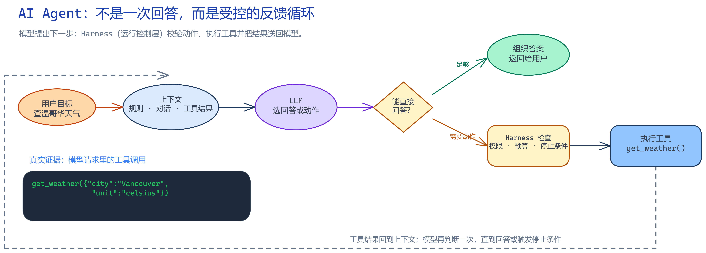
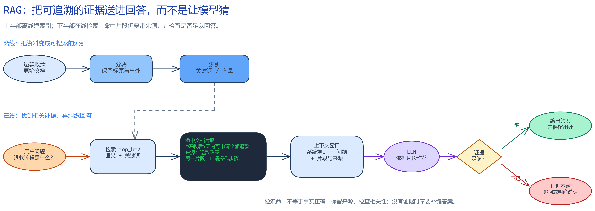

# AI Agent：十章学习版

这份学习版用“解决什么问题、为什么需要、怎么工作、会怎么坏、如何验证”串起全书。它是理解和复习的入口，不替代[中文原版书稿](./introduction.md)及实验。AI 模型、API 和工具变化很快，涉及具体产品能力时请核对原章注明的版本和官方资料。

## 先抓住一个整体模型

**Agent = 模型 + 上下文 + 工具 + 运行控制。** 模型根据当前信息提出下一步；上下文告诉它现在知道什么；工具让它观察或改变外部世界；运行控制负责循环、权限、预算、重试和停止。模型会犯错，所以一个可用 Agent 不能只靠一段提示词。

## 第 1 章：AI Agent 入门

**一句话概括：** Agent 是一个能根据反馈反复选择动作的程序。

- **问题与取舍：** 一次模型回答适合固定问答；需要查资料、执行操作并根据结果调整时，才需要循环式 Agent。自主性越高，控制成本也越高。
- **工作过程：** 把目标和可用信息交给模型；模型选择回答或调用工具；程序执行工具并把结果放回上下文；循环直到完成或达到预算。
- **会怎么坏：** 工具结果可能误导模型，循环可能卡住，提示词不能代替权限检查。Agent 的“自主”不代表它理解真实世界或一定能完成任务。
- **如何验证：** 给一个需要两步工具操作的任务，记录每轮输入、动作、结果和停止原因；再注入错误工具结果或循环调用。
- **记住：** Agent 的核心是反馈循环；工具是边界清晰的外部动作；停止条件和权限必须由程序控制。

原章：[AI Agent 入门](./chapter1.md) · [配套实验](../chapter1/README.md)

图源：[可编辑 Excalidraw 文件](../diagrams/agent-feedback-loop.excalidraw)

## 第 2 章：上下文工程

**一句话概括：** 上下文工程是在有限输入空间里，安排模型完成当前任务所需的信息。

- **问题与取舍：** 只追加全部历史看似不会丢信息，但会浪费 token、增加噪声并可能超出上下文窗口；过度压缩又会丢掉关键约束。
- **工作过程：** 组合系统指令、用户请求、历史、检索材料和工具结果；按任务保留最相关内容，并关注消息格式、顺序和缓存友好性。
- **会怎么坏：** 过期记忆、互相矛盾的指令、检索噪声和提示注入都会让模型走偏。KV Cache 优化的是重复前缀的计算，不会自动让内容更准确。
- **如何验证：** 固定问题，分别改变上下文顺序、长度和检索材料；比较正确率、延迟、token 消耗和缓存命中情况。
- **记住：** 上下文有容量上限；“更多”不等于“更好”；要按任务挑选并验证信息。

原章：[上下文工程](./chapter2.md) · [相关实验](../chapter2/README.md)

## 第 3 章：用户记忆与知识库

**一句话概括：** 记忆保存跨轮次有用的信息，RAG 在需要时从外部资料中找依据。

- **问题与取舍：** 把所有对话塞进每次请求很贵，也容易带入无关或过期内容；只依赖模型参数又无法保证掌握用户的最新私有资料。
- **工作过程：** 从交互中提取候选记忆，判断是否值得保存并设置来源、时间和权限；回答时检索相关记忆或文档，再把证据提供给模型。
- **会怎么坏：** 错误记忆会长期污染回答；分块太大或太小会损害检索；检索到资料不代表回答就正确。个人数据还需要删除、脱敏和访问控制。
- **如何验证：** 用一组带已知答案、过期信息和相似干扰项的问题测召回与回答；检查来源引用、更新和删除是否生效。
- **记住：** 记忆要可更新、可删除；RAG 解决“找资料”，不自动保证“理解正确”；保留来源和权限边界。

原章：[用户记忆和知识库](./chapter3.md) · [相关实验](../chapter3/README.md)

图源：[可编辑 Excalidraw 文件](../diagrams/rag-evidence-pipeline.excalidraw)

## 第 4 章：工具

**一句话概括：** 工具把模型的意图变成受控、可观察的外部操作。

- **问题与取舍：** 只靠模型生成文字不能可靠查实时数据或改变系统状态；把所有能力暴露成一个万能工具又难以审计和授权。
- **工作过程：** 用清楚的名称、描述和参数表达能力；程序校验参数和权限后执行；结果以结构化形式返回模型。工具很多时先检索或分层加载。
- **会怎么坏：** 描述含糊会选错工具，参数校验不足会误操作，工具结果中的不可信文本可能带来提示注入。MCP、Skills 等是接口或组织方式，不等于安全边界本身。
- **如何验证：** 测试合法、缺失、越权和恶意参数；记录调用前后的状态；确认高风险动作需要明确授权或人工确认。
- **记住：** 工具定义就是能力边界；服务端必须独立做校验；可观察、可撤销的工具更安全。

原章：[工具](./chapter4.md) · [相关实验](../chapter4/README.md)

## 第 5 章：Coding Agent 与通用 Agent

**一句话概括：** Coding Agent 通过搜索、编辑、运行和检查代码来完成软件任务。

- **问题与取舍：** 只让模型一次生成完整补丁，难以及时发现上下文缺失和错误；让 Agent 执行命令更有能力，也更可能损坏文件或泄漏数据。
- **工作过程：** 先读取项目说明和相关代码，形成小计划；逐步修改；运行必要的检查；根据结果修正，并清楚报告改动。
- **会怎么坏：** 错误假设会扩大成错误补丁；自动重试可能反复破坏状态；不受限的 shell、网络和凭据访问会放大风险。
- **如何验证：** 在隔离分支给一个边界清楚的任务，核对差异、命令记录、失败处理和最终状态；给任务加入测试失败或权限拒绝。
- **记住：** 项目上下文决定代码质量；小步编辑便于恢复；执行权限要最小化并保留审查证据。

原章：[Coding Agent 与通用 Agent](./chapter5.md) · [相关实验](../chapter5/README.md)

## 第 6 章：交互方式扩展

**一句话概括：** 当输入输出包含语音、图像或异步事件，Agent 必须适应不同的时序和数据形态。

- **问题与取舍：** 纯文本轮询适合简单任务；实时语音或外部事件要求低延迟、持续连接和中断处理，但实现成本更高。
- **工作过程：** 接收事件或多模态输入，按时间顺序维护会话状态，触发模型和工具，再把结果以合适模态返回；长任务需要持久化状态和可恢复步骤。
- **会怎么坏：** 重复事件造成重复操作，乱序事件破坏状态，语音识别错误被当成确定指令，连接断开后任务悬挂。
- **如何验证：** 注入延迟、重复、乱序和中断；测端到端延迟、恢复率、识别错误传播和用户打断后的行为。
- **记住：** 异步任务需要状态机；多模态输入也需要校验；响应速度与推理深度要按任务取舍。

原章：[交互：观察与动作空间的扩展](./chapter6.md) · [相关实验](../chapter6/README.md)

## 第 7 章：Agent 评估

**一句话概括：** 评估要回答 Agent 在明确任务和环境下能否稳定完成目标。

- **问题与取舍：** 漂亮的演示只能说明某次成功；固定基准便于比较，但可能与真实业务任务不一致。
- **工作过程：** 定义任务、环境、成功判据和允许工具；运行多次并保存完整轨迹；分别看单次能力、重复稳定性、成本和时延。
- **会怎么坏：** 数据泄漏会虚高成绩；判分器偏差会奖励错误行为；只报告平均成功率会掩盖长尾失败。
- **如何验证：** 先人工审查任务与判分器；重复运行同一基准；抽查成功和失败轨迹，并与真实用户任务对照。
- **记住：** 没有明确判据就谈不上成功率；单次成功不是可靠性；评估集要持续防泄漏和更新。

原章：[Agent 的评估](./chapter7.md) · [相关实验](../chapter7/README.md)

## 第 8 章：模型后训练

**一句话概括：** 后训练用示范和反馈改变模型行为，但需要数据、奖励和评测共同约束。

- **问题与取舍：** 提示词可以快速改变单次任务行为；需要稳定、广泛的行为变化时，才考虑监督微调或强化学习等训练方法。
- **工作过程：** 监督微调用示范教模型模仿；强化学习根据任务反馈调整策略。训练前要先确认失败确实来自模型能力，而不是上下文、工具或环境问题。
- **会怎么坏：** 训练数据偏差会被模型学进去；奖励指标可能被“钻空子”；训练成本高也不保证泛化到新任务。
- **如何验证：** 预先留出未见任务集，比较训练前后正确率、稳定性、成本和副作用；检查模型是否只学会格式或泄漏答案。
- **记住：** 先诊断瓶颈再训练；示范和奖励各有盲点；用独立评估确认收益。

原章：[模型后训练](./chapter8.md) · [相关实验](../chapter8/README.md)

## 第 9 章：Agent 的持续进化

**一句话概括：** 从运行反馈中改进 Agent，但每次改动都要能评估、回滚和追责。

- **问题与取舍：** 静态系统不会自动适应新任务；自动把每次经验写回记忆或代码又会积累错误和危险行为。
- **工作过程：** 收集轨迹，归因失败，提出小范围改进，在离线评测或沙箱里验证，通过门槛后再发布，并观察线上指标。
- **会怎么坏：** 错误经验变成长期规则；自修改绕过权限；评估集被优化到过拟合；无法回滚导致线上持续退化。
- **如何验证：** 先用历史失败案例做回归，再在隔离环境试运行；比较新旧版本并设置自动回滚阈值。
- **记住：** 学习信号要先验证；改进过程本身也需要安全约束；没有回滚的自我修改不可控。

原章：[Agent 的持续进化](./chapter9.md) · [相关实验](../chapter9/README.md)

## 第 10 章：多 Agent 协作

**一句话概括：** 多个 Agent 分工可能提升复杂任务能力，也会增加沟通、协调和错误传播成本。

- **问题与取舍：** 单 Agent 有上下文或执行能力上限；拆成多个角色能并行处理，但简单任务会因协调开销变慢、变贵。
- **工作过程：** 明确每个角色的输入、输出、权限和完成条件；由共享工作区或协调者传递结果；对关键结论交叉检查并汇总。
- **会怎么坏：** 多个 Agent 共享文件时互相覆盖；错误被其他角色当成事实继续传播；所有角色观点相同，无法真正互相验证。
- **如何验证：** 与单 Agent 基线比较成功率、耗时、成本和故障率；注入错误子结果、通信超时和并发写入，检查隔离与恢复。
- **记住：** 只有可并行且边界清楚的任务才值得拆分；协作协议要定义责任；比较基线后再决定是否多 Agent。

原章：[多 Agent 协作](./chapter10.md) · [相关实验](../chapter10/README.md)

## 全书复习路线

先理解 Agent 循环（第 1 章），再学习如何组织信息（第 2–3 章）和控制动作（第 4–5 章）；随后处理异步交互（第 6 章），建立评估（第 7 章），再考虑训练与持续改进（第 8–9 章）；最后判断多 Agent 是否真的带来收益（第 10 章）。每学完一章，挑一个配套实验，记录输入、观察结果和失败边界。
