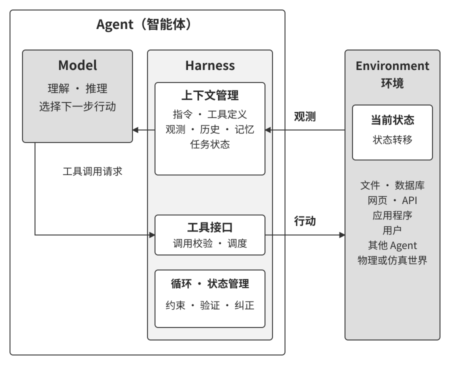
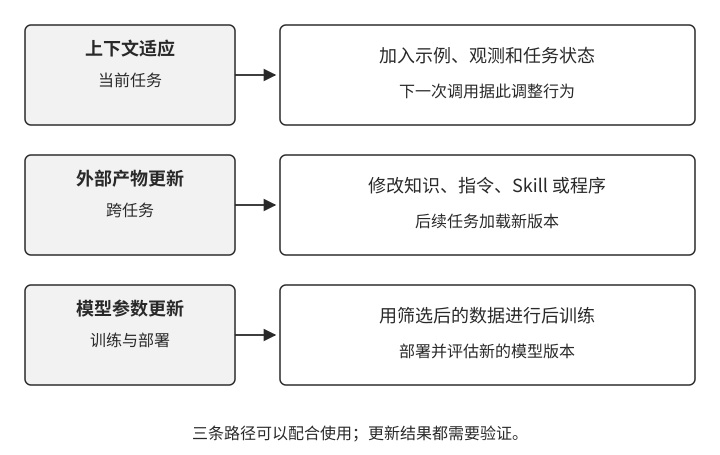
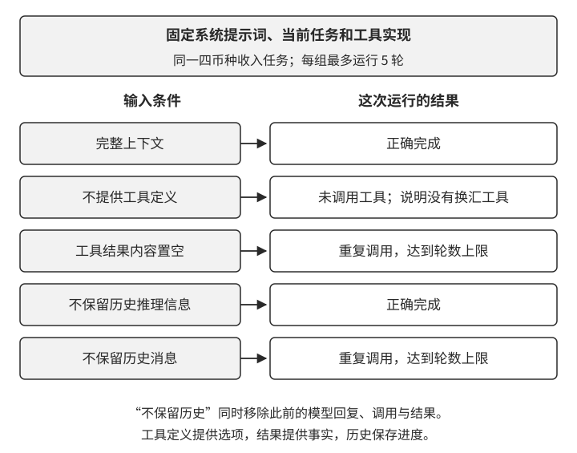
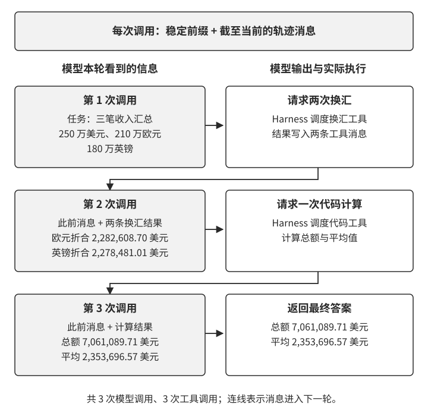
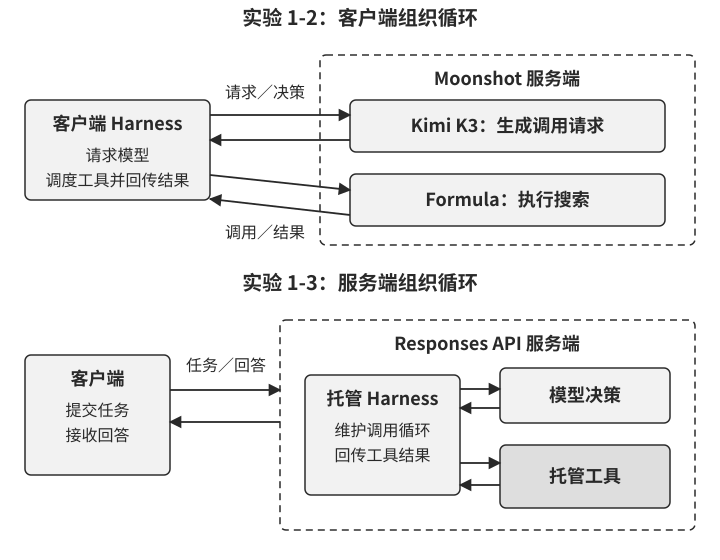
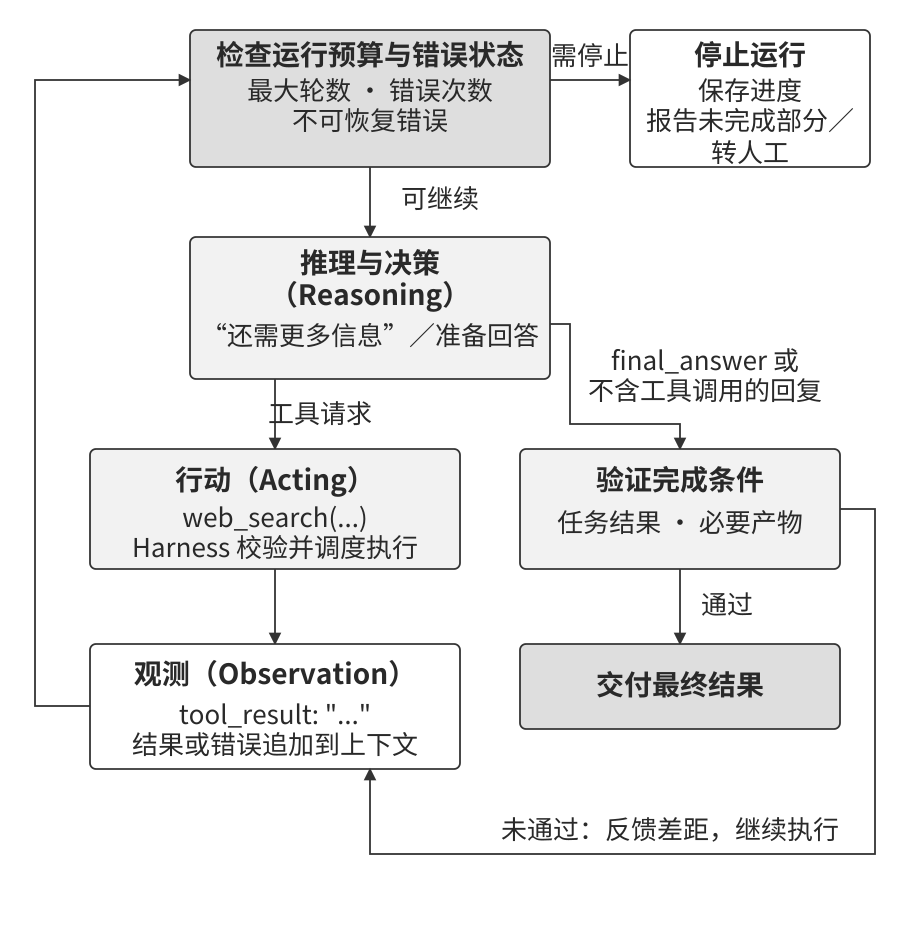

# AI Agent 入门

如果你用 Cursor 写过代码，看它搜索代码库、编辑多个文件、运行测试直到通过；用 ChatGPT 的 deep research 调研过一个课题，看它反复搜索、阅读，总结出一份完整报告；用 Manus 操控浏览器帮你完成在线任务；让豆包手机助手帮你在手机上订票、发消息；或者让 Pine 替你打电话给运营商协商降低账单——你已经在使用 Agent 了。

这些产品的形态各异，但有一个共同点：它们能够自主规划执行步骤、调用各种工具完成任务，并根据结果不断调整后续行动的智能系统。Agent 正在成为我们与计算机交互的一种全新方式。

先考虑一个小任务：把美元、欧元、英镑和日元收入统一换算成美元，再求总额和平均值。模型需要知道有哪些工具，取得换算结果，调用计算工具，最后核对答案。如果换算已经执行，结果却没有回到模型，它会怎样继续？如果工具超时，系统又该直接重试，还是先核实执行状态？

本章沿这两个问题展开：先看模型、上下文和工具如何完成任务，再看 Harness 如何组织运行、检查结果和处理失败。收入汇总实验用于观察这一过程；产品案例则说明同样的结构如何用于编程、调研和真人沟通。

## 现代 Agent = LLM + 上下文 + 工具

Agent 的最小功能构成可以用一个简洁的公式来表示：**Agent = LLM + 上下文 + 工具**。这个公式描述的是 Agent 边界之内的三类核心功能，其中每个词都需要做广义但边界清楚的理解。

- **LLM** 负责理解意图、思考规划和做出判断。它的能力来自两部分：**预训练**所积累的世界知识与语言能力，以及**后训练**所塑造的行为与决策方式——后者的具体技术（如有监督微调与强化学习）将在第 8 章从训练视角展开。
- **上下文** 是每个决策点被组织并提供给模型的信息——包括来自环境的观测、用户记忆、领域知识、自身状态和任务进展。
- **工具** 是 Agent 用来感知或改变外部世界的接口——从预定义的工具调用到动态生成代码，从委托子 Agent 协作到主动与用户沟通。这里采用的是功能视角；在后文的生产实现视角下，工具定义、调用协议和适配器属于 Harness，工具所连接的文件、数据库、网页或其他外部对象则属于环境。

简单说来，三者分别提供决策能力、决策依据和交互接口。为了方便理解，你可以把 LLM 比作 Agent 的“大脑”，把上下文比作它当前的“视野”，把工具比作连接外部世界的“感官和手脚”。这组粗略比喻分别强调决策、信息与交互。

上述公式不包含 Agent 与之交互的环境（environment）。在经典的强化学习和控制论视角下，Agent 与环境分别位于交互边界的两侧。环境不断向 Agent 返回当前观测，Agent 根据当前上下文选择下一步行动；行动作用于环境，环境再产生新的观测，循环由此继续。这是理解 Agent 与环境交互的最小结构，如图1-1 所示。

图1-1 同时给出了两个抽象层次。外层是 **Agent 与环境的交互关系**：环境包括数字系统、用户与其他 Agent，以及物理或仿真世界。环境向 Agent 返回观测，Agent 通过工具接口向环境采取行动，由此形成闭环。

内层是 **Agent 的 Model + Harness 结构**：Model 负责理解、规划和选择下一步行动；Harness 是 Agent 边界内承载模型运行与交互的系统层，负责组织上下文、提供工具接口、维护运行循环、管理状态，并实施权限控制与验证。Harness 可以创建、隔离或代理环境，但环境自身的状态与转移规律仍然位于 Agent 边界之外。图中的 Model 对应前文公式中的 LLM，上下文和工具接口则由 Harness 组织和管理。Model + Harness 结构由此构成“LLM + 上下文 + 工具”在生产实现视角下的进一步展开，本章后半部分将详细介绍这一结构。

从强化学习的角度看，模型承担类似策略的决策功能，上下文带入具体观测和历史，工具提供与环境交互的接口。第 8 章将进一步讨论策略如何从交互中学习。

为便于对照理解，表1-1 汇总了 Agent 三个核心功能要素及其直观比喻、强化学习概念之间的大致对应关系。

**表1-1 Agent 核心功能要素的三种理解视角**

| 直观比喻   | 功能要素 | 强化学习视角 | 在本文中的含义                                             |
| ---------- | -------- | ------------ | ---------------------------------------------------------- |
| 大脑       | LLM      | 策略（近似）               | 根据上下文理解任务、进行规划并选择下一步行动               |
| 视野       | 上下文   | 具体观测与历史           | 汇集当前决策可用的信息，包括环境观测、历史、记忆和任务状态 |
| 感官和手脚 | 工具     | 可获取的观测与可执行的动作 | 通过工具接口获取外部观测或对环境采取行动                   |

表中的“动作”沿用强化学习术语，一般工程叙述使用“行动”。

下面先借用强化学习中的观测空间和动作空间概念，从 Agent 与环境的接口界定系统边界，再依次介绍工具、LLM 和上下文，最后回到这些组件如何在运行循环中协同工作。

### 观测空间与动作空间：Agent 与环境的接口

Agent 每次从环境获得的具体信息称为**观测**。例如，换汇工具返回的一笔美元金额是一次观测；这个接口可能返回的结果集合则属于**观测空间**。同样，模型这次提交的换汇请求是一个具体**动作**，接口允许选择的动作集合构成**动作空间**。区分一次交互与所有可能的交互，有助于设计 Agent 的能力边界。[^ch1-interface]

本书在 Agent—Environment、强化学习及相应的工程接口语境中，用“观测”表示环境提供给 Agent 的信息；描述人、读者或研究者查看、比较现象时，仍使用“观察”。

**环境返回的观测与 Agent 通过工具接口采取的行动，共同构成了 Agent 与外部环境之间的交互边界**。Harness 把环境返回的具体观测组织成模型能够处理的上下文，再把模型选择的行动通过工具接口转换为作用于环境的操作。没有进入上下文的信息，对模型来说就像不存在；没有被工具接口允许的操作，模型即使知道该怎么做，也只能停留在文字建议上。

因此，**在底层模型固定时，重新定义或扩展 Agent 实际可用的观测空间和动作空间，往往是提升任务表现最直接的系统工程手段之一**。在工程实现中，这通常表现为调整进入上下文的信息，或扩展 Agent 可以调用的工具。许多看似需要“更聪明的模型”的问题，其实只是接口问题：把任务所需的数据纳入上下文，或把完成任务所需的操作封装成工具，原本不可解的任务就可能变得可解。

**Manus：合并原本分离的接口。** 在 Manus 出现之前，深度调研、Coding（代码生成）和 Computer Use 常以三条相对独立的产品路线发展。Manus 的代表性特点是把三者整合进同一个有广泛影响力的生产级 Agent：虚拟浏览器扩大了 Agent 实际可用的观测空间，文件系统、代码执行与命令行执行扩大了它实际可用的动作空间。这些能力在同一个任务中衔接，使 Agent 能同时利用调研、编程和界面操作完成工作。

**OpenClaw：把接口延伸到用户的数字生活。** OpenClaw 又把 Agent 实际可用的观测空间和动作空间向外推进了一层。它通过用户已经在使用的 WhatsApp、Telegram、Slack、Discord、iMessage 等消息渠道接收任务和返回结果，让 Agent 可以随时随地被触达；同时采用本地 Gateway，连接 Google Drive、Notion 等云应用以及本地文件系统。这样一来，分散在不同账号与设备中的相关数字内容，都可以在用户明确授权后成为 Agent 能够获得的观测，并被其工具处理。相较于早期 Manus 以隔离云端沙盒为中心、往往需要上传文件或另行配置连接器的形态，本地优先的 OpenClaw 跨越了更大的数据边界。值得注意的是，Manus 后来也加入了 Google Drive 连接器和桌面端本地访问，这恰好再次说明，产品能力的演进往往也表现为 Agent 实际可用的观测空间和动作空间的扩展。

这两个案例说明，产品能力的变化往往可以还原为接口边界的变化。回到 Agent 内部，LLM、上下文和工具共同支撑 Agent 的运行：上下文承载 Agent 获得的观测信息，工具接口承载观测与行动，LLM 基于当前上下文作出决策。表1-2从感知、行动和决策三个方面比较了五类 Agent 产品。

**表1-2 五类 Agent 产品的感知、行动与典型决策过程**

| Agent 产品 | 观测信息 | 行动方式 | 典型决策过程 |
|----------------|----------------------|----------------------------|------------------------------|
| **Cursor 等 Coding Agent** | 需求、读取到的代码片段、目录列表、终端输出 | 开放式（代码搜索、文件读写、执行命令等） | 增量开发：理解需求→搜索相关代码→编辑代码→测试验证→调试修复 |
| **深度调研类 Agent** | 搜索结果、网页内容、论文摘要与引用 | 开放式（搜索查询、网页读取、生成报告等） | 迭代深化：根据已有信息调整搜索方向，逐步综合出完整报告 |
| **Browser Use 等 Computer Use Agent** | 屏幕截图、DOM 或无障碍树、操作结果 | 开放式（点击、输入、滚动、截图、执行代码等） | 视觉感知 + 操作：观察屏幕→识别目标元素→执行操作→验证结果 |
| **豆包等手机助手 Agent** | 手机截图、App 界面状态、系统反馈 | 开放式（点击、滑动、输入、打开 App 等） | 意图理解 + App 操控：理解用户需求→定位目标 App→执行操作→确认完成 |
| **Pine 等个人办事 Agent** | 经授权读取的账户记录、账单结果、服务商资料 | 开放式（打电话、发邮件、填表单、与用户确认） | 多步骤任务执行：收集信息→制定协商策略→联系服务商→谈判→汇报结果 |

这些 Agent 的动作空间具有**开放性**：模型可以根据任务生成查询、代码、工具参数，并组合成新的操作序列，内容和组合方式难以预先穷举。系统通过工具定义、参数结构、权限和运行环境限定这些操作的范围。在这个范围内，模型规划行动，并根据反馈持续调整。

### 工具：Agent 的感官和手脚

工具是 Agent 与外部世界交互的桥梁：感知工具承载环境到 Agent 的观测，执行工具承载 Agent 到环境的行动。没有工具，Agent 只能“纸上谈兵”；有了工具，它才能真正读取或改变世界。

Agent 与环境的接口可以从不同维度理解：**感知属性**和**执行属性**强调信息流动的方向，**协作属性**和**用户沟通属性**强调交互对象，**事件触发属性**则强调 Agent 被唤起的方式。同一个接口可以同时具有几种属性，例如浏览器既能读取页面，也能提交表单。

- **感知**让 Agent 能访问信息：搜索引擎提供实时网络数据，文件系统读取本地文档，API 和数据库则对接外部服务和企业核心数据。
- **执行**让 Agent 改变世界：代码执行、文件操作、系统命令、外部 API 调用——决策由此变成实际行动。

- **协作**让 Agent 与其他 Agent 分工合作，例如委托子 Agent 完成专项任务，或在多智能体系统中协调行动。人在关键决策点进行确认则属于人机协作，通常通过用户沟通工具或专门的审批接口实现。

- **事件触发**描述 Agent 如何被外部事件唤起，在广义工具体系中承担事件适配器的作用。一封新邮件、一个预定时间点，或另一个系统发出的 Webhook 回调，都可以激活 Agent，让它开始后续的思考和行动。事件适配器同时也是环境向 Agent 提供观测的通道，因此可能与感知工具或用户沟通工具发生交叉。
- **用户沟通**按交互对象来划分，指 Agent 主动与用户建立连接、传递信息的渠道。它通过文字消息、语音通话、邮件等方式，将执行进展、确认请求或主动关怀传达给用户。从信息流方向看，这类工具也可以视为执行工具；单独列出它，是为了强调用户既是 Agent 所处环境的一部分，也是许多任务中的关键协作者和监督者。

以上五种属性构成本书理解 Agent 交互接口的基本框架，第 4 章将进一步讨论它们之间的交叉关系和设计原则。工具设计的质量会显著影响 Agent 的能力边界与可靠性——接口定义不清晰，模型就可能误用工具；错误处理不到位，工具调用失败后，Agent 就可能重复尝试或停滞；权限控制太宽泛，Agent 一旦出错，后果就难以挽回。MCP 等协议的推广，正在降低工具接入和复用的成本。

**工具调用**（tool calling）是 Agent 的一项核心能力，它让模型能够提出外部工具调用请求。**函数调用**（function calling）是其中一种常见的结构化实现形式；代码执行、Computer Use 等能力，也可以通过专用工具或其他交互协议提供。模型本身通常不直接执行这些操作；Harness 负责解析、校验和分发请求，由工具或环境实际执行，再把结果返回给模型。本书后续统一使用“工具调用”这一术语。

在最小实现中，工具调用可以概括为四步：

1. 在上下文里告诉模型有哪些工具可用（包括名称、用途和参数）；
2. 模型判断要不要调用工具、调用哪个、传什么参数；
3. Harness 校验并分发调用，工具执行完毕后，结果被追加到上下文中；
4. 模型据此决定下一步行动。

这个流程构成一般 Agent 循环的基础，也可以用于实现后文介绍的 ReAct。

例如，模型读到欧元收入后，向换汇工具提交金额、原币种和目标币种。Harness 检查参数并发起调用，再把换算结果放入上下文。下一轮，模型就能使用这笔美元金额进行汇总。第 2 章将进一步说明工具定义和执行结果怎样进入上下文。

在为 Agent 设计工具时，可以先从任务所需的最窄能力起步，再随任务复杂度提升逐步扩展。如果任务只是做四则运算，一个参数清晰的计算器就足够了；当任务升级为读取表格、清洗缺失值、计算统计量并绘图时，运行在受控沙盒中的 Python 代码解释器就比不断叠加专用工具更容易组合和探索。但通用性也扩大了出错和攻击面：代码必须在隔离沙盒中运行，默认不能访问网络，也不能读取授权工作目录以外的文件，并对执行时间、CPU、内存和输出大小设置上限。

同样，单一日志工具适合记录一段执行过程；对于需要数小时甚至数天的长程任务，受控的虚拟工作目录则可以同时保存计划、中间结果、运行日志和最终产物，让 Agent 能在多次执行之间接续工作。这个目录也应限定可读写的路径、容量和文件类型，并防止路径越界。

工具的开放程度应与业务风险相匹配。支付、删除数据、发送邮件和生产部署等高风险或强业务约束操作，仍应封装为参数明确、权限受限且全程可审计的专用工具，必要时再加上预览和人工确认。因此，工具设计的核心原则是：**通用基础能力用于组合与探索；专用工具用于约束高风险和强业务规则操作**。

### LLM：Agent 的大脑

LLM 是 Agent 的决策核心。收到用户的请求后，它需要从可能不完整或含糊的表述中识别任务目标，再将复杂任务拆解成可执行的步骤。执行过程中，它还要持续做出判断：下一步该做什么、要不要调用工具、调用哪个工具、传什么参数。这种“理解—规划—决策”的能力以预训练（pre-training）所积累的知识和语言能力为基础，并由后训练（post-training）进一步塑造，是工作流和自主 Agent 都依赖的基础。实际执行仍由 Harness、工具和环境共同完成。

在采取实际行动之前进行规划与推演，是 Agent 的一项重要能力。这一过程不改变外部环境，却可以提升后续行动的质量。LLM 能够利用预训练阶段获得的知识与问题求解模式，根据数学规律、因果关系和任务分解方法等已有信息规划行动，从而减少从零开始探索的成本。传统强化学习 Agent 可以利用已经学到的策略、价值函数、环境模型或规划算法进行结构化探索；本章讨论的 Agent 通常在开始具体任务之前，已经从大规模预训练中获得了较广泛的知识基础。后训练则在此基础上进一步塑造模型的行为和决策方式，模型原生工具调用就是其中一个重要体现。

#### 模型原生工具调用

业界常用“模型即 Agent”（model as Agent）概括模型在任务执行中日益增强的决策能力。通过后训练，模型学会根据任务与反馈选择工具、填写参数并调整计划。Harness 提供上下文、工具接口和运行循环，将这些决策组织成可执行的任务。

Harness 原指马具，用于驾驭和引导马的力量。在 Agent 中，它将模型的能力组织成可靠的任务执行，包括上下文管理、工具接口、约束、验证和纠正。本章后半部分将围绕这五项功能展开。

模型自主决策的空间越大，出错时的影响面也越大，因此需要更精细的约束、验证和纠正机制来确保可靠性。模型厂商可以通过协同优化模型与 Harness，持续改善完整系统的表现。

**模型会不会“吃掉” Harness？** Rich Sutton 在《苦涩的教训》中指出，能够随计算规模扩展的搜索与学习方法，长期往往胜过大量手工编码的领域知识。[^ch1-bitter] 这也提醒我们：为模型能力不足而增加的适配逻辑，可能随模型进步而简化。工具选择、格式修复和部分规划工作，都可能更多地交给模型或新的运行机制。

模型与 Harness 的分工需要随评估结果调整：模型暂时做不稳的工作，由适配代码补充；当模型已经能稳定完成，就简化相应代码。权限执行、身份绑定、外部状态核验和审计则由系统持续承担。这样既能利用模型进步，也能保持明确的运行责任。

#### Agent 的学习机制：从上下文适应到持久更新

前面讨论了模型可以通过强化学习将工具调用策略内化为原生能力。但 Agent 的行为改变不只发生在训练阶段。按照更新发生的位置和持续时间，可以把它理解为三条互补的路径（图1-2）：任务内的上下文适应、跨任务的外部产物更新，以及训练周期中的参数更新。

- **上下文适应**（context adaptation）发生在当前任务中。示例、状态和检索结果进入上下文后，模型可以立即调整行为，却不会因此改变下一次会话的持久状态。它的优势是快速、低成本，局限是受上下文窗口和信息组织方式的约束。第 2 章将详细讨论这种适应如何工作。
- 要让变化跨越任务保留下来，可以更新**外部产物**（external artifacts）：把事实和经验整理为知识文档，把可语言化的策略写进提示词或 Skill，把确定性流程与约束写成程序和 Harness。这些产物可审计、可修订，执行时仍需通过上下文或工具接口被 Agent 使用。第 3 ～ 5 章分别给出知识与程序基础，第 9 章则讨论如何从已评价的运行轨迹中生成这些更新。

- 对于医疗影像理解、自然语言风格或隐式决策策略等难以用外部规则完整表达的能力，可以考虑通过后训练更新**模型参数**（model parameter）。参数更新的部署成本较高，效果仍需在未参与训练的任务上验证；第 8 章将系统介绍其方法。三条路径在不同时间尺度上协同：上下文负责临场适应，外部产物负责可控积累，参数负责内化难以显式表达的能力。

### 上下文：Agent 的当前决策视野

上下文是 Agent 在每个决策点能看到的全部信息。就像一个人在做决策时需要看到桌上摊开的所有资料——任务说明、参考手册、之前的沟通记录、最新的数据——Agent 的上下文就是它的“视野”。从 API 的视角看（详见第 2 章），每次调用 LLM 时的上下文由以下五个部分构成。

- **系统提示词**（system prompt）：与用户每次输入的提示词不同，系统提示词通常由开发者或 Harness 构造，用来说明 Agent 的身份、任务边界和行为准则。它既可以作为会话内相对稳定的指令前缀，也可以根据产品配置、用户记忆或环境状态按会话动态生成。提示词只能说明允许的行为，真实权限必须由 Harness 与环境中的访问控制强制执行。
- **工具定义**（tool definitions）：声明 Agent 可用工具的名称、功能描述和参数格式。在本书采用的结构化工具调用实现中，没有工具定义，模型就无法得知有哪些工具可用——我们在消融实验（实验 1-1）中将验证这一点。在本书的基础实现中，工具定义通常与系统提示词一起构成请求前部相对稳定的前缀；生产框架也可以按需把工具的完整 schema 动态加载到上下文末尾，而不破坏已有前缀，详见第 2 章和第 4 章。
- **用户消息**（user messages）：来自用户的输入。用户消息中还可能包含通过 RAG（详见第 3 章）动态检索引入的**外部知识**——覆盖训练数据截止后的信息或私有领域知识。
- **模型回复**（assistant messages）：保存模型给用户的回答、提出的工具请求，以及服务提供的推理信息。这些记录帮助后续调用接续此前的判断。
- **工具执行结果**（tool results）：Agent 框架执行工具后返回的结果。这些结果是下一步判断的直接依据，使模型可以根据当前轨迹调整后续行动，减少本轮任务中的重复操作。

在本书的基础实现中，前两项（系统提示词 + 工具定义）通常组成相对稳定的前缀，后三项（用户消息 + 模型回复 + 工具执行结果）则组成随交互不断增长的动态历史消息。这五个部分共同构成了 LLM 每次推理时的上下文。

要了解这些信息怎样影响决策，可以从完整上下文中移除一部分，再看任务在哪一步发生变化。这种对照方法称为**消融实验**。

> **实验 1-1 ★★：上下文的关键作用**
>
> 回到本章开头的收入汇总任务：将 250 万美元、210 万欧元、180 万英镑和 3.8 亿日元统一换算成美元，再计算总额与平均值。我们保留相同的任务要求和系统提示词，先运行完整上下文，再分别移除工具定义、工具结果、此前轮次的推理信息和历史消息。图1-3 展示了这五组运行的结果。
>
> 
>
> 在这组 Kimi 运行中，完整上下文支持 Agent 正确完成计算。去掉工具定义后，模型表示缺少可用的换汇工具；工具结果被置空后，它反复尝试换汇，直到达到轮数上限。去掉历史消息也出现了重复调用：上一轮取得的进展在下一轮丢失了。保留工具结果和历史、只去掉此前的推理信息时，Agent 仍完成了任务，已有数据足以支持它重新判断下一步。
>
> 这几种行为把上下文的作用具体地呈现出来：工具定义提供行动选项，执行结果带回新事实，历史保存任务进度。设计上下文时，可以逐步追问：下一步决策需要什么信息？这条信息从哪里来？经过裁剪后，它还在吗？

### ReAct：Agent 的典型运行循环

了解了 Agent 的三大组件后，你自然会提出下一个问题：它们如何协同工作？一般来说，Agent 通过“观测—决策—行动”循环与环境持续交互：环境返回观测，模型基于当前上下文做出决策，Harness 再把决策转化为工具调用或其他行动。环境随后返回新的观测，循环继续，直到满足退出条件。

**ReAct**（reasoning + acting）将推理与行动交替组织起来：模型判断当前需要什么信息，选择工具；工具返回新的观测，模型再据此决定下一步。收入汇总中的换汇、计算和回答，就可以沿这样的循环完成。推理可以在模型内部进行，系统通过工具请求、返回结果和最终回答衔接各轮执行。

取其中三笔收入，看看这个过程怎样展开：250 万美元、210 万欧元和 180 万英镑。

1. 第一轮，模型请求将欧元和英镑换算成美元。两次换汇分别返回约 228.26 万美元和 227.85 万美元。
2. 第二轮，模型读到换汇结果，调用计算工具求和并除以三，得到总收入约 706.11 万美元、平均收入约 235.37 万美元。
3. 第三轮，模型根据计算结果向用户作答，任务结束。

这三轮中的观测、决策、行动及其结果，按时间排列就构成了 Agent 的**轨迹**（trajectory）。历史消息保存了轨迹中的对话和工具交互。图1-4 展示了一种直接的组织方式：每次调用都带上系统提示词和工具定义，再附上截至当前的消息。

这个例子用了三次模型调用和三次工具调用。第一轮的两次换汇彼此独立，可以同时执行；求和需要等待换汇结果。由此可见，一轮模型调用可以提出多个工具请求，执行顺序由它们的数据依赖决定。

随着任务推进，上下文不断增长。保留历史让模型能接续进度，也增加了后续调用要处理的信息量。第 2 章将讨论怎样在保留关键事实的同时控制这种增长。轨迹还提供了调试入口：遇到错误时，可以沿着工具请求和返回结果，定位模型从哪一步开始偏离任务。

接下来两个实验沿用同样的循环，分别观察客户端调度和服务端托管两种实现。

> **实验 1-2 ★：Kimi K3 的多轮搜索与查询调整**
>
> 给模型一项需要核查最新事实的研究任务，并提供网络搜索工具。第一轮搜索通常只解决一部分问题：一篇文章给出了结论，另一篇提供了日期，却仍缺少原始出处。模型可以据此缩小查询范围，继续寻找证据，再将结果组织成回答。
>
> 阅读这个实验时，重点看前后两轮搜索的联系：后一次查询补充了什么，模型依据哪些结果决定继续或结束？配套程序负责维护循环，搜索服务负责执行查询，模型负责组织查询和使用返回的信息。这正是模型主导工具调用决策的具体表现。[^fn-CH01-3]

> **实验 1-3 ★：Responses API 的托管研究闭环**
>
> 在选定的十座东南亚首都中，哪两座相距最近？搜索可以取得坐标，代码执行工具可以计算十座城市之间的 45 对距离。实验中的 Qwen 模型先搜索坐标，再调用服务端代码解释器完成计算，最后依据结果回答。搜索与计算由同一项任务串联起来。
>
> 任务要求也可以在执行前补齐。例如，分析最近一个月的比特币走势，需要先确定数据源和技术指标。我们在系统提示词中设置“先澄清、后执行”的规则，让模型先询问这些要求，再组织搜索和计算。这样，用户选择的数据口径就能贯穿后续分析。
>
> 图1-5 对比了两种实现。客户端循环由应用逐次调度工具、回传结果；托管循环由服务端组织模型和工具之间的交互，应用提交任务并接收回答。两者都需要完成决策、执行和反馈，区别在于循环由谁维护。
>
> 

## Harness 工程：模型之外的竞争力

到这里，你已经理解了 Agent 的基本运行机制——模型基于上下文做出决策，Harness 通过工具接口将决策转化为行动，并根据环境反馈继续循环；ReAct 是这一循环的一种典型实现。前面的实验展示了这套机制如何运行，但这套机制也存在明显的脆弱点：模型可能产生幻觉（编造不存在的工具或参数）、选错工具，或在遇到错误时无法自我恢复。一个能跑的 Demo 和一个可靠的产品之间还有巨大的鸿沟，而这些脆弱点正是 Harness 工程要解决的问题。本章前半部分回答了 Agent 是什么，下半部分回答 Agent 如何在生产环境中可靠地运行。

前面几节建立了 **Agent = LLM + 上下文 + 工具** 的最小功能公式，并通过图1-1明确了 Agent 与环境的边界。从 Harness 工程视角看，可以把 LLM 抽象为核心组件 Model，把 Agent 边界内负责支撑模型运行及模型与环境交互的代码、配置和服务统称为 Harness。前一个视角说明功能组成，后一个视角说明这些功能如何实现。

**Agent = Model + Harness。** Model 提供决策能力；Harness 负责上下文管理、工具接口、约束、验证和纠正。这五项功能可以由多个模块配合实现。

Harness 主要发挥两方面的作用：支撑 Agent 运行，并保障系统可靠性。前者主要通过上下文管理和工具接口实现，后者主要通过**约束**（限定 Agent 能做什么、不能做什么）、**验证**（检查 Agent 做得对不对）和**纠正**（做错了怎么补救）实现。本书将它们概括为 Harness 的五项功能。

最小 Demo 只需 Model 和能构造上下文、暴露工具的 Harness；生产系统还要在同一边界内加入约束、验证和纠正。比如，退款 Agent 可以把政策放进上下文、用权限和金额规则约束调用、用数据库状态验证结果；遇到超时时，先查询外部状态并检查幂等性，再决定安全重试、补偿、回退或转人工。Harness 工程研究的正是这层“Agent 边界内、模型之外”的运行与治理代码。

以退款任务为例，工具接口和金额检查属于 Harness；退款记录、账户余额和业务服务属于环境。Harness 将退款请求交给业务服务，服务返回交易状态，Harness 再据此组织下一轮上下文。

五项功能在这条执行路径上共同起作用：上下文管理提供退款政策和订单情况，工具接口连接业务服务，约束检查退款资格与金额，验证核对交易状态，纠正在超时或失败后接续处理。尤其在请求超时时，先查交易是否已经生效，才能避免重复退款。图1-6 将这些检查放入完整的运行循环。

早期的 Agent 框架主要关注上下文与工具：给模型工具、给模型上下文，让它“能做事”。而生产级 Agent 系统的重心已经转向约束、验证与纠正：确保工具调用是安全的、上下文是经过管理的、错误是可恢复的。

以 Claude Code 为例，它的关键能力不只来自文件读写、命令执行和搜索等工具，还来自围绕工具构建的 Harness 机制：权限策略限定操作边界，会话、记忆和上下文压缩帮助维持长任务中的状态，Hooks 与测试支持自动验证，检查点和错误处理则帮助系统恢复。

**行业正在从“能做事”向“可靠地做事”转变，Harness 工程因此成为 Agent 系统的核心竞争力。**

### 从提示工程到 Graph 工程：工程视角的扩展

本书用五个工程视角观察关注范围的变化。

- **提示工程**关注怎样表达指令，让模型理解要求。
- **上下文工程**进一步考虑每次调用提供哪些信息，怎样组织、检索和压缩。
- **Harness 工程**负责模型之外的运行机制，包括上下文、工具接口、约束、验证和纠正。
- **Loop 工程**关注任务怎样持续推进：谁发现下一件事，何时检查结果，什么情况下继续、暂停或结束。
- **Graph 工程**关注如何把 Agent 循环、确定性程序和人工决策组织成执行图，安排依赖、路由和状态交接。

这些视角通过承载、组合和嵌套相互关联。运行循环由 Harness 承载，一个循环可以成为执行图的节点，图中的某个节点也可以调用另一套工作流。可以根据当前问题选择相应的视角。

**在模型相同的情况下，系统表现仍可能因上下文、工具和执行方式而显著不同。**

这一判断在最近的工程实践中得到验证。LangChain 在 Terminal-Bench 2.0（一个评估 Agent 在终端环境中完成复杂任务能力的基准测试）上的实践，为“模型之外的工程会显著影响系统表现”这一判断提供了一个有力例证：在模型保持为 `gpt-5.2-codex` 的条件下，得分从 52.8% 提升到 66.5%（从当时排行榜 30 名左右跃升至前 5），改变的是系统提示词、工具说明和中间件等 Harness 组件，具体包括让 Agent 检查执行结果、检测重复循环和调整思考策略等工程手段。详见 LangChain 官方文章“[Improving Deep Agents with harness engineering](https://www.langchain.com/blog/improving-deep-agents-with-harness-engineering)”。

### 构建有效 Agent 的核心原则

根据 Anthropic 的工程文章“[Building effective agents](https://www.anthropic.com/engineering/building-effective-agents)”总结的经验，成功的 Agent 系统遵循三个核心原则。

- **保持简单**。从最简单的方案开始，只在确实必要时才增加复杂度。直接的 API 调用优于复杂的框架，清晰的代码优于聪明的抽象。因为每多一层抽象都会成为以后调试时新的盲区。
- **保持透明**。明确显示 Agent 的规划步骤、执行日志和决策轨迹——这不只是为了调试方便，也是让用户建立信任的前提。因为黑箱里的错误一旦发生，外部观察者既无法定位也无法纠正。

- **设计好 Agent–计算机接口（ACI，Agent-computer interface）**。ACI 强调的是从 Agent 视角设计接口（让 Agent 容易理解和使用），而非传统 API 从程序员视角设计接口。工具的命名和参数要直观，容易误用的地方要从设计一开始就让错误无法发生——比如 SIM 卡的缺角让卡片只能从一个方向插进卡槽，避免了用户插反的错误；微波炉门没关好就绝不加热，避免了用户开门加热的危险行为。这种“用设计消除错误”的思路，在制造业里有一个专门的术语，叫**防呆**（poka-yoke），源自丰田生产体系。设计不好的工具会让再强的模型也频繁出错——因为模型与工具之间唯一的沟通通道就是接口本身，接口定义不清会被模型放大成系统性的错误。

三条原则确定了设计取向。进入具体系统，还要解决三个相互关联的问题：用什么模型作为决策核心，怎样组织模型调用和工具执行，以及怎样设置安全边界。模型选型是配套决策，编排与护栏则把前述原则落实为具体结构。

> **如何选择模型**
>
> 模型是 Agent 的智能基座，选对模型往往比优化提示词更有效。选型可以从能力、任务成本和接口三个方面展开。
>
> **闭源模型。** 常见的闭源模型提供商包括 OpenAI（GPT 系列）、Anthropic（Claude 系列）和 Google（Gemini 系列）等。闭源模型通常在能力上领先，但成本较高且受限于厂商的 API 策略。选模型时不要只看排行榜，**要在你自己的任务上做评估**（见第 7 章）。
>
> **开放权重模型。** 开放权重便于私有化部署和微调，但可用权限还取决于具体许可证。它是否适合你的业务，应由任务效果、部署成本和运维能力共同决定。选型时尤其要测试工具调用、长任务表现和失败后的恢复能力。
>
> **能力之外，还要考虑产品与 API 的使用边界。** 模型能力通过具体产品和 API 提供，选型时要一起确认接口与使用范围。不同厂商会对网络安全、模型蒸馏、模型提取、隐私数据和高风险操作设置不同的使用边界；同一个任务在聊天产品、Coding Agent 和 API 中也可能得到不同结果。因此，模型选型不能只比较准确率、价格和速度，还要在自己的真实任务上测试：模型是否愿意执行、接口是否暴露所需能力，以及服务条款是否允许这种使用方式。对于业务关键任务，还应提前准备人工接管或其他合规模型作为替代路径。
>
> **根据任务复杂度选择推理能力。** 多步、开放式任务通常需要规划、工具选择和动态决策，应优先考虑推理与工具调用能力；单步抽取、分类和执行路径固定的工作流，则未必需要推理模型。推理强度还会影响延迟与成本，因此应根据具体任务评估推理强度。
>
> **关注输出速度和多模态能力。** 除了成本，还有两个容易被忽视的维度。一是**输出词元的速度**：Agent 往往需要多轮推理，每轮都要等待模型输出完成才能执行下一步，所以输出速度会直接影响端到端的响应延迟——如果一个 Agent 任务需要 20 轮推理，如果每轮仅模型输出就慢约 2 秒，累计便会多等待约 40 秒。二是**多模态支持**：如果你的 Agent 需要理解图片、音频或视频，多模态能力就是硬性要求，不同模型在这方面的差异很大。

### 编排模式：工作流与自主 Agent

编排模式是 Harness 中“上下文与工具”层面的组织方式——它决定了上下文如何在 LLM 调用之间流动、工具如何被调度，以及 Agent 的执行路径是预先设定还是动态生成。Agent 系统的编排方式经历了从简单到复杂的演进过程，每种模式都有其适用场景和相应的取舍。根据 Anthropic 与数十个团队合作构建 Agent 的经验，许多成功实现采用了简单、可组合的模式。

在构建 LLM 应用时，应遵循“从简单到复杂”的原则：

- 先考虑单个 LLM 调用——如果通过优化提示词和上下文示例就能解决问题，就不要引入 Agent 系统；
- 当需要多步骤处理时，对于可以清晰分解为固定子任务的场景，考虑使用工作流；
- 只有当需要动态决策和灵活的执行路径时，才使用自主 Agent。

需要记住的是：Agent 系统通常会用延迟和成本换取更好的任务性能，应该谨慎权衡这种交换是否值得。

**从满足任务的最小设计开始。** 先给模型清楚的目标、必要的信息和可组合的工具，用程序落实权限、原始材料保护和最终发布等业务要求。随后根据评估中反复出现的失败，逐项增加验证器、独立审核者或固定流程。每一项机制都应对应具体问题，并有可观察的效果。

#### 工作流模式：控制流预定义的编排

**工作流**（workflow）是通过预定义的控制结构编排 LLM 和工具的系统。开发者预先规定节点、允许的分支和路由条件，但一次运行实际经过哪条分支，仍可能由输入、规则、工具执行结果或节点中的模型输出决定。控制流边界和可选路径由模型之外的代码预先定义。

以一个简化的订票服务为例，假设该服务先核实身份，再搜索航班，支付授权后提交预订，可设计为五个节点：

1. **核实用户身份**——调用身份验证 API，确认用户是谁；
2. **搜索可用航班**——根据用户需求查询航班数据库；
3. **确认选择**——向用户展示候选方案并确认航班、座位及附加服务；
4. **取得支付授权**——由用户确认金额，调用支付接口取得授权；
5. **提交预订**——调用预订接口，根据结果完成扣款或释放授权，并通知用户。

每个节点内部可以使用 LLM（例如用自然语言理解用户的出行需求），但节点之间的流转顺序是代码固定的——这个示例要求身份核实后才能搜索、支付授权后才能提交预订。实际订票流程还需处理库存锁定、出票失败和授权撤销，具体顺序由业务协议决定。

工作流模式有两个核心优势。第一是**严格的流程控制**：开发者可以确保关键步骤不被跳过或乱序执行，例如“未获支付授权不能提交预订”这类业务规则通过代码强制执行，不依赖 LLM 的判断。第二是**安全性**：当节点间路由、各节点可使用的工具与权限以及状态变更规则都由模型之外的代码强制执行时，确定的执行路径可以降低 Agent 跳到不该执行分支的风险，并把攻击面更多限制在当前节点及其获准操作范围内。每个节点还需通过最小权限、输入/输出验证和状态变更控制，管理工具对外部资源的影响。

工作流的主要局限是**缺乏变通性**。当出现预设流程未覆盖的情况时（例如用户在付款环节临时想改签、或航班突然取消需要推荐替代方案），固定的节点路径无法灵活应对，只能走预设的异常处理分支或将控制权交还给人类。

举一个最简单的工作流例子：**文生图**。用户的需求往往就是一句大白话，比如“帮我画一个 AGI 实现以后程序员的工作场景”；一些传统文生图模型和工作流虽然能够接收自然语言，却更依赖特定的提示词组织方式，例如逗号分隔的英文标签、质量词和负面提示词。因此，工作流可以在用户和生图模型之间安排两个固定节点。

1. **提示词改写**——用 LLM 把用户的自然语言需求改写成文生图模型习惯的提示词格式。对于上面的例子，“帮我画一个 AGI 实现以后程序员的工作场景” 是个很宽泛的需求，因此 LLM 还需要认真思考（例如 “AGI 实现之后程序员不需要写代码了，因此应该画一个程序员在海边晒太阳，通过脑机接口指挥 AI 员工”），然后给出具体的场景描述。
2. **图片生成**——用改写后的提示词调用文生图模型，得到图片。

执行路径是代码写死的。这个工作流里的 LLM 节点做的是**适配**，即把用户的自然语言改写成目标模型和当前工作流更容易稳定处理的输入格式。不同模型对提示词结构的敏感度不同，适配可以改善输入与模型之间的配合。这种专门给工具或模型的能力短板打补丁的 Harness 代码，不妨称为**适配层**。

如果把生图工具换成具备**原生图像生成**能力的多模态模型，比如 Nano Banana 2、GPT Image 2，许多场景可以省去专门的提示词改写节点。不过，面对复杂构图、指定文字、风格和画质等约束，提示中仍需要把要求说明得具体、清楚。

> **实验 1-4 ★：文生图工作流与原生图像生成的对照**
>
> 同一个生图需求，可以先经过 LLM 改写，再交给文生图工具，也可以直接交给支持原生图像生成的模型。我们用两类需求比较这两条路线：一类已经指定产品、文案和风格，另一类只给出“AGI 实现以后程序员的工作场景”这样的主题。
>
> 在降噪耳机海报的例子中，用户明确要求使用“深夜独处也清净”这句文案。改写节点遗漏了文案，还加入了避免生成文字的要求，最终图片丢失了用户最关心的内容。直接生成的路线则保留了这句中文文案。检查中间提示词，就能找到要求在哪一步丢失。
>
> 对于宽泛主题，改写可以帮助补充场景、构图和氛围；模型具备相应能力时，也可以直接完成这些补充。因此，评估适配层应围绕两个问题展开：它补上了什么能力？它是否完整保留了用户要求？当下游模型已经能稳定完成任务，就可以简化这层流程。

把视野从文生图实验扩大到更一般的 Harness，可以看到适配层的简化有两条路径。一类适配被模型能力取代：例如 few-shot 示例、“让我们一步一步思考”之类的提示词技巧，已部分被更强的指令遵循和推理能力吸收。另一类适配由 API、运行时或 Harness 的新机制承接：例如输出格式修复和 JSON 解析容错，可以更多交给结构化输出的约束解码、schema 校验和原生工具调用协议。两类变化都会减少“翻译”和“脚手架”代码，但发生的位置不同。

#### 自主 Agent：动态自主决策

当工作流的固定路径无法满足需求时，我们就需要**自主 Agent**（autonomous agent）。自主 Agent 与工作流的核心区别在于：Agent 根据**环境反馈**动态选择执行路径。

仍以订机票为例：自主 Agent 不需要预定义 5 个固定节点。用户说“帮我订下周三去上海的机票”，Agent 会自行决定：先搜索航班→发现需要登录→于是先核实身份再回来搜索→发现最便宜的航班需要转机→主动询问用户是否接受→用户说不要转机→Agent 调整搜索条件……

这意味着自主 Agent 需要具备自主规划的能力——自主决定执行步骤，还需要能识别失败、调整策略，而不只是在出错时停下来。运行系统需要设置明确的**停止条件**（任务完成、达到最大轮数或遭遇不可恢复的错误），否则 Agent 容易陷入死循环或过度执行。

从实现角度看，自主 Agent 通常由 Harness 维持运行循环，让模型持续获取环境反馈、选择并调用工具来推进任务。ReAct 是这种循环的一种典型实现。为了更直观地呈现自主 Agent 的运行方式，图1-6从执行流程视角概括了“推理—行动—观测”的循环及其退出分支。

自主 Agent 特别适用于开放式任务——这类任务通常无法预先确定具体步骤和执行路径，需要根据环境反馈不断调整。典型的应用场景包括：Coding Agent 解决 SWE-bench（一个评估 Agent 自动修复真实 GitHub Issue 能力的基准测试）任务，Computer Use 像人类一样操作计算机界面，以及需要迭代搜索和分析的研究任务。

不过，自主性也带来了更高的成本和潜在的复合错误风险。因此在部署自主 Agent 时，必须在沙盒环境中进行充分的测试，设置适当的护栏和监控机制，并考虑在关键决策点加入人机协作的检查点。

#### 两种模式的选择与混合

很多系统会混合使用工作流和自主 Agent：关键的、有严格合规要求的流程用工作流来确保可靠性，需要灵活决策的部分切换到自主 Agent 模式。例如，n8n 是一个成熟的工作流自动化平台，开发者通过可视化界面拖拽功能组件来构建 Agent，可以在同一个系统中同时使用工作流节点和自主 Agent 节点，如图1-7 所示为 n8n 工作流编辑器界面。

**图1-7 n8n 工作流编辑器界面**

> **Agent 开发工具与平台参考**
>
> 表 1-3 梳理了部分代表性的 Agent 开发工具与平台，帮助读者建立整体印象，并作为初步选型参考。
>
> **表1-3 代表性 Agent 开发工具与平台简要对比**
>
> | 工具/平台             | 核心定位                                   | 主要组织形态                     | 开发方式                    | 适用场景                                             |
> | --------------------- | ------------------------------------------ | -------------------------------- | --------------------------- | ---------------------------------------------------- |
> | **Codex harness**     | Codex 的开源 Agent 运行时                  | 自主                             | 代码优先，可嵌入自有应用    | Coding Agent、把 Agent 嵌进自家产品                  |
> | **Claude Agent SDK**  | 通用 Agent harness 与开发 SDK              | 自主                             | 代码优先                    | 复杂自主任务、Coding Agent                           |
> | **LangChain**         | 可配置的 Agent 框架                        | 自主                             | 代码优先                    | 快速构建 Agent 和自主应用                            |
> | **LangGraph**         | 低层编排框架与运行时                       | 工作流 + 自主                    | 代码优先                    | 长程、有状态的 Agent，混合确定性与 Agent 步骤的工作流 |
> | **n8n**               | 可视化工作流自动化平台                     | 工作流 + Agent                   | 低代码（可视化 + 代码）     | 业务流程自动化、跨系统集成、技术团队                 |
> | **Dify**              | 开源 AI 应用开发平台                       | 工作流 + Agent + 对话应用        | 低代码（可视化 + API）      | RAG、知识库与生成式 AI 应用                          |
> | **CrewAI**            | 多智能体与工作流编排框架                   | Crews + 事件驱动 Flows           | 代码优先                    | 多智能体任务分解、长程且有状态的工作流               |
> | **OpenClaw**          | 开源、自托管的个人 AI 助手网关             | 自主 + 消息/事件触发             | 配置 + 代码（自托管）       | 个人助理、深度调研、Computer Use、多平台消息集成     |
> | **DeepSeek Harness**  | 开源、插件化的 Agent harness（开发者预览） | 一切皆插件                       | Web UI + 插件开发           | Agent 开发者、研究者                                 |
> | **Pi**                | 极简终端 Coding Agent harness              | 自主                             | CLI + TypeScript 扩展 / SDK | 终端编程、定制或嵌入 Agent                           |
>
> 请注意前两项，Codex harness 是驱动 Codex app、CLI 和 IDE 扩展的开源运行时，也可以嵌入其他产品。Claude Agent SDK 则让开发者在自己的进程中使用 Agent、工具和会话等抽象构建应用。
>
> 选择开发工具时，可以从自己的业务任务出发：它能否清楚地表达执行流程，能否查看和恢复状态，接入新工具要增加多少工作？优先选择抽象清晰、便于调试和组合的方案。

编排模式解决的是上下文与工具的组织问题。但光能做事还不够，还要确保做得对、做得安全。为此，需要设置护栏，将约束、验证与纠正落实到实践中。

### 护栏与安全性

**护栏**（guardrails）构成了保障 Agent 行为安全可控的分层防线，可用于管理机密性与安全风险（例如减少敏感系统指令泄露）或声誉风险（例如确保模型行为与品牌形象一致）。**安全是跨越 Agent 与环境的系统级问题。** Harness 主要实施上下文层和执行层护栏；数据库、文件系统或业务服务等环境则负责强制执行数据层护栏。两侧共同形成完整防线。

实践中可以先针对已识别的风险设置护栏，再在发现新漏洞时逐步添加。本节只做高层次的概览，确立全书统一的分层骨架；具体实现见第 2 章的提示词注入讨论、第 4 章的执行工具，以及第 5 章的代码与权限设计，初次阅读无须深究。

单个护栏不太可能提供足够的保护，多个专门的护栏组合使用，才能构建出更有韧性的 Agent 系统。

护栏也存在另一类失败：**误拒绝**。为了降低危险请求被放行的概率，模型可能同时拒绝一部分合法但形式敏感的任务，例如经过授权的安全测试、模型蒸馏研究。因此，护栏评估不能只测试“应当拒绝的请求是否被拦截”，还要测试“明确允许的请求是否能够正常完成”。

#### 护栏类型

按防护生效的位置，可以把护栏分为三层：**上下文层、执行层、数据层**。前两层主要位于 Agent 边界内，最后一层位于环境侧，三者共同构成端到端 Agent 系统的纵深防御。资源侧的访问控制直接检查真实身份和权限，执行层检查操作，上下文层检查进入模型的信息。本书后面所有的安全讨论都可以归入这个三层分类体系。

**上下文层**护栏管的是**模型能看到什么**，在内容进入上下文之前进行检查，通常包含四种机制。**相关性分类器**标记偏离主题的查询，比如编程助手收到“帝国大厦有多高？”这类无关问题。**安全分类器**检测越狱（jailbreak）和提示词注入：越狱侧重诱导模型绕过既定安全限制，提示词注入侧重让模型把不可信内容误当成应当遵循的指令，既可能由用户直接输入，也可能通过网页、文档等外部数据间接发生（二者在具体攻击中可能重叠）。**内容审核**标记有害或不当的输入，如暴力、歧视性内容。**基于规则的保护**采用确定性措施，包括黑名单、输入长度和格式限制，以及对已知危险模式的过滤。来源标注与“指令/数据”分离也属于这一层，第 2 章会展开。SQL 注入等执行风险不能仅靠文本过滤解决，还应在执行层和数据层采用参数化查询、最小权限与数据库约束。

> **Constitutional Classifiers**
>
> 上下文层护栏的一个代表性工业实践是 Anthropic 的 Constitutional Classifiers（基于“宪法”规则的安全分类器）。其核心机制有三点：一是**规则驱动**——用自然语言写成的规则（明确规定允许哪些内容、禁止哪些内容）生成合成训练数据，训练输入/输出分类器；二是**上下文联合判断**——新一代系统把用户提问和模型回答放在一起检查，因为有些回答单独看毫无问题（如“如何使用食品调味料”），只有对照提问才能发现“食品调味料”其实是化学试剂的暗语；三是**两级筛查**——先用一个极轻量的探针（直接读取模型内部激活，几乎零成本）检查所有对话，发现可疑之处再交给更强的分类器复核，再决定是否放行。这样一来，第一级即使误报较多也不影响用户体验，成本也大大降低。

外部内容可能同时影响模型的行动和自我检查。因此，权限校验应放在模型上下文之外，由执行层和数据层根据可信身份与规则实施。

**执行层**护栏管的是**模型能做什么**，在行动真正生效之前验证。其核心是**工具风险评级**：根据操作是否可逆、权限等级和财务影响，为每个工具标注风险等级（低/中/高），高风险操作需额外审查或人工确认。安全关键的复核采用上下文之外的机制，包括独立审查、最小权限凭证、沙盒隔离和人在回路。返回给用户的回复本身也是一次行动（第 4 章把它归为用户沟通工具），因此**输出检查**同样属于这一层：**PII 过滤器**审查输出中的个人身份信息（如身份证号、手机号），防止不必要的暴露；**输出验证**则通过内容检查确保回复与品牌价值一致。

**数据层**护栏管的是**世界最终能被改成什么样**。它把访问控制放在数据库、文件系统或业务服务等最终资源一侧，由经过人工审查的规则强制规定什么身份可以读取或修改哪些数据。常见手段包括数据库的行级安全策略、约束和校验器、受控视图与存储过程，以及由可信运行时根据真实身份绑定、Agent 无法自行伪造的用户、租户和权限信息。这一层的价值在于它不依赖上面两层是否正确——即使提示词注入得手、生成的代码完全漏写了权限判断，越权操作仍会在数据层被拒绝。第 5 章会以动态生成软件为例展开这一层。

#### 人在回路

**人在回路**[^6]（human-in-the-loop，HITL）是一项关键的保护措施。它以增加等待和交互成本为代价，降低高风险操作或异常情形中的损失概率，因此需要在安全收益与用户体验之间权衡。这在部署早期尤为重要，有助于识别失败模式、发现边缘情况并建立健壮的评估周期。

[^6]: 业界还有人机协同、人工干预等译法。

实施人在回路机制，可以让 Agent 在无法完成任务时平稳地移交控制权。在客户服务中，这意味着将问题升级到人工客服；对于 Coding Agent，这意味着将控制权交还给开发者。

通常有两种主要情况会触发人在回路。

- **超过失败阈值**：为 Agent 的重试次数或操作次数设置上限。如果 Agent 超过了这些限制，就应该升级到人在回路。
- **高风险操作**：涉及敏感、不可逆或高风险的操作时，应触发人工监督，至少在团队对 Agent 可靠性建立起足够信心之前是如此。典型的例子包括授权大额退款或付款等。

### Harness 五项功能在“构建”部分的主要落点

表1-4 列出了 Harness 五项功能在第 2～6 章的主要落点。同一项功能会在多个场景中出现：例如，上下文管理既要处理第 2 章的消息增长，也要接收第 6 章的语音和界面观测。第 7～9 章进一步讨论评估、后训练和持续进化，第 10 章扩展到多个 Agent 的协作。

**表 1-4 Harness 五项功能在第 2 ～ 6 章的主要落点**

| Harness 功能 | 对应章节 | 核心内容 | 安全关注点 |
|----------|-----------------|------------------------------------|---------------------------|
| 上下文管理 | 第 2 章、第 3 章、第 6 章 | 提示工程、Agent 状态栏、上下文压缩、用户记忆、RAG、Agent Skills、多模态观测 | 提示词注入、上下文污染、敏感信息暴露 |
| 工具接口 | 第 4 章、第 6 章 | 工具分类、MCP 标准、主动工具发现、多模态与异步交互接口 | 接口误用、观测污染、交互边界失控 |
| 约束 | 第 2 章、第 4 章、第 5 章 | 指令边界、权限控制、沙盒与代码化规则 | 未授权访问、不可逆操作、影响范围扩大 |
| 验证 | 第 5 章、第 6 章 | 测试驱动、工具执行结果校验、输出与交互结果检查 | 错误结果被接受、身份与责任归属不清 |
| 纠正 | 第 2 章、第 5 章 | 上下文重建、安全重试、状态核验、回滚与人工接管 | 重复执行、恢复失败、错误状态继续传播 |

安全同样不按章划分：它是贯穿全书的横切关注点（cross-cutting concern，即一个影响系统多个部分的问题），按前一节的三层护栏组织——上下文层和执行层主要落在 Harness 内部，数据层则落在环境侧。表1-4的“安全关注点”一列，列出了各项功能需要处理的主要风险。

Anthropic 在“[Effective harnesses for long-running agents](https://www.anthropic.com/engineering/effective-harnesses-for-long-running-agents)”中展示了 Harness 如何缓解单次上下文难以支撑长程任务的问题。他们将复杂任务分解为“初始化 Agent”（设置环境、分解任务列表）和“执行 Agent”（在每个会话中增量推进并留下清晰的交接产物），帮助 Agent 跨多个有限上下文持续推进，并减少“上下文耗尽”和“过早声明完成”。后续章节将从不同的对象继续展开这些功能——第 2 章从最核心的上下文工程开始，第 5 章将专门展开 Harness 工程在 Coding Agent 中的完整实践。

## 贯穿全书的设计模式

本书后续章节会反复用到一批设计模式，在这里统一命名并给出定义。具体系统可以根据任务、风险和成本选择相应的模式及实现方式。

**提议者–审核者（proposer-reviewer）**：将产出与审核交给两个相互独立的角色。提议者生成候选结果，审核者根据任务要求和外部证据检查产物。例如，审核幻灯片时查看渲染页面，审核代码时运行测试，审核工具请求时检查参数与权限。独立的检查过程增加了一条发现错误的路径。第 3 章将它用于知识更新，第 4 章用于工具调用审批，第 5 章用于代码和内容产物，第 7 章用于评估，第 9 章用于更新提案，第 10 章进一步讨论协作中的独立验证。

**渐进式披露（progressive disclosure）**：先提供可检索的目录，再按需加载细节。它同时优化两件事——上下文预算与选择精度。第 2 章的 Agent Skills 是最典型的形态（元数据常驻、正文按需加载），第 3 章的分层检索、第 4 章的主动工具发现与分页截断、第 10 章的 Agent 发现都是它的变体。

**只增不改（append-only）**：对于需要缓存、重放或审计的记录，状态优先以追加的方式演进，避免直接覆盖已有记录。换来的是可缓存、可重放、可审计，同时让关键变化留下可追溯的历史。第 2 章的 KV 缓存前缀稳定性是它的性能形态——改动越靠前，作废的缓存越多；第 3 章的事件式记忆、第 4 章将新工具的定义追加到轨迹末尾以保持前缀稳定，都是这一模式在特定场景中的实现。

**边界集 + 保留集（boundary set + retention set）**：验证可能影响既有行为的修改时，要同时检查“它应当改变的那批样本”和“它不应当影响的那批样本”。只测前者可能把过拟合当成进步，只测后者则可能把无效修改当成安全。第 7 章的回归任务、第 8 章的训练与评估隔离、第 9 章的更新提案验证都建立在这对集合上。

**最小 diff + 可回滚**：对于需要控制变更风险的系统，每次修改尽量小、带来源、可单独回滚。它让归因成为可能——出了问题时，可以定位到具体的改动。第 3 章的知识更新、第 5 章的代码补丁、第 9 章的提示词与程序更新都遵循这一模式；本章讨论的上下文适应、外部产物更新和参数更新都需要记录版本与来源，恢复代价则取决于具体实现，不能仅按更新对象排序。

## 本章小结

本章从实践出发，建立了理解和构建 Agent 的基础框架。

**Agent = LLM + 上下文 + 工具**：在这个最小功能公式中，LLM 是 Agent 的大脑，负责理解、规划与决策；上下文构成 Agent 的当前决策视野；工具是 Agent 的感官和手脚，连接 Agent 与外部环境，使其能够获取新的观测或执行行动。三者分别提供决策能力、决策依据和交互接口。

**扩展接口边界是重要的能力杠杆**：在模型固定时，扩展 Agent 可获取的观测或可执行的动作，往往能把原本不可解的任务变为可解。Manus 和 OpenClaw 的演进说明，接口边界的扩大可以显著改变产品能力；这种扩大必须按需进行，并配合权限控制和验证。

**上下文决定每一步决策能依据哪些信息**：在本书的基础实现中，上下文由相对稳定的前缀（系统提示词 + 工具定义）和随交互增长的轨迹组成。实验1-1显示，不同上下文组件的缺失会以不同方式影响工具调用、状态判断和任务连续性。ReAct 循环则把模型响应和环境反馈不断追加到轨迹中，使 Agent 能够持续推进任务。

**Harness 是竞争力所在**：当模型能力逐渐接近时，真正的差异越来越多地来自 Harness——围绕上下文和工具构建的约束、验证与纠正机制，使 Agent 能够更可靠地做事。模型能力会不断吸收一部分适配层，但真实业务中的运行、治理和恢复机制仍需要 Harness 承担。

**从工作流到自主 Agent**：先考虑单次模型调用，再考虑工作流，最后才引入自主 Agent，是减少不必要的复杂度和意外风险的实用顺序。每种编排模式都有其适用场景，不存在通用最优解。

**五个设计模式贯穿全书**：提议者—审核者、渐进式披露、只增不改、边界集 + 保留集、最小 diff + 可回滚。

**安全是系统问题**：从设计之初就明确权限、检查和恢复机制。护栏按防护生效的位置分为上下文层、执行层和数据层；前两层主要位于 Agent 边界内，数据层位于环境侧，三者共同构成端到端防线。

下一章将深入探讨 Harness 中最核心的组件——上下文工程。关于 Agent 概念在强化学习中的学术渊源，以及传统 RL Agent 与现代 Agent 的深入对比，我们将在第 8 章系统展开。

以下思考题邀请你将本章的设计方法用于自己的任务。

## 思考题

1. ★★ 如果你只能给一个 Agent 系统增加一项能力——更强的模型、更丰富的上下文还是更多的工具——你会选哪个？在什么条件下你的选择会改变？
2. ★★★ 在“每轮追加、每轮重读完整轨迹”的简化 ReAct 实现中，假设每轮新增的内容量大致相当，而第 *i* 轮都要重新处理前 *i* –1 轮积累的全部内容，累计处理的上下文量为什么会随轮数近似二次方增长？可以用哪些方法降低这种增长？
3. ★★ 随着工具调用决策越来越多地由模型承担，Harness 工程的重要性反而在增加。这两个趋势如何共存？Agent 框架未来的核心价值体现在哪些方面？
4. ★★ 在消融实验中，“工具执行结果”的缺失可能使 Agent 重复调用工具，直至耗尽迭代预算。在生产环境中，除此之外还有哪些情况可能导致 Agent 无限循环？你会设计怎样的检测和终止机制？
5. ★ 本章用感知、行动、典型决策过程三个维度分析了五个 Agent 产品。请选择一个自己日常使用的 AI 产品，用这三个维度进行分析，并思考它的架构设计是否合理。如果由你来设计这个 AI 产品，有哪些改进空间？
6. ★★ 如果你要设计一个专门处理航班订票的客服系统，你会选择工作流模式还是自主 Agent 模式？有没有可能在同一个系统中混合使用两种模式？
7. ★★★ 护栏部分提到了工具风险评级。如果一个工具在大多数情况下是低风险的，但在特定参数组合下变为高风险（如 `delete_file` 删除普通文件 vs 删除系统文件），你会如何设计动态风险评估？
8. ★★ 本章所说的“开放式”是指动作内容或组合方式难以预先穷举，可用工具、参数结构、权限和运行环境仍由系统规定。在什么场景下，把动作空间进一步限制为只能从少量预定义选项中选择，反而更合适？
9. ★★ 人在回路机制要求 Agent 能“优雅地移交控制”。在实践中，用户可能不在线、响应很慢，或者给出模糊的指令——此时 Agent 应该怎么办？
10. ★★★ 我们在前言中指出，好的系统设计原则能够穿越模型的迭代周期，但形成和落实这些原则的具体工程方法可能会随模型能力进步而过时。试举一个这样的 Agent 工程方法，并说明理由。

[^fn-CH01-3]: 感谢读者 asdlem 通过 [GitHub Issue #30](https://github.com/bojieli/ai-agent-book/issues/30) 指出并厘清了“RL 内化的是工具调用决策策略、而非工具执行机制”这一区分。

[^ch1-interface]: 观测是一次交互得到的信息，观测空间是其可能取值的集合。参见 [Gymnasium 环境接口](https://gymnasium.farama.org/api/env/)。第 8 章将进一步讨论策略与交互过程。

[^ch1-bitter]: Rich Sutton, [The Bitter Lesson](http://www.incompleteideas.net/IncIdeas/BitterLesson.html), 2019。这篇文章讨论了通用学习方法与人工设计之间的长期关系。
