# 上下文工程

第 1 章把上下文比作 Agent 的“当前决策视野”。收入汇总中，模型读到换汇结果后才能继续计算；如果下一轮丢失这些结果，就可能重新换汇。任务越长，要保留和组织的信息越多：用户的要求、已经取得的数据、尝试过的方法，以及尚未完成的步骤。

**上下文工程**（context engineering）研究怎样将这些信息提供给模型。它是 Harness 的一项核心工作：在每次调用前，选择当前需要的内容，安排顺序，并控制长度。图2-1 概括了上下文中的主要信息及其来源。

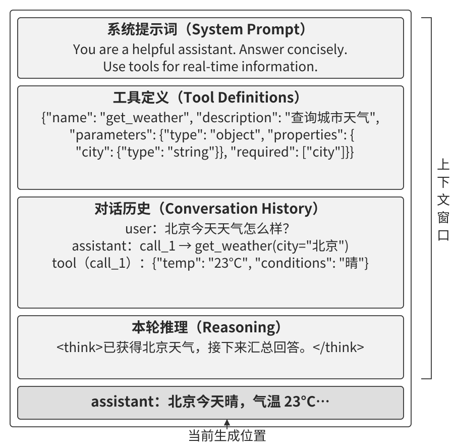

本章先从一次工具调用看消息怎样进入上下文，再讨论四个设计问题：怎样复用已处理的前缀，怎样按需加载规则与知识，怎样明确当前状态，以及怎样在长任务中压缩历史。

## 上下文：让模型掌握任务背景

想象一位经验丰富的工程师加入你的团队。他熟悉编程语言和算法，要修复产品中的问题，还需要了解项目架构、业务约定和测试方式。Agent 也有同样的信息需求。面对“帮我修复这个 bug”，它至少需要三类背景：

- **代码信息**：相关模块、核心数据结构、调用关系和团队代码规范，用于定位问题并选择修改位置。
- **流程规范**：分支策略、审查要求和验收标准，用于安排修改、测试与交付。
- **环境信息**：依赖版本、测试环境和可用权限，用于判断在哪里运行，以及怎样验证结果。

这些背景通过文档、工具观测和运行状态进入上下文。模型的通用能力由此与具体项目连接起来。实际调试时，可以先检查失败的那一步需要什么信息，再确认这条信息是否已经送入模型。

上下文工程也依赖团队的信息管理。架构决策、业务规则和操作流程写得清楚，Agent 才容易检索和使用。**对远程协作友好的团队，往往也对 Agent 友好。** Linux 内核等开源项目通过邮件讨论、代码审查和提交记录保存大量协作背景，新加入的开发者可以沿记录理解代码演变。这种可检索、可追溯的工作方式，也为 Agent 提供了学习项目的入口。

我在听翁家翌的访谈时，对他反复谈到的上下文问题印象很深：拥有共同背景，有助于人理解工作、与团队配合；模型同样需要获得任务所处的背景。[^ch2-weng] 构建 AI 原生团队，也就需要持续整理文档、维护知识，让人和 Agent 都能找到完成工作所需的信息。

ReAct 论文将这种关系写成一个简洁的形式：Agent 根据当前上下文选择动作，上下文由此前的观测与动作积累而成。[^ch2-react] 对本书的 Agent 来说，用户请求给出目标，工具结果带回事实，模型回复和调用记录保存执行过程。Harness 再将这些历史与系统提示词、工具定义一起组织为下一次请求。

因此，本章始终围绕一个问题展开：**怎样以合适的成本，让模型拿到下一步决策所需的信息？**

[^ch2-weng]: WhynotTV，《翁家翌：OpenAI，GPT，强化学习，Infra，后训练，天授，tuixue，开源，CMU，清华》，Podcast #4，[访谈视频](https://www.bilibili.com/video/BV1darmBcE4A)。

[^ch2-react]: Yao, Shunyu, et al., [ReAct: Synergizing Reasoning and Acting in Language Models](https://arxiv.org/abs/2210.03629), ICLR, 2023。

## 从一次调用看上下文怎样组织

先看由客户端保存会话的实现：Harness 在每次调用前整理消息，将下一步所需的历史随请求发给模型。使用服务端托管会话时，这项工作由服务端承担。两种实现都需要管理信息的来源、顺序和保留范围。

### 消息角色：记录信息从哪里来

消息通常带有角色标识。以配套实验采用的消息结构为例，可以区分四种角色：

| 消息角色 | 内容 | 在天气查询中的作用 |
| --- | --- | --- |
| 系统消息（system） | 开发者配置的身份、任务规则与行为要求 | 要求查询实时数据并注明单位 |
| 用户消息（user） | 用户提交的目标和补充信息 | 询问温哥华当前时间与天气 |
| 模型回复（assistant） | 模型生成的回答或工具请求 | 请求查询时间和天气 |
| 工具结果（tool） | 工具执行后的返回内容 | 提供时间、温度和天气状况 |

角色帮助服务端和模型解释信息来源。工具结果还需要与对应请求关联，才能区分“哪一次查询得到了哪条结果”。Harness 负责维护这种关联。

工具定义随请求一起提交，说明工具的名称、用途和参数。四类消息加上工具定义，对应第 1 章介绍的五类上下文信息。工具定义提供可选能力，消息记录这一次任务中的交流与执行。

### 单轮对话：从请求到回答

用户问“你能帮我做什么”时，Harness 可以将系统规则和这条问题一起发给模型。模型根据收到的信息生成回答，Harness 再把回答保存到历史中。图2-2 展示了这个过程。

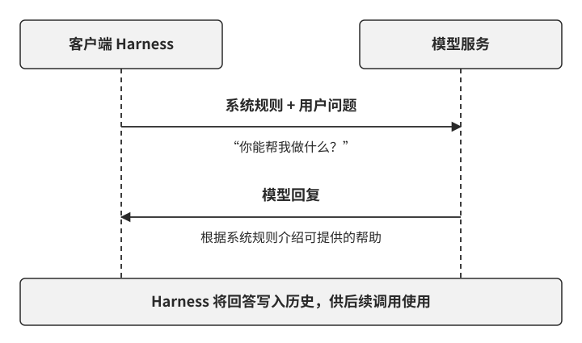

用户接着问“那先帮我查一下天气”时，上一轮对话提供了“你”和“帮我”的背景。客户端需要把相关历史带入新请求，模型才能接续对话。这样的历史管理，也是工具调用循环的基础。

### 多轮工具调用：新事实怎样进入下一次请求

现在把问题改为“温哥华现在几点，天气怎么样”。时间和天气来自外部数据，需要先查询再回答。图2-3 按两轮模型调用展示了完整过程。

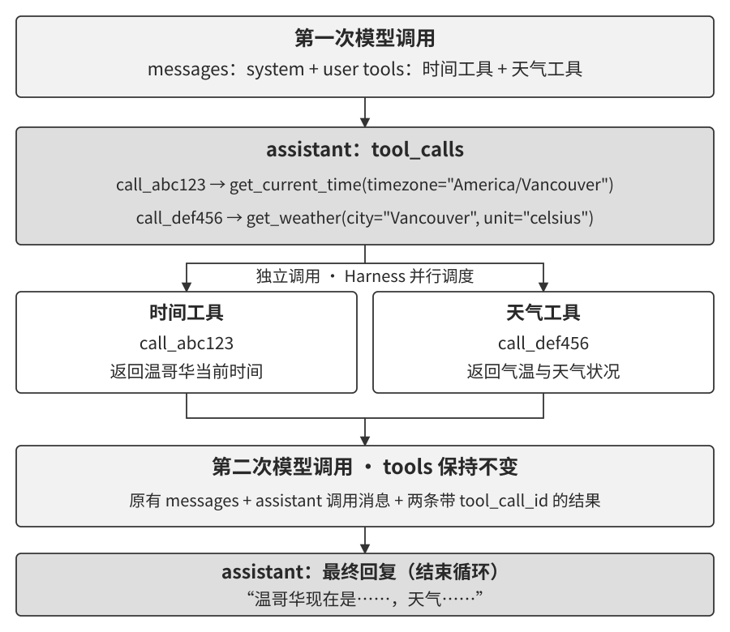

**第一轮，模型选择工具。** Harness 提交任务、系统规则，以及时间和天气工具的定义。模型生成两个请求：按温哥华时区查询时间，按城市查询天气。Harness 检查参数后调度工具执行，并保存各自的返回结果。

**第二轮，模型使用结果。** 新请求包含原来的任务和规则、上一轮提出的两个工具请求，以及对应的两条结果。模型据此组织回答，说明当地时间和天气。最终回答也写入历史，供后续对话使用。

两次工具调用的参数都能从用户问题直接确定，因此可以并行执行。如果用户问“目的地明天是否适合徒步”，而目的地还需要从行程中查询，天气查询就要等待地点确定。**工具之间的数据依赖，决定了哪些调用能并行，哪些需要下一轮继续。**

每次调用前，Harness 都要维护一份连贯的消息记录。裁剪历史时，应把工具请求与相应结果作为一组处理；执行失败时，也要记录明确的失败结果，让模型据此更换参数、补充信息或选择其他方法。

### 稳定前缀与增长的历史

回看两轮请求，系统规则和工具定义保持相同，后面增加了工具请求、执行结果和最终回答。图2-4 将它们分成两个部分：**相对稳定的前缀**与**随任务增长的历史**。

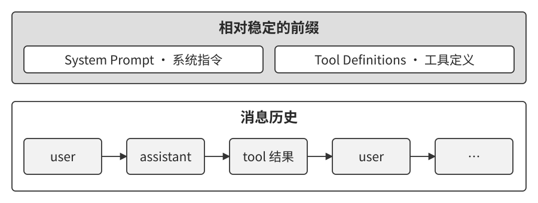

这个布局为后续设计提供了起点。规则和常用工具定义放在前部，便于复用计算；新观测和任务进展追加到后部；历史过长时，再将已完成阶段整理成摘要。当前状态也可以单独汇总，让模型直接读到尚未完成的事项。

> **实验 2-1 ★：本地 LLM 服务部署与工具调用**
>
> 同样的查询流程可以在本地运行。实验使用 Qwen3-0.6B，通过本地模型服务接收请求；客户端维护消息、检查工具参数、执行查询并回传结果。图2-5 展示了这几部分的关系。
>
> 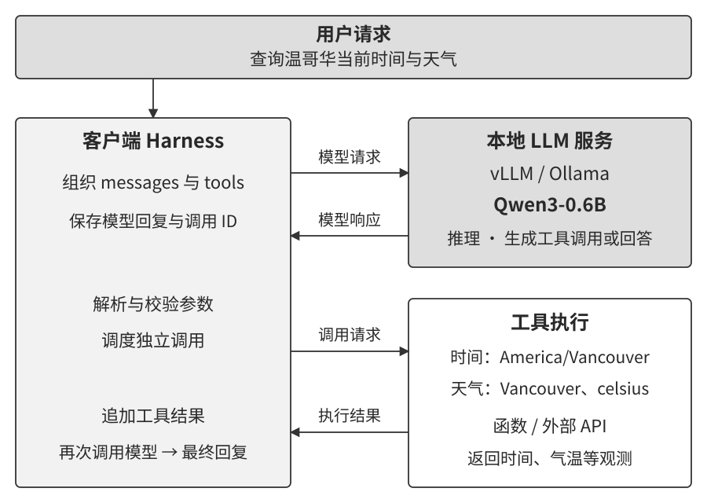
>
> 在保存的运行中，模型先请求温哥华时间和天气，客户端取得两条结果后发起第二轮调用，模型给出回答并结束任务。沿着这两轮消息，可以看到一次完整的“决策—执行—反馈”循环。
>
> 实验还可以用来比较稳定前缀与修改前缀后的响应时间。先让服务处理一段固定说明，再复用它发起请求；随后修改说明前部的内容，比较首个 token 的到达时间。记录中的五组对照，有四组在复用前缀时更快。缓存带来的收益，正是下一节要解释的问题。

## KV Cache 友好的上下文设计

在天气查询的第二轮调用中，系统规则、工具定义和用户问题都已经处理过。如果能复用这部分计算，模型就可以更快地处理新加入的工具结果。

**KV Cache** 保存模型为已有 token 计算的键和值，供后续生成使用。推理服务还可以在请求之间复用相同前缀的缓存，这通常称为 **Prompt Cache**。前者服务于连续生成，后者把复用扩展到多个请求。对上下文设计来说，共同的要求是保持待复用前缀的 token 序列一致。

以客服 Agent 为例，系统说明很长，当前时间却每轮都在变化。如果把时间写在说明开头，下一轮请求从时间处就开始不同，后面的说明也需要重新处理。将时间作为新状态追加到历史末尾，前部的说明和已有历史就有机会继续复用。**变化发生得越晚，可以保留的共同前缀越长。**

据此，可以先建立三条布局规则：

1. **稳定内容放在前部。** 系统规则和常用工具定义在同一任务中尽量保持一致；调整时，明确它解决的问题与缓存代价。
2. **新状态追加到后部。** 时间、任务进展和新观测随任务推进进入历史，供下一轮使用。
3. **保留清楚的消息结构。** 使用服务支持的角色与工具关联方式，由聊天模板转换为模型输入。

后面的注意力实验解释 KV Cache 保存了什么，聊天模板说明消息怎样变成 token，最后再看前缀变化怎样影响缓存复用。

### 注意力如何读取已有信息

处理“北京的天气怎么样”时，模型需要把不同位置的信息组合起来。注意力机制为此计算三类向量：**Query（查询）**表示当前位置要匹配什么，**Key（键）**参与匹配，**Value（值）**提供被汇总的信息。

计算分为三步：先用 Query 与各位置的 Key 计算分数，再经过缩放、掩码和 softmax 得到权重，最后按权重汇总 Value。权重决定每个位置在这一次信息汇总中的贡献。图2-6 用四个词组和一组设定权重演示这个过程。

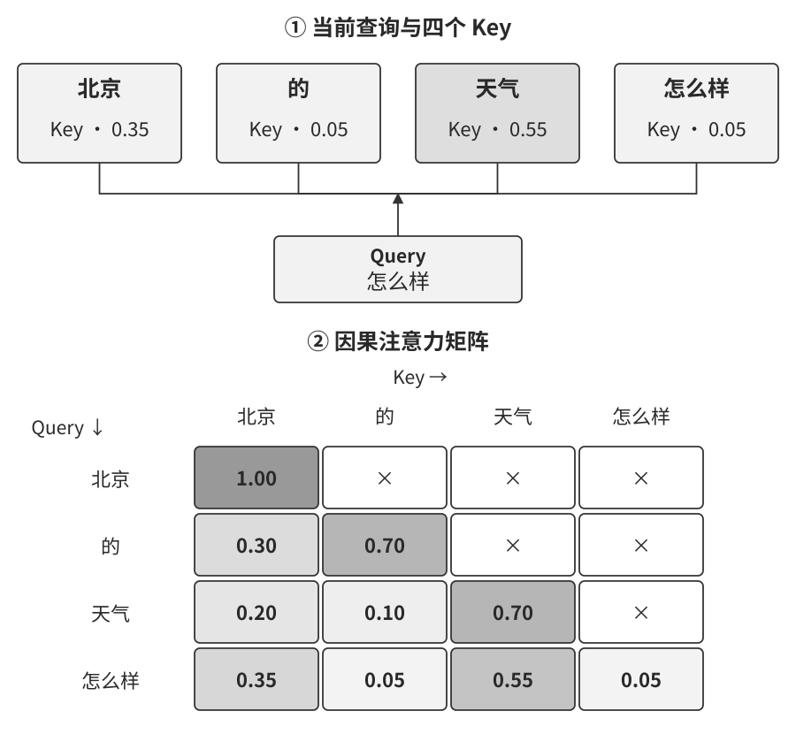

图中“天气”的权重为 0.55，“北京”为 0.35，另外两个词组各为 0.05。加权结果因此更多地包含前两者的信息。实际模型按 token 计算，同一个词可能分成多个 token；不同层和注意力头也会形成不同分布。

将每个查询位置的权重排成一行，就得到**注意力矩阵**。横轴表示被读取的位置，纵轴表示发起查询的位置。对于本章采用的因果注意力，当前位置只能读取自身和此前位置，矩阵右上角由掩码置零。

> **实验 2-2 ★：注意力机制可视化**
>
> 让本地 Qwen3-0.6B 处理“北京 的 天气 怎么样”，保存不同层的注意力权重。图2-7 从同一次运行中选取第 1、14、28 层，各层对注意力头取平均，并使用相同的灰度标尺。输入在这次分词中对应九个 token。
>
> 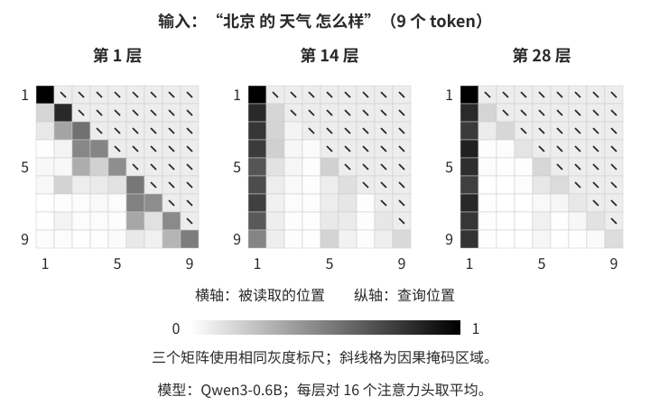
>
> 先看右上角：三个矩阵都没有读取未来位置。再沿同一列比较：后两层在首位置分配了较多权重，第 1 层的分布则更分散。这种首位置聚集与研究中所说的 **attention sink（注意力汇聚点）**现象相联系。已有研究发现，一些初始 token 即使语义作用有限，也会获得较高权重；保留这些位置有助于维持特定流式推理方案的表现。[^ch2-sink]
>
> 配套实验还保存了一道乘法题的生成过程，可以沿输入、推理文本和最终回答观察分布变化。热力图适合查看模型在各位置间如何分配权重；要判断任务是否完成，还需核对答案和执行结果。

长上下文中的信息利用还可以通过任务实验来研究。例如，《Lost in the Middle》将相关资料放在不同位置，观察问答与检索表现的变化，发现被测试模型常在资料位于开头或结尾时表现更好。[^lost-in-the-middle] 这为上下文布局提供了一个可测试的设计方向：把稳定规则放在前部，把当前任务状态放在后部，再用真实任务评估效果。

[^ch2-sink]: Xiao et al., [Efficient Streaming Language Models with Attention Sinks](https://arxiv.org/abs/2309.17453), ICLR, 2024。

[^lost-in-the-middle]: Liu et al., [Lost in the Middle: How Language Models Use Long Contexts](https://aclanthology.org/2024.tacl-1.9/), TACL, 2024。

### 聊天模板：把消息转换为模型输入

客户端保存的是带角色的消息，模型处理的是连续的 token。**聊天模板**（chat template）负责连接这两种表示：它按模型约定的格式排列消息，加入角色与边界标记，再交给分词器转换为 token。图2-8 展示了一条消息的基本组织方式。[^ch2-template]

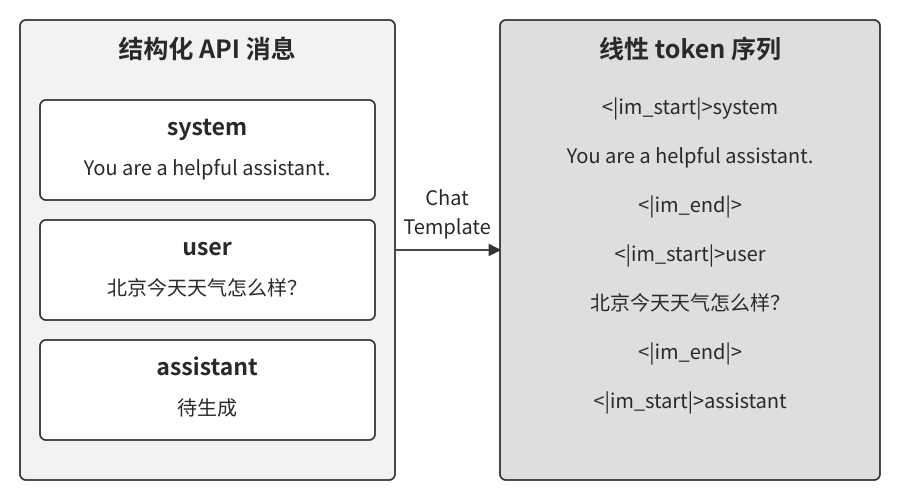

可以把模板理解为信封格式：正文写明内容，信封标明来源和边界。不同模型使用各自训练时采用的格式。本地模型服务加载相应模板，就能将客户端的消息转成模型熟悉的输入。

图2-9 把同一段对话放在两侧比较。左侧按消息角色组织，右侧按模型输入顺序排列。最后留出助手回复的起点，模型从这里继续生成。

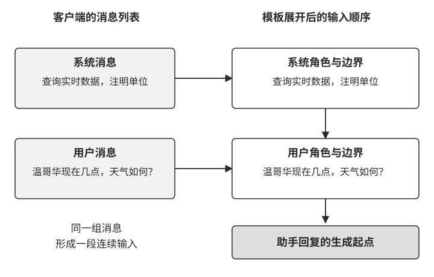

工具交互也经过这个转换。Harness 保存工具请求与结果的关联，模板将它们编码为模型可识别的结构。若把工具结果重新写成普通用户发言，消息来源就改变了，后续处理也会随之变化。保留正确的角色和关联，才能让模型接续执行。

推理模型还可能返回供下一轮续用的推理状态。模型适配层应按服务协议保存和回传这些状态，压缩历史或切换模型时也要一起处理。第 5 章将通过模型切换实验讨论这项工作。

模板同时影响缓存：系统规则、工具定义和历史最终形成一段 token 序列。缓存匹配这段实际序列的共同前缀，因此稳定的内容需要配合稳定的排列与编码方式。

[^ch2-template]: Hugging Face Transformers 文档，[Chat templates](https://huggingface.co/docs/transformers/chat_templating)。

### KV Cache 的原理与约束

设模型已经处理了四个 token：A、B、C、D。D 位置的 Query 读取这四个位置的 Key 和 Value，得到用于预测下一个 token E 的表示。E 被选出并送回模型后，模型计算 E 自身的 Key 和 Value，将它们追加到缓存，再用新的 Query 预测后续 token。[^ch2-cache]

**KV Cache 将已计算的键和值留在各层，供后续位置直接读取。** 因果注意力使历史位置的表示保持稳定：追加 E 会增加一个新位置，A 到 D 的计算结果可以继续使用。在全注意力解码中，新位置仍需读取已有缓存，因此上下文越长，读取的数据越多。缓存容量和访问带宽由此成为长上下文推理的重要成本。

同样的复用可以扩展到下一次请求。图2-10 比较了两个相近请求：相同的前缀读取缓存，新增部分继续计算。

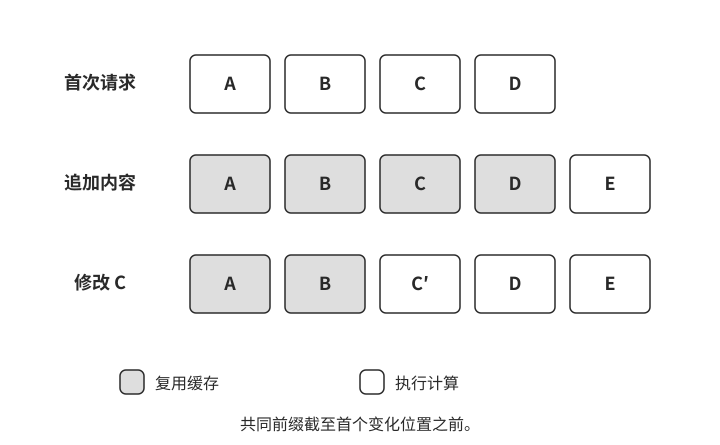

如果把 C 改为另一个 token，A、B 的计算结果仍然有效；C 及其后的表示需要重新计算，因为后续层已经将前文信息融入各位置。常规前缀缓存据此匹配到首个变化位置。改动越靠后，可复用的前缀越长。

这也解释了系统规则与动态状态分开安排的价值。修改业务规则时，系统应使用新规则并承担相应的重算；更新当前时间时，将新状态追加到末尾，就能保留更多已有计算。

[^ch2-cache]: Hugging Face Transformers 文档，[How caching works](https://huggingface.co/docs/transformers/main/en/cache_explanation)。

> **实验 2-3 ★★：常见的错误上下文管理模式**
>
> 让 Agent 完成同一项代码查找任务，分别改变上下文的组织方式：保持稳定前缀、更新系统提示词、更新用户配置、重排工具、滑动保留历史，以及把消息改写成普通文本。比较每种方式时，同时查看缓存用量、响应时间和任务进展。
>
> 在保存的 Kimi 运行中，稳定前缀、两种动态信息、工具重排和文本改写都完成了任务；滑动窗口组反复查找文件，最终达到轮数上限。沿记录回看，可以发现查找结果随着窗口移动而丢失，下一轮又从同一步开始。
>
> 缓存数据提供了另一条观察线索：稳定前缀组累计命中 768 个输入 token，工具重排组为 256 个。两种动态信息组也记录了缓存命中。实际收益应结合变动位置、共同前缀长度和服务端缓存记录判断。
>
> 这组对照给出两个检查入口。第一，查看相邻请求从哪里开始不同，定位可复用前缀缩短的原因。第二，检查裁剪后还保留哪些任务事实，尤其是已经取得的结果、尝试过的方法和未完成事项。维护上下文时，把成本与任务连续性放在一起评估。

### 将缓存纳入系统设计

跨请求复用还取决于服务是否保留了相应缓存、请求是否路由到可访问缓存的位置，以及模型和相关配置是否兼容。工程上可以同时记录缓存命中的输入量、首 token 延迟和费用，判断稳定前缀带来了多少收益。

缓存收益会影响上下文的组织方式。设计时可以沿着一条请求检查：哪些内容由所有任务共享，哪些只属于当前会话，哪些每轮都在变化？

**把变化频率相近的信息放在一起。** 通用规则和常用工具定义放在前部，会话要求与动态状态放在后部。例如，三项二值配置最多产生八种组合；如果它们都出现在开头，后面的相同内容也会分散到不同前缀中。将共同内容提前，有助于扩大可复用范围。

**明确子任务继承哪些信息。** 子 Agent 若使用相同模型、兼容配置并继承父任务的完整前缀，可以尝试复用这段计算。独立子任务也可以只接收必要背景，以较短的上下文开始工作。选择取决于任务的信息需求与实际调用成本。

**保存已经提交的摘要。** 将长工具结果整理成摘要后，把这份摘要随会话持久化。后续调用继续使用同一文本，恢复会话时也加载原版本，减少重新生成措辞造成的前缀变化。

**把推理状态的续用条件纳入历史管理。** Claude 的 preserved thinking 机制会检查推理块对应的前缀；在启用该检查的接口中，修改先前的系统规则、工具或消息，会使相关推理块失效。追加新消息能保持原有前缀，历史压缩则应通过兼容的整理方式建立新的上下文起点。[^ch2-preserved-thinking]

这些选择共同影响任务质量、延迟和费用。系统需要在更新规则、整理历史和复用计算之间作出明确取舍，并通过运行数据验证。

[^ch2-preserved-thinking]: Anthropic，[Preserved thinking](https://platform.claude.com/docs/en/build-with-claude/preserved-thinking)，Claude API 文档。

> **延伸阅读：把 KV Cache 看作可编辑、可组合的笔记**
>
> 我在一项研究中考察了前缀缓存的另一种用法：把预填充产生的状态看成模型留下的“笔记”。一个字段的影响会传播到后续位置，因此局部修改字段时，需要让已经形成的结论一起更新。[^ch2-2]
>
> 研究沿两个方向展开：编辑通过修正信息或推理过程更新结论；组合通过位置重定位复用预先计算的技能缓存。它们将评估问题具体化为：哪些状态可以保留，哪些需要更新，输出与完整重算能保持多大程度的一致。对 Agent 来说，这为频繁更新记忆、加载技能时复用计算提供了新的研究方向。

[^ch2-2]: Li, Bojie, [Models Take Notes at Prefill: KV Cache Can Be Editable and Composable](https://arxiv.org/abs/2606.17107), 2026。

### 从缓存布局到内容组织

知道了信息怎样进入模型和复用计算，接下来就要决定放什么内容。

- **提示词与 Skills**提供规则、方法和领域知识。通用规则保持稳定，专项内容按需加载；外部材料进入上下文时保留来源边界。
- **Agent 状态栏**汇总时间、进度、调用计数和环境观测，让模型直接获得当前情况。
- **上下文压缩**整理逐渐增长的历史，保留后续决策需要的事实与约束。

下面依次展开这三类设计。

## 提示工程：把任务要求写清楚

**提示工程**（prompt engineering）通过指令、示例和材料组织，引导模型完成任务。本节重点讨论系统提示词：它像一份工作手册，交代 Agent 的职责、业务规则、执行流程和交付标准。一个实用的检验方法是，请熟悉业务但刚接触这项任务的人阅读，看看他能否判断下一步该做什么。

### 语气与风格：让表达符合服务场景

账单客服需要清楚、克制，教学助手需要耐心解释，创作助手则可以更活泼。提示词应把这些要求写成可执行的表达习惯。例如：“先说明处理结果，再给出下一步；遇到等待，说明正在等待什么。”

篇幅要求也应服务于沟通。进度通知可以只有一两句，费用争议则需要交代计算依据。可以为典型场景各提供一个范例，让模型同时看到语气、信息量和段落结构。

### 结构化提示：让规则容易查找

当提示词同时包含身份、流程、费用和工具要求时，用标题分组可以帮助定位。每组围绕一个问题展开：身份说明服务范围，流程说明执行顺序，费用规则说明计算口径，工具要求说明参数与调用条件。

Markdown 适合表达标题、列表和步骤；XML 等带标签的格式便于标明材料边界。选择格式时，应让层次清楚、名称一致，并便于程序维护。实际效果可以用同一批任务比较，重点检查规则是否被正确应用。

### 按流程组织规则

一份包含上百条零散规则的手册，会让读者反复查找当前该用哪一条。把规则安排到执行阶段，就能同时交代顺序和异常分支。

以文件处理为例，可以依次安排五步：确认文件可访问，识别文件类型，完成必要的备份或预处理，执行修改，验证产物。每一步都说明进入条件、完成标准和失败后的去向。读取失败时先解决访问问题；验证失败时回到修改环节。模型由此获得清楚的任务进度和下一步选择。

涉及权限、备份和发布的强制要求，还应由 Harness 与工具执行检查。提示词帮助模型规划，程序将业务要求落实到实际操作中。

### 业务规则：把判断口径落实到具体情形

在生产系统中，许多看起来像模型不稳定的问题，源于业务定义含糊。以帮用户打电话处理账单的 Agent 为例，团队需要同时明确服务方式和计费方式。可以考虑三类方案：

- **按节省金额提成**：对谈判降低现有账单的任务，按约定比例收取佣金。
- **固定服务费**：对预订、退款申请或取消订阅等任务，按服务内容收取费用。
- **特殊任务预收费**：对成本较高、结果不确定的任务，事先说明费用、退款条件和服务范围，由用户确认。

接下来要处理边界情形。“退掉上个月买的衣服”是在取回已付款项，“取消订阅”是在停止后续服务，“降低本月账单”才对应现有支出的减少。如果三者都笼统归入“省钱”，同一任务就容易被分配到不同计费模式。

产品负责人需要给出明确口径：哪些任务适用提成，哪些收取固定费用；节省金额以哪张账单为基准；费用何时产生，按什么单位计算，如何舍入；退款与取消分别满足哪些条件。工程实现将这些规则写入提示词、计费程序和验收用例。对于金额计算，由工具依据同一规则计算，再让模型解释结果。

在我的业务实践中，产品经理、运营和工程师需要共同维护这份规则。产品定义服务承诺，运营提供真实争议和边界案例，工程负责将规则落到系统。线上出现分歧时，先定位缺少哪条定义，再补充例子和检查，逐步形成稳定的业务行为。

### Few-shot 示例：展示期望的做法

当要求涉及语气、格式或细微的分类边界时，可以给模型几组输入与输出示例，这称为 **few-shot 提示**。例如，分别展示账单降价、退款申请和取消订阅的分类结果，并说明判断依据。示例把抽象规则变成可对照的具体情形。

挑选时优先覆盖容易混淆的情况。可以先用少量示例运行一批任务，检查哪些错误减少了，哪些仍然存在，再决定增补或修改。固定示例可放在稳定前缀中；按任务检索的示例可在共同规则之后加载，同时评估增加的信息是否值得相应的上下文成本。

### 工具定义：说明能力与使用条件

工具定义是模型选择行动时使用的操作说明。名称应表达用途，描述应交代适用条件，参数应说明含义、单位和取值范围。对于日期、金额、时区等容易混淆的字段，可以加入一个简短示例。

工具之间的关系也需要写清楚。例如，修改订单前先查询当前状态，提交退款时使用已核实的订单标识。描述说明业务前提，运行系统检查前提是否满足。第 4 章将进一步讨论接口设计与校验。

工具数量增多后，可以先提供目录与搜索入口，再在选中工具后加载完整定义。加载位置由接口和 Harness 的实现决定；采用追加式加载时，已提交的定义保留在原位置，后续消息继续追加。这样既保留工具的使用依据，也便于复用已有前缀。后面的 Skills 将用同样的按需加载思路组织领域知识。

> **实验 2-4 ★★：提示工程的消融实验**
>
> 在航空客服任务中，分别改变语气、规则组织和工具描述，看看 Agent 的行为怎样变化。实验基于 τ-bench，选取相同的十项任务，设置六组条件：完整基线、夸张语气、轻松语气、打乱规则组织、移除工具描述，以及组合修改。每组使用相同的模型与用户模拟方式。
>
> 这次 Kimi 运行中，六组分别完成了 7、6、9、8、9、8 项任务。保留函数与参数结构、移除描述的组也完成了九项，说明在这些任务中，模型能够利用其余信息选择工具。
>
> 阅读记录时，可以从失败步骤寻找改进方向：哪条业务规则被漏用，哪个参数被误解，哪次交流没有补齐必要信息？再围绕这些问题修改提示词，用更多任务和重复运行检查效果。**提示词的组织方式需要通过任务表现检验。**

### 提示注入：保持指令与外部材料的边界

Agent 会读取网页、邮件和文档，其中的文本由外部来源提供。**提示注入**（prompt injection）试图让模型把这些材料中的指令当作应当执行的要求，从而偏离用户任务。对于能调用工具的 Agent，这种偏离还可能影响文件、消息和业务数据。

以网页摘要为例，用户授权的是阅读与总结。网页中提出的其他操作要求，应继续作为网页内容处理。Harness 可以从三个方面维持这条边界：

- **保留来源。** 标明材料来自哪份文档、哪个网页或哪次工具调用，让模型能够区分任务要求与待处理内容。
- **保持消息结构。** 按接口约定保存用户要求、模型请求和工具结果，避免在整理历史时抹去来源与关联。
- **检查实际行动。** 工具调用按真实用户身份、授权范围和业务规则校验，高风险操作通过独立审核或人工确认。

Skills 与状态栏也需要来源管理。团队审核并发布的 Skill 可以提供工作指导；外部材料中的片段则保留为资料。状态栏中的计数和执行状态由可信运行记录产生，摘要中引用的外部事实保留出处。这样，信息在整理和转存后仍能追溯其来源。

上下文中的来源标记与执行层的权限检查共同工作。第 3 章讨论检索材料的处理，第 4、5 章进一步说明工具权限、隔离环境和产物验证。

> **实验 2-5 ★★：提示注入攻防实验**
>
> 这个实验考察外部材料与用户任务冲突时，系统能否维持既定的授权范围。场景覆盖当前输入、工具读取的材料，以及跨轮次保存的信息；分别比较提示词提醒、来源标记和执行确认等机制。
>
> 观察时，把回答与实际行动分开记录：模型是否继续完成原任务，是否提出了超出授权的调用，这些调用是否被运行系统拦截，正常任务是否受到影响。由此可以定位每项防护在哪一步起作用，再组合成完整的处理流程。

## 动态提示词与 Agent Skills

一个 Agent 既处理账单，又整理文档，还制作演示文稿，各项任务需要的操作说明会越来越多。如果每次查询天气都带上整套幻灯片制作指南，就要反复处理大量无关内容。**按需加载**可以让信息随任务进入上下文。

Agent Skills 将专项指令和辅助资源组织为可独立维护的能力包。每个 Skill 提供名称、简短描述和核心流程，还可以附带参考资料、模板与脚本。运行时先提供目录，选中后加载正文，执行中再读取相关细则。这种分层加载称为**渐进式披露**（progressive disclosure）。[^ch2-3]

### 从目录到具体做法

以制作演示文稿为例，图2-11 展示了三个加载阶段。

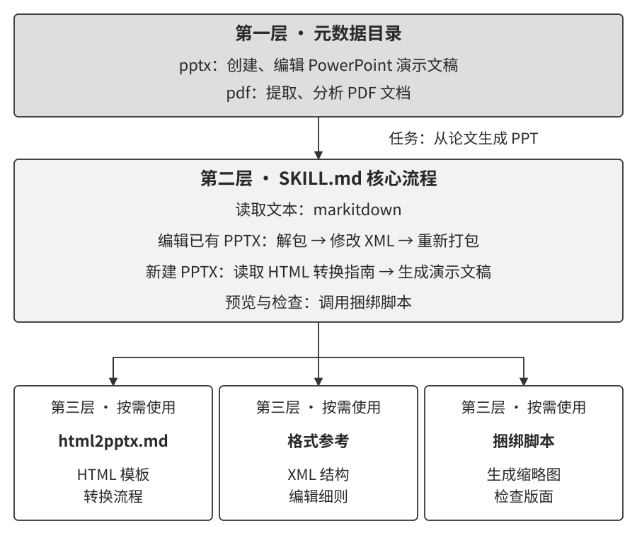

**目录帮助选择。** 模型先看到简短描述，例如“根据材料创建或修改演示文稿，并检查最终版式”。描述应交代适用任务，让模型能在文档处理、表格分析和演示文稿制作之间作出选择。

**核心流程指导执行。** 用户要求把论文做成演示文稿时，Harness 加载相应 Skill。核心流程可以依次要求阅读论文、确定讲述主线、安排页面、制作内容、渲染检查。模型由此知道怎样推进，以及用什么标准判断完成。

**参考资料补充细节。** 处理图表时读取图表规范，编辑现有文件时读取格式说明，检查页面时使用配套预览工具。资源随当前步骤加载，主流程保持简洁。

用户也可以显式指定某项 Skill。Harness 根据请求加载相应内容，模型随后沿核心流程执行。两种触发方式都把专业指导送到需要它的任务中。

[^ch2-3]: Agent Skills，[Agent Skills Overview](https://agentskills.io/home)。

### 将经验写成可执行的 Skill

一份可用的 Skill 应让刚接触任务的人知道四件事：何时使用，按什么顺序行动，哪些情况需要确认，什么结果算完成。

可以从一个真实任务开始整理。先写目标与读者，再写关键步骤，为容易出错的地方配上例子，最后列出验证方式。制作演示文稿时，“文字简洁”可以具体化为每页围绕一个结论，图表标明单位，渲染后检查遮挡和字号；这些要求都能在产物中逐项查看。

写作型 Skill 则可以从作者满意的几篇文章出发。归纳用词、句式、段落与语气，形成简短初版，再让它处理一个新题目。作者逐句改稿后，将反复出现的修改整理回规则：哪些长句需要拆开，哪些判断需要案例支撑，哪些表达应直接说清。保留修改前后的例子，下一轮就有了具体参照。宝玉关于写作 Skill 的讨论也强调了从个人范文提炼风格的方法。[^ch2-baoyu-remove-ai-writing-flavor]

每次更新都要用新任务验证。能够稳定改善结果的经验进入核心流程，偶尔用到的细节进入参考资料，确定性的操作可以封装成脚本。Skill 由此逐步积累为团队可维护的工作方法，并通过版本记录保留每次调整的依据。

[^ch2-baoyu-remove-ai-writing-flavor]: 宝玉，[《别再用提示词去 AI 味了，方向就是错的》](https://baoyu.io/blog/2026-02-14/remove-ai-writing-flavor)，2026。

### Skills 怎样进入上下文

图2-12 沿一次任务展示加载顺序：开始时提供目录，模型选择演示文稿 Skill，Harness 加入核心流程，执行到具体步骤时再补入参考资料与工具结果。

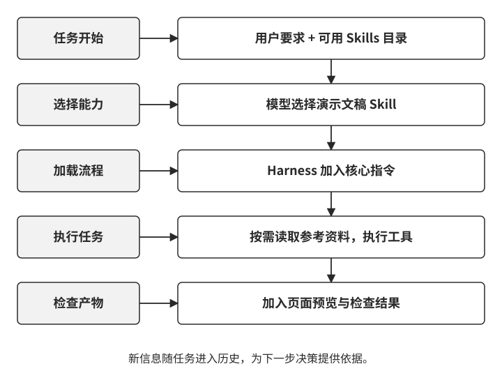

正文以哪种消息形式进入模型，由运行时负责。例如，Claude Code 在 Skill 调用位置将指令作为会话消息加入历史。[^ch2-cc-skill-inject] 采用读取工具的实现，则可以通过工具结果返回内容。设计 Harness 时，应保留资源来源和版本，使后续调用能够沿同一份指导继续工作。

图2-13 进一步展示追加式加载怎样配合缓存。目录先进入请求，核心流程在被选中后加入，参考资料再随执行追加。每次新增内容需要处理；此后的请求可以复用保持不变的前缀。已经加载的内容保留在历史中的原位置，后面的消息继续增长。

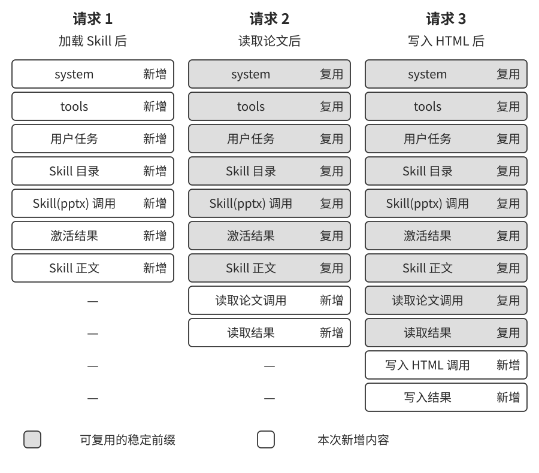

这种组织方式把专项内容的首次处理推迟到实际使用时。评估时可以检查三个量：目录本身占用多少上下文，每项任务加载了多少正文，以及这些内容对任务成功率和耗时产生了什么影响。

[^ch2-cc-skill-inject]: Claude Code 文档，[How Claude Code uses prompt caching](https://code.claude.com/docs/en/prompt-caching)，Invoking skills and commands。

### Skills 与工具怎样配合

Skill 提供做事的方法，工具执行具体操作。制作演示文稿时，Skill 说明怎样组织叙事和检查版式，读取工具取得论文内容，代码工具生成文件，渲染工具提供页面预览。

一组通用工具可以支撑多项 Skill。例如，文件读取、代码执行和图片查看，既能用于演示文稿，也能用于报告与数据分析。涉及支付、发布等业务操作时，仍由专用接口落实权限和流程要求。第 4 章讨论这些工具如何设计，第 9 章进一步讨论运行经验如何进入指令、知识和程序。

> **实验 2-6 ★★：使用 Agent Skills 从论文生成演示文稿**
>
> 选择一篇论文，要求 Agent 生成包含问题背景、方法、关键结果和结论的演示文稿。先看它如何根据目录选中 PPTX Skill，再看核心流程、制作指南和预览工具分别在什么步骤被使用。
>
> 配套的一次 Kimi Code 运行使用 Anthropic 的 PPTX Skill，生成了 13 页演示文稿。运行记录包括核心指令和制作指南的加载、文件生成及缩略图检查。阅读时可以沿着“加载指导—执行操作—查看产物”追踪，每一步新增了哪些信息，又促成了什么行动。
>
> 检查最终产物时，将论文与幻灯片并排查看：主要结论是否保留，图表与文字是否一致，来源是否明确，页面是否清晰。加载流程与产物质量共同构成这项实验的观察对象。

> **实验 2-7 ★★：从个人范文创建写作 Skill**
>
> 准备三到五篇原创文章，从中整理表达偏好，生成一份包含适用任务、核心规则和示例的写作 Skill。选一个新题目起草文章，由作者逐句修改，再把重复出现的修改归纳回 Skill。
>
> 第二轮换一个题目，观察前一轮的问题是否减少，以及规则是否影响了应当保留的个人表达。通过“范文—试写—改稿—更新”的循环，将写作经验转成可以反复使用和检验的指导。

## Agent 状态栏：把当前进展提供给模型

Skills 提供做事的方法，长任务还需要一份随执行更新的进度记录：已经尝试了什么，取得了哪些结果，当前还允许哪些操作？Harness 将这些信息整理为简短的状态摘要，放入模型本轮的上下文，这就是 **Agent 状态栏**（Agent status bar）。图2-14 展示了状态从执行记录进入决策的过程。

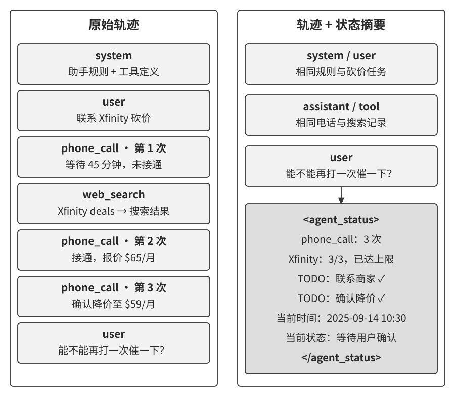

手机状态栏让人直接看到时间、电量和网络情况，Agent 状态栏也提供类似的入口。例如，“已联系商家三次”“退款仍在等待”“还需确认到账”，让模型迅速掌握当前情况。

### 从原始记录到明确状态

考虑账单客服的一个约束：同一项任务最多给同一商家拨打三次电话。原始轨迹中既有通话记录，也有搜索结果和用户消息。模型每次决定是否继续拨号，都要找到此前的通话并判断次数。

Harness 可以在工具执行后更新计数，并在下一轮提供“该商家已拨打三次，次数达到上限”。统计结果随执行维护，模型可以直接据此选择等待、改用其他渠道或向用户说明进展。调用次数上限同时由执行层检查，形成从状态展示到实际操作的闭环。

这项设计把多次决策都会用到的信息提前算好。通话次数、剩余预算和待办状态适合由程序维护；任务摘要可由模型提取，再与工具记录核对。我的上下文蒸馏研究也沿着这一方向，考察将分散记录整理为可直接使用的状态，怎样影响推理效率与任务表现。[^ch2-8]

[^ch2-8]: Li, Bojie and Noah Shi, [Distill, Don’t Retrieve: Inference-Time Context Distillation for LLM Agent Reasoning](https://01.me/research/context-distillation/), 2026。

> **实验 2-8 ★★：观察状态栏怎样影响后续决策**
>
> 给本地 Qwen3-0.6B 一段客服历史，其中已有三次联系 Xfinity 的电话记录，并穿插搜索结果。随后用户要求再打一次电话。一组只提供原有历史，另一组在末尾补入“已拨打三次，达到上限”的状态摘要。
>
> 两组各运行三次。带状态栏的三次都明确表示停止拨号；原有历史组两次明确停止，另一次输出未形成明确判断。六次生成均未提出再次拨号的请求。
>
> 配套热图可以用来查看生成时读取了哪些位置，行为记录则用来检查模型如何处理次数限制。改变历史长度、干扰信息和任务要求后，继续比较判断是否明确、事实是否准确，以及产生判断需要多少计算。

### 状态栏应保存什么

状态栏可以从三类信息开始设计。

**任务进度**记录原始目标、已完成步骤、当前步骤和待办事项。对于退款任务，可以分别标出申请已提交、商家已确认、到账待核实。每项状态都要有明确的更新条件，避免把“提交成功”提前写成“退款完成”。

**事件信息**说明事情何时发生、来自哪里、关联哪个对象。通话时间随通话记录保存，查询时间随数据返回保存；模型由此区分旧进展和新变化。

**环境与执行状态**提供当前时间、可用资源、调用次数及最近错误。一次读取失败后，状态可以保留失败对象、原因和已尝试的处理方法，帮助模型选择下一条路径。

选择字段时，从下一步决策倒推：如果知道这条信息，会改变什么行动？优先保留答案明确的字段，并为每个字段确定可信来源。

### 将最新状态加入上下文

图2-15 展示一种直接的组织方式：稳定规则在前，任务历史居中，最新状态位于本轮输入末尾。状态由 Harness 生成，消息角色与包装方式采用模型服务支持的协议，内容中标明来源和更新时间。

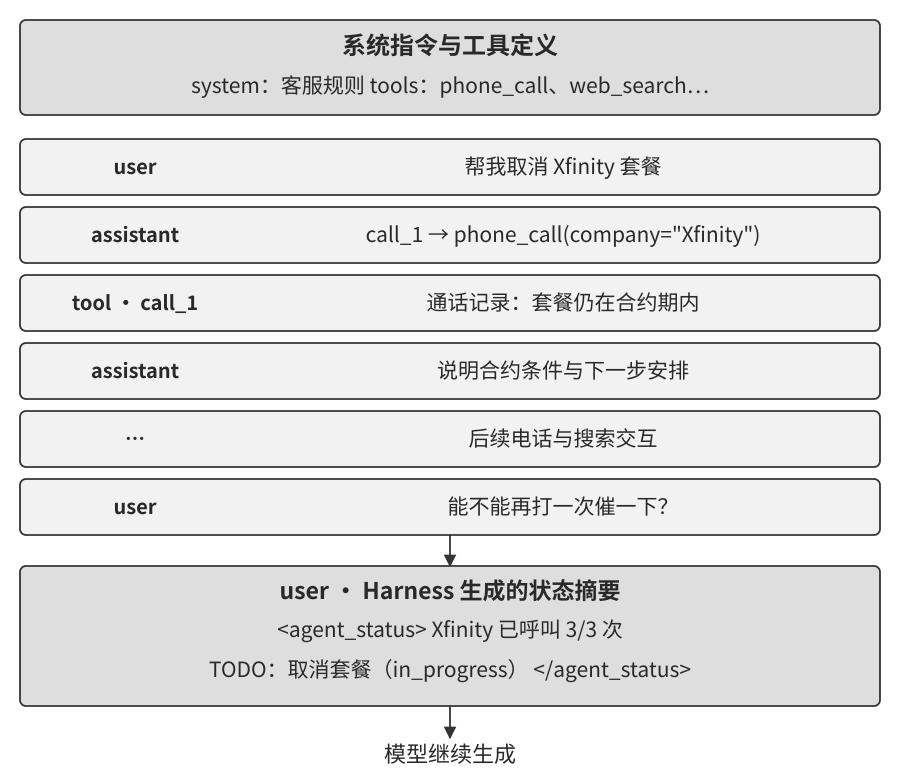

例如，用户询问退款进展时，本轮状态可以写明：三次通话已完成，商家仍在处理中，下一项是核实到账。模型同时获得历史依据与当前摘要，能够据此组织回答。

首次追加状态保留了已有前缀。下一轮状态变化后，系统还需要决定怎样处理旧版本，这会影响缓存与上下文长度。

### 替换与追加的取舍

**替换旧状态**：移除上一份摘要，再加入最新版。上下文中保留一份当前状态，体积较小；旧状态所在位置之后的共同前缀会发生变化，需要重新处理相关后缀。

**保留历史并追加**：原有状态留在历史中，末尾加入新版，并标明时间或版本。前缀继续保持稳定，旧状态则逐步增加上下文占用。模型需要根据版本识别当前有效状态。

可以用三个量比较这两种方式：一份状态有多长，两次更新之间产生了多少消息，任务预计还要更新多少次。状态短、两次更新间的历史较长时，追加更有利于复用；状态大且频繁变化时，替换有助于控制长度。最终选择还要结合服务的缓存计费、推理状态续用条件和实际任务表现。

> **实验 2-9 ★★：比较不同的状态提示**
>
> 配套实验提供五类提示：事件时间、工具计数、待办列表、详细错误和系统环境。逐项启用后，比较 Agent 在对应任务中的选择，再观察组合使用的效果。
>
> 时间帮助区分新旧事件，计数显示重复尝试，待办列表保存子任务，错误信息提供修复线索，环境信息说明当前运行条件。例如，文件读取失败后，明确的错误原因和已尝试次数可以帮助模型判断是修正位置、检查访问条件，还是向用户补充询问。
>
> 固定运行中，每类对照包含五项任务。时间提示组完成五项，未提供提示的组完成三项；工具计数组两侧均完成五项。详细错误组完成四项，对照组完成五项；待办组也出现了未完成产物的情况。这些结果提示我们沿具体失败步骤检查：新增状态是否准确，是否被使用，以及后续操作是否真正完成。
>
> 组合提示组完成五项，对照组完成三项。继续迭代时，可以从组合组改善的任务出发，定位哪条状态补齐了决策所需的信息，再用重复运行验证。

### 维护状态的来源与有效期

计数、时间和执行状态优先取自运行记录。模型提取的摘要应保留依据，外部材料中的事实附上来源，避免在整理过程中变成未经核实的系统结论。

状态还需要明确有效期。退款已提交可以保留为历史事实，账户余额、服务状态和可用额度则要随查询更新。恢复长任务时，先核实可能变化的字段，再继续执行。

原始记录提供进一步核查的入口。状态栏只保留当前选定的维度，后续问题可能需要通话内容或计算依据，因此可以将原始材料归档并按需读取。下面讨论怎样进一步整理增长的历史，在保留任务依据的同时控制上下文。

## 上下文压缩策略

提示工程组织规则，Skills 按需提供知识，状态栏汇总当前进展。随着任务推进，搜索页面、工具结果和对话历史还会持续积累。**上下文压缩负责把这些材料整理成下一步决策所需的信息**，为后续工作留出空间。

### 从原始记录到可用结论

先看一个简单的例子。宠物店的巡查记录写着：

> 笼子 1：黑猫。笼子 2：白猫。笼子 3：黑猫。笼子 4：黑猫。笼子 5：白猫。

如果后续任务是准备猫粮，可以把记录汇总成“共 5 只猫，其中黑猫 3 只、白猫 2 只”。如果任务是安排逐笼检查，就需要保留每个笼子与猫的对应关系。两种表示服务于不同的后续操作。**压缩的第一步，是确定接下来还要用这些信息做什么。**

统计结果可以由程序计算，重复内容可以按规则去除，跨页面的事实可以交给模型归纳。把已经得到的结论整理好，后续决策就能直接使用，重复检索与计算的开销也随之减少。

研究任务同样如此。十几次搜索之后，一份按人物组织的进展表，可以同时说明已经查到的职业信息、对应来源和待核实的问题。它把散落在历史中的材料转化为清晰的工作状态。来源之间存在分歧时，表中应分别记录各自的说法与时间，后续搜索才能有明确目标。

压缩也要满足运行预算。上下文窗口需要容纳当前输入、接下来的模型输出和工具返回；调用费用与处理时间则取决于输入规模、缓存和服务计费方式。Harness 可以结合剩余预算与任务阶段安排整理：一个子问题完成后归档结论，下一轮预计返回大量材料时提前腾出空间。

随着历史增长，关键信息还可能变得难以利用，例如遗漏早先的约束、重复已经完成的步骤。这类质量退化常被称为**上下文腐化**（context rot）。整理后的摘要应通过继续执行任务来检验：约束能否得到遵守，事实能否找到来源，下一步能否接上已有进展。

### 压缩的位置与缓存代价

客户端压缩通常发生在两次模型调用之间。Harness 保存原始记录，整理需要替换的历史，再用新的消息序列发起下一次请求。图2-16 展示了这种上下文重组：稳定规则继续位于前部，已完成阶段转成摘要，当前步骤保留所需细节。

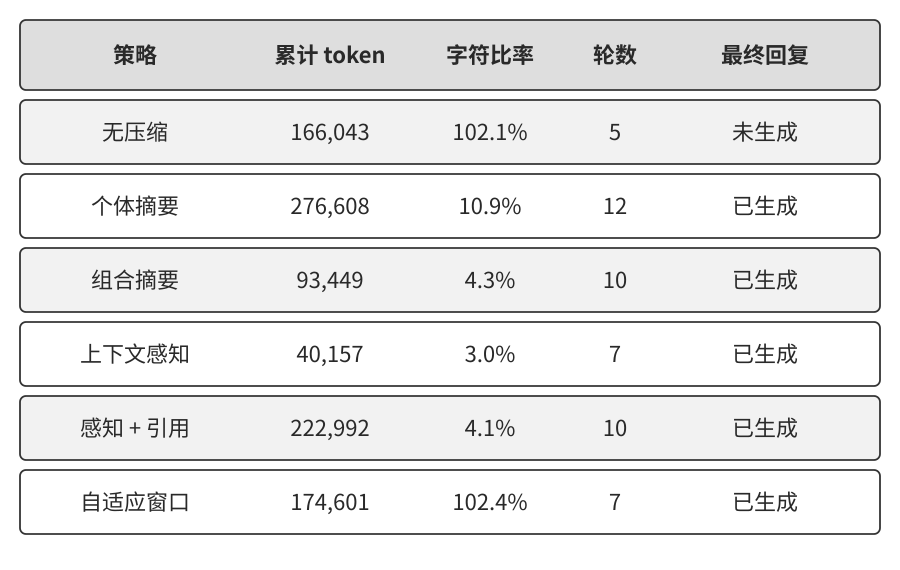

前缀缓存可以复用首次修改位置之前的内容；从修改处开始，后续内容需要重新处理。把稳定规则放在前部，有助于保留这部分缓存。把旧历史整理成摘要，则减少了后续每轮需要处理的内容。选择压缩时机时，要一起考虑这次重建的开销、后续预计轮数和腾出的空间。

一段搜索结果刚进入上下文，模型可能还需要逐项比对，适合保留细节；一个研究阶段结束后，已确认的结论可以合并归档。按阶段整理，也便于把摘要检查纳入任务流程。

压缩后的消息还要符合所用接口的要求。工具请求与返回应保持有效的关联；推理状态的保留和续用遵循运行时协议。对于绑定前缀的推理状态，可以通过兼容的服务端整理能力续接，或以任务摘要建立新的推理起点。[^ch2-preserved-thinking]

> **实验 2-10 ★★★：上下文压缩策略对比**
>
> 用“调研 OpenAI 联合创始人的职业状态”练习压缩设计。先明确调查截止日期，再围绕人员名单、职业变动和来源时间逐步搜索。随着页面积累，比较六种组织材料的方法。
>
> **无压缩**保留全部原文，作为比较起点。**逐页摘要**分别提炼每个页面，再把摘要放入上下文，便于保留各页的来源关系。**合并摘要**先汇集页面，再生成综合说明，便于合并重复事实和组织跨页线索。
>
> **任务感知摘要**进一步加入当前问题与已有进展。例如，任务关注职业归属，就优先保留任职机构、职位、变动时间与待确认事项。**带引用的任务感知摘要**把每条结论连到对应来源，方便后续核查。**窗口化压缩**让新返回的材料先以原文进入历史，达到预算阈值时再批量整理工具结果。
>
> 图2-17 概括了六种处理流程。逐页与合并决定材料怎样组织，任务感知决定摘要关注什么，引用决定如何追溯，窗口化决定何时整理。这些选择可以组合使用。
>
> 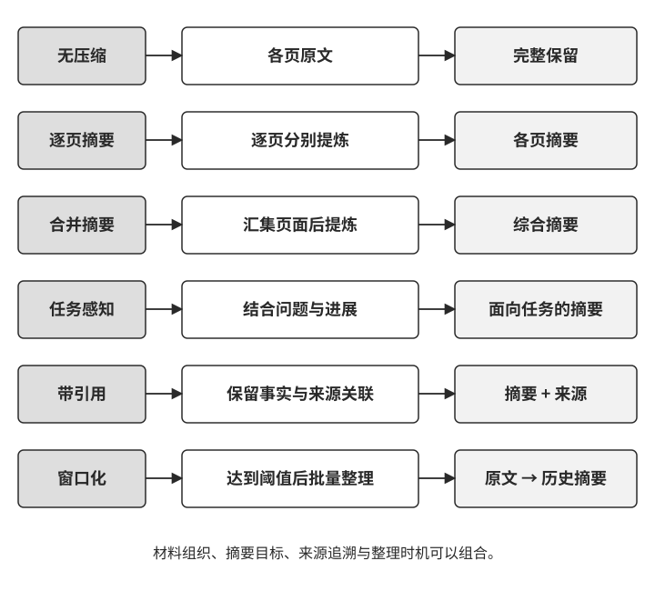
>
> 比较时，先使用同一批页面检查摘要是否保留姓名、机构、时间和来源，再让 Agent 接着完成调研。重点查看遗漏了哪些事实、是否重复搜索、追问时能否找到依据，同时记录摘要生成与后续调用的总开销。这样就能把材料整理质量与任务推进效果联系起来。

### 按信息生命周期安排整理

在一个完整系统中，可以把上下文管理安排在几个位置。

**工具返回时控制体积。** 对长页面和大文件，保存完整内容，同时向模型提供与任务相关的片段或概览。概览附带可定位到原文的引用，模型需要细节时再读取。网页导航、重复页脚等内容可以在进入上下文前清理。

**子问题完成时归档结论。** 一轮调研结束后，记录已确认的事实、证据和待解决事项。计算得到的结果同时保留口径，设计决策同时保留理由。下一阶段读取这份记录，就能接着推进。

**接近预算时重组历史。** Harness 为下一次输出和工具返回预留空间，再决定保留多少近期细节、压缩哪些旧材料。支持服务端上下文编辑的接口，也可以承担部分整理工作；客户端仍需掌握最新状态与摘要来源。

**整理完成后检查可继续性。** 摘要应覆盖用户目标、有效约束、已完成事项、关键证据和下一步。检查通过后，再切换到新的上下文。若摘要遗漏关键材料，先补齐；多次整理仍无法满足预算时，保存进展，拆分任务或请求用户缩小范围。

这几处处理共同构成分层管理：入口减少冗余，阶段交接提炼结论，预算管理控制长度，检查保证任务接续。

### 保留什么，比压到多短更重要

压缩策略首先要识别**后续决策依赖的信息**。调研人员职业状态时，姓名、机构、职位、时间和来源需要连在一起；检查支付故障时，触发条件、错误现象、已做检查和检查结果需要一起保留。脱离这些关系，简短的结论也很难指导行动。

其次，要按任务选择细节。同一篇人物报道，用于整理任职名单时关注机构和时间，用于分析职业轨迹时还需要变动原因与前后关系。任务发生变化后，可以沿来源索引重新读取原文，补充新的问题所需的信息。

来源链接和原文归档承担不同作用。链接便于访问与引用；带时间的归档保存当时读到的内容。对于需要复核的结论，可以同时保留来源、获取时间和相应片段，使摘要中的事实能够回到证据。

最后，给重要进展留下持续更新的记录。我尤其重视早期架构决策、约束背后的理由和已经走过的失败路径。这些内容决定后来的人和 Agent 能否顺利接手。就像团队用文档延续项目知识，Agent 也应在阶段结束时更新工作记录。提示词和 Skill 可以把这一步纳入固定流程。

当前任务的记录支持继续执行；多次任务的轨迹经过整理和评估，还可以沉淀为持久经验。第九章将进一步讨论这个过程。

### 用子 Agent 隔离探索过程

对于目标明确、探索材料很多的子任务，还可以采用**上下文隔离**。主 Agent 提出问题，子 Agent 在独立上下文中查找和分析，再返回结论与必要证据。

例如，任务要求在代码库中找到处理支付回调的函数。搜索子 Agent 可以阅读多个模块，返回目标函数的位置、调用关系和判断依据。主 Agent 据此决定修改范围，深入阅读与修改直接相关的代码。搜索过程中大量临时线索留在子任务记录中，主上下文集中承载当前决策所需的材料。

这种安排需要设计好交接。任务说明应给出目标、相关背景、权限与完成标准；返回结果应包含结论、证据和待确认问题，并保留继续追问的入口。委派与结果合并会增加调用开销，适合结合探索规模和任务依赖来选择。隔离与压缩可以配合使用：子 Agent 整理自己的探索历史，主 Agent 整理多个子任务的结论。

子 Agent 作为协作工具的设计将在第四章展开，多 Agent 系统的上下文架构则是第十章的主题。

## 本章小结

上下文工程围绕一个问题展开：怎样让模型在每一步获得完成当前任务所需的信息。消息结构标明来源与交互关系，稳定前缀支持缓存复用，提示词组织规则，Skills 按需加载专项知识，状态栏提供当前进展。任务持续推进时，压缩与隔离共同控制材料规模，工作记录保存结论、理由和证据。

这些方法需要放回任务中检验：模型能否理解要求、选择合适的工具、利用已有结果并接着完成工作。下一章把信息管理扩展到跨任务的用户记忆和共享知识库。

## 思考题

1. ★★★ 实验 2-3 中，滑动窗口组出现了重复查找。请设计一套历史管理策略，说明哪些信息保留原文、哪些整理成摘要，以及压缩时如何权衡信息完整性、上下文长度与缓存重建开销。
2. ★★ 一个任务经过上百轮工具调用后，需要重组上下文。你会在交接摘要中保留哪些事实与任务状态？如何按照所用接口的协议处理工具请求、返回和推理状态，使任务顺利续接？
3. ★★ 对一批调研页面生成简短摘要后，如何检查摘要保留了关键事实及其关系？请设计一组追问，并说明来源链接与原文归档分别发挥什么作用。
4. ★★ 如果状态栏的工具计数器出现错误，模型可能据此选择错误的下一步。你会如何设计计数来源、更新机制与执行检查，及时发现并处理这类问题？
5. ★★ 系统提示词由多人持续维护时，规则容易重复或冲突。请结合实验 2-4，设计一套修改、审查和评估流程，说明如何判断一次改动对任务完成质量的影响。
6. ★★★ 宠物店的巡查记录需要同时支持猫的数量统计和逐笼检查。请设计一种上下文表示，并说明记录更新后如何维护统计结果、明细与两者的一致性。
7. ★★★ 如何让 Agent 在合适的任务中发现并加载 Skill？请设计目录描述、选择示例和评估任务，并考虑多个 Skill 都相关时的处理方式。
8. ★★ Agent 加载 Skill 的核心流程后，如何检查它是否在后续操作中遵循了流程？比较不同模型时，你会固定哪些条件、记录哪些行为？
9. ★★★ 在工具数量多且经常变化的系统中，如何组织稳定规则、工具目录、按需加载的定义和动态状态？请说明这种布局对工具发现、缓存命中与任务完成的影响。
