# 用户记忆和知识库

上一章讨论怎样为一次任务组织上下文。用户再次发起请求时，Agent 还需要接上过去的信息：上次选了什么方案，哪些偏好仍然有效，哪些事情还在等待处理。团队文档和产品资料也需要持续维护，让不同任务都能找到适用的知识。

本章从这两类需求出发。**用户记忆**保存与特定用户相关的偏好、事实和交互经验，支持跨会话服务。**知识库**组织业务规则、专业文档和项目资料，供有权限的用户与 Agent 检索。用户记忆关注“这条信息属于谁、在什么情境下成立”，知识库关注“这份资料适用于什么问题、当前版本是什么”。两者都需要处理信息更新、来源追溯和访问范围。

持久存储中的信息经过选择，才会进入模型的当前上下文。图3-1 展示了本章主线：先建立用户记忆，再学习检索增强生成（RAG），最后将检索、更新和知识组织结合起来。沿着这条主线，我们始终检查两件事：需要的信息是否保存下来，当前任务是否能正确使用它。

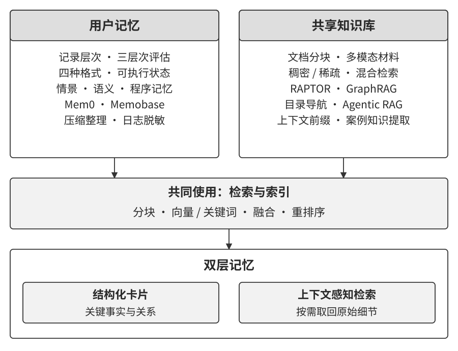

## 用户记忆系统

设用户向旅行助手提出请求：

> “帮我订下周五去东京的机票。我通常喜欢靠窗，吃素，请安排素食餐。订票时使用我已保存的航空会员信息。”

这段话包含几种不同用途的信息。“通常喜欢靠窗”是用户明确表达的偏好，“吃素”是后续餐食安排需要考虑的事实，“下周五去东京”是有时间范围的行程。系统可以把它们分别保存，并记录来源与更新时间。将相对日期换算为具体日期时，还要结合本次对话的日期和时区。

下一次订票时，Agent 可以读取座位偏好和餐食要求，再核对用户这一次的选择。如果用户说“这次想坐过道”，本次订票使用新的要求；长期偏好是否变化，可以结合用户的明确说明更新。**记忆需要保留事实成立的对象、时间与情境。**

实现上，Harness 可以在会话结束或适当的任务节点提取候选记忆，检查来源、重复项和冲突，再写入存储。用户直接设置的偏好也可以通过程序保存。后续任务按身份和权限读取相关记录，纳入当前上下文。保存、更新、检索和使用，构成一条完整的记忆链路。

### 记忆能力的评估：三层次框架

评价记忆系统，可以从后续任务中的表现入手。公开基准 LoCoMo 通过长时间、多会话的对话，考察问答、事件摘要和多模态对话生成，提供了研究长程记忆的一种方法。[^ch3-locomo]

[^ch3-locomo]: Maharana et al., [Evaluating Very Long-Term Conversational Memory of LLM Agents](https://arxiv.org/abs/2402.17753), 2024。

结合记忆基准与业务实践，我把需要检查的能力归纳为八项：个人信息保留、偏好追踪、话题切换、记忆更新、多会话连续性、关联推理、时间理解和冲突处理。为了把这些能力落实到 Agent 任务中，本书采用三个层次组织评估。

**第一层：基础回忆。** 用户提供一条明确事实，系统在需要时准确取回。例如，用户已保存航空会员信息，订票时应找到相应航空公司和会员号。这一层检查事实是否写入、是否完整，以及是否属于当前用户。

**第二层：多会话检索。** 一个任务需要关联不同时间、不同对象的信息。例如，用户有两辆车，要求“为我的车预约保养”时，Agent 应找到两辆车的记录，并确认本次服务对象。取消“洛杉矶之旅”时，需要关联同一行程中的机票和酒店。查询贷款时，则需要区分已经生效的合同和此前咨询的报价。对象、时间和状态共同决定哪些记录适用。

**第三层：主动服务。** Agent 根据当前任务发现用户尚未明确提出的相关需求。预订国际行程时，结合证件记录提醒用户核对有效期；手机损坏时，汇集设备保修、信用卡保障和运营商保险，帮助用户比较处理途径；整理年度税务材料时，汇总不同收入和支出的记录，列出待补材料。这里考察的是能否发现关联、补齐信息并提出有依据的建议，后续操作按用户授权执行。

三个层次逐步增加信息组织与使用的要求。后文的实验 3-9 和 3-11 还会使用同一框架，比较检索方法对记忆使用的影响。

> **实验 3-1 ★：用三层次框架评估记忆系统**
>
> 配套评估集包含 60 个用例，三个层次各 20 个。每个用例给出一段或多段会话，以及随后要回答的问题。可以先选择一个简单用例，沿着“读入会话—形成记忆—接收新会话—更新记忆—回答问题”走完一遍。
>
> 每次更新只提供已有记忆和新会话；最终回答使用形成的记忆。这样的安排，可以直接检查信息在逐步整理中如何保留、改变或丢失。评分由独立模型依据原始会话与评分标准完成，分别检查事实准确性、信息覆盖、推理和主动帮助，并记录缺乏依据的陈述。
>
> 阅读一个失败用例时，先在原会话中找到所需事实，再检查各次记忆更新，最后检查回答。沿这条链路，可以区分提取遗漏、更新覆盖和使用错误，为下一步设计找到具体问题。

### 轨迹、当前上下文与长期记忆

设计记忆系统时，先区分几类用途不同的记录。

**轨迹**按时间记录一次运行中的消息、工具请求和执行结果，供回看过程、调试与追溯。事件日志可以采用追加式写入，再依据数据保留要求归档或清理。它回答的是“当时发生了什么”。

**当前上下文**是 Harness 为本轮决策组织的输入，包含所需的历史、规则、工具定义和检索材料。第二章讨论的摘要与压缩在这一层发挥作用。它回答的是“下一步需要知道什么”。

**用户长期记忆**跨会话保存用户相关信息，按用户与实体组织，并保留时间、来源和有效状态。Harness 可以在任务开始时加载相关记录，模型也可以通过工具按需检索。它回答的是“过去的信息中，哪些仍对这个用户有用”。

系统还会维护**业务状态**，例如等待用户确认、正在处理、等待付款或已经完成。业务状态按事件更新，既可进入当前上下文，也可持久保存以支持任务恢复。第六章将继续讨论事件驱动的运行方式。

这几类记录可以通过来源标识连接起来：长期记忆中的偏好指向用户的原始表达，当前上下文中的任务摘要指向相应执行记录。沿这些关联，系统能够核对事实、处理纠正，并在新任务中选出相关信息。

### 用户记忆的四种存储格式

同一段对话可以形成不同的记忆表示。以“用户在 TechCorp 担任高级工程师，负责推荐系统”为例，图3-2 展示了四种组织方式。选择时，需要一起考虑读取方式、事实之间的关系和更新频率。

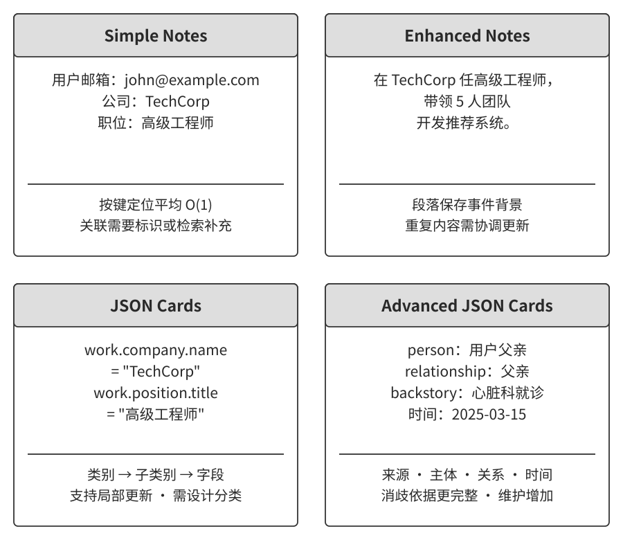

**简单笔记（Simple Notes）**把信息拆成短事实，例如公司、职位和负责的项目。它便于逐条写入和修改。事实涉及多个对象时，可以给笔记增加对象标识，让“哪份工作”“哪个项目”的关系保持清楚。读取某个确定编号的笔记与在全部笔记中搜索，分别依赖存储索引和检索方法。

**增强笔记（Enhanced Notes）**用一段话保留相关事实：“用户在 TechCorp 担任高级工程师，负责推荐系统。”公司、职位与工作内容出现在同一段中，便于整体读取。用户换岗时，需要更新相关段落，并检查其他笔记是否仍引用旧职位。

**JSON 卡片（JSON Cards）**按类别和字段组织信息。工作卡片可以分别记录公司、职位和项目，更新职位时保留其他字段。涉及多个主题的事实可以通过实体标识、标签或关联记录连接起来，例如把个人项目同时关联到技术偏好和周末活动。字段设计决定了哪些信息容易查询和维护。

**增强 JSON 卡片（Advanced JSON Cards）**进一步记录主体、与用户的关系、来源背景和时间。例如，同样提到“张医生”，一张卡片说明他是用户的牙医，另一张说明他是用户父亲的心脏科医生。主体与关系帮助选择服务对象，来源与时间帮助判断信息是否仍然有效。维护时需要检查这些字段与原始会话是否一致。

四种格式提供了不同的信息粒度。短事实适合独立更新，段落保留连贯背景，字段支持定向查询，关系与来源支持消歧和追溯。可以根据业务需要组合使用：偏好按字段维护，经历保留摘要，涉及多个家庭成员的事项增加主体关系。最终选择通过实际任务检验。

> **实验 3-2 ★★：比较四种记忆格式**
>
> 在实验 3-1 的同一批用例上，分别采用四种格式。保持会话顺序和问题相同，比较每轮保存了哪些事实、怎样处理更新，以及最终回答能否使用这些信息。
>
> 配套完整运行覆盖四种格式与 60 个用例。按独立模型的评分规则，简单笔记、增强笔记、JSON 卡片和增强 JSON 卡片分别通过 48、52、51、49 个用例。多会话检索层中，增强笔记通过 16 个，增强 JSON 卡片通过 12 个。
>
> 可以从两种格式结果不同的用例入手，追踪关键事实在记忆中的位置：对象是否分清，状态是否更新，来源是否保留，回答是否使用了相应记录。把这些差异与维护开销放在一起比较，就能判断当前任务需要怎样的表示。

### 可执行记忆：让状态参与计算

当用户问“去年有多少次国际旅行”时，系统需要找到符合时间与行程条件的全部记录，再完成统计。若把行程保存为具有明确字段的对象，程序就能按日期筛选、按类型计数。这样的表示也适用于检查重复预订、比较日期和发现状态冲突。

**可执行记忆**把用户状态与处理状态的规则放在一起。以行程管理为例，状态记录目的地、出发日期、预订状态和相关证件；规则负责计算间隔、检查重复和生成提醒。模型从对话中提取更新，程序检查字段与关系，再对新状态执行规则。这样，一次更新既改变记录，也能触发后续检查。

> **延伸阅读：User as Code**
>
> 我在 User as Code 中探索了这种设计：将用户记忆组织成一个持续维护的软件项目，用带类型的对象保存状态，用函数表达查询和规则。新事实先进入日志，再定期整理成可执行状态，保留从状态回到原始信息的依据。[^uac]
>
> 这项设计把聚合与检查纳入记忆系统。对于反复出现的统计问题，可以复用同一计算；状态发生变化时，可以重新执行相关规则。工程上还需检查事实提取、状态更新和规则本身，分别确认输入与计算是否正确。

[^uac]: Li, Bojie, [User as Code: Executable Memory for Personalized Agents](https://arxiv.org/abs/2606.16707), 2026。

采用这种方式时，可以先选一类边界清楚的业务对象。行程记录适合按日期与状态统计；证件信息可以提供到期提醒，具体出行要求再依据目的地和行程核对。生成的规则经过审查与测试，在受限环境中执行。普通文本记忆也可以配合计算工具，两者的结合取决于业务中哪些操作值得持续维护为规则。

### 按用途组织记忆内容

前面讨论了怎样表示信息，接下来考虑保存什么。借用认知科学中的术语，可以从事件、事实与方法三个角度组织 Agent 的长期记忆。

**情景记忆**（episodic memory）记录具体经历。例如，一次东京行程的日期、已选航班、订单状态和用户当时的要求。它帮助回答“上次怎样处理”“这次行程还缺什么”。记录时，把时间、对象与来源一起保存。

**语义记忆**（semantic memory）保存可重复使用的事实与知识。例如，用户明确表示通常喜欢靠窗、需要素食餐。此类信息可以来自直接说明，也可以由多次交互归纳；归纳结果保留依据与适用范围，用户纠正时及时更新。

**程序性记忆**（procedural memory）保存完成任务的方法。例如，订票时先确认日期与目的地，再查找航班、核对偏好、确认价格，最后按授权提交。第二章介绍的 Skill 就可以承载这类流程。将执行经验整理成方法时，还要保留使用条件与检查步骤。

当前任务也需要临时可用的信息，可以从**工作记忆**（working memory）的角度理解：正在处理的目标、相关历史、检索到的事实和当前状态共同支持本轮决策。上下文窗口承载送入模型的部分，Harness 还可以在外部维护待办、计数和业务状态。

表3-1 将前面的设计问题放在一起。记录的用途、表示方式和内容类型需要配合选择。

表3-1 记忆设计的三个视角

| 设计视角 | 回答的问题 | 本章示例 |
| --- | --- | --- |
| 记录用途 | 为什么保留这份信息？ | 轨迹用于追溯，当前上下文支持决策，长期记忆支持跨会话使用，业务状态支持运行与恢复 |
| 表示方式 | 怎样读取和更新？ | 短笔记、段落、字段卡片、带关系和来源的卡片、可执行状态 |
| 内容类型 | 后续需要使用什么？ | 情景中的具体事件、可复用的事实、执行任务的方法 |

例如，用户的座位偏好属于事实，可以保存在长期记忆的字段中；一次订票经历属于事件，可以保存为带时间和来源的摘要；从订票经验中整理出的流程，可以进入相应 Skill。三者通过用户与行程关联，服务于后续任务。

### 记忆框架案例

记忆框架把提取、存储、更新和检索连接起来。下面用 Mem0 和 Memobase 说明两项设计选择：在什么阶段处理事实变化，以及怎样组织用户画像与事件。

**Mem0：写入与检索之间的分工。** 2025 年论文介绍的流程先提取候选事实，再检索相近记忆，决定新增、更新、删除或保持原状。用户先说住在北京，后来明确表示搬到上海，系统可以据此更新当前居住地。论文还探索了用实体关系图组织记忆的变体。[^ch3-mem0-paper]

新版开源算法采用仅追加的事实提取流程，将变化前后的记录一起保存，查询时结合语义、关键词与实体匹配查找相关材料。[^ch3-mem0-new] 图3-3 对比了两种处理流程。前一种在写入时整理当前事实，后一种保留更多历史，由检索和回答阶段结合时间与情境判断适用信息。

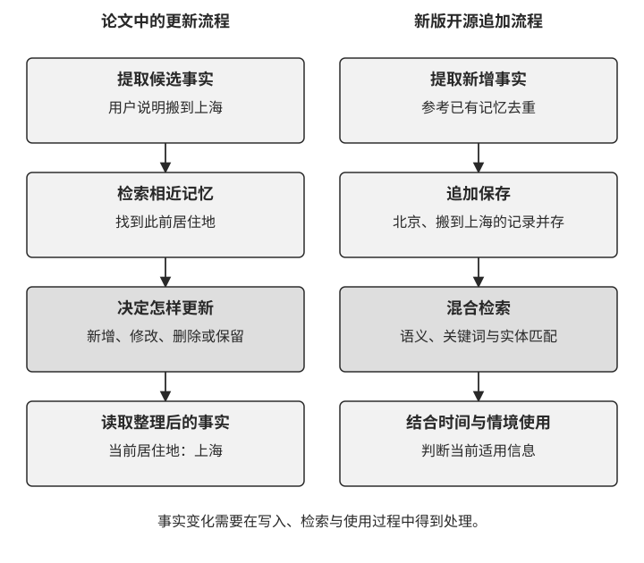

这两种安排把工作放在不同阶段。设计时，需要检查写入是否保留必要历史，查询能否识别变化，以及错误记录怎样纠正。追加式保存同样需要维护更正关系与有效期，让后续任务能够找到当前适用的事实。

[^ch3-mem0-paper]: Chhikara et al., [Mem0: Building Production-Ready AI Agents with Scalable Long-Term Memory](https://arxiv.org/abs/2504.19413), 2025。

[^ch3-mem0-new]: Mem0，[Open Source: Migrating to the New Memory Algorithm](https://docs.mem0.ai/migration/oss-v2-to-v3)。

**Memobase：画像与事件分开组织。** Memobase 用可配置的主题组织用户画像，用事件时间线保存经历；对话先进入缓冲区，再批量提取和更新。查询时读取已整理的画像与事件，将一部分整理工作提前到后台完成。[^ch3-memobase]

这为“稳定属性”和“具体经历”提供了各自的入口。查询用户通常使用什么语言，可以读取画像；查询上次何时讨论旅行预算，可以检索事件。批处理的安排也引出一个工程问题：新信息进入缓冲区后，到可被查询之间存在时间间隔。应用可以结合任务需要，在会话结束时触发整理，或将最新会话与已有记忆一起提供给模型。

[^ch3-memobase]: Memobase，[项目说明与记忆处理流程](https://github.com/memodb-io/memobase)。

### 多类型记忆怎样协同

结合前面的内容，可以设计图3-4 所示的参考架构。它把事件、事实和方法分别组织，再通过检索与整理连接到当前任务。

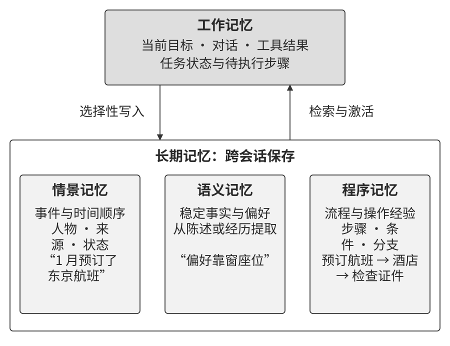

任务开始时，Harness 依据用户身份与问题检索材料：事件记录提供过去的经历，事实记录提供有效偏好，流程提供执行方法。相关内容进入当前上下文，模型据此选择下一步。工具执行带回的新结果继续形成轨迹。

任务推进或结束时，系统从新增记录中提取候选记忆，检查来源与状态变化，再更新相应存储。一次订票可以形成新的行程事件，用户的明确纠正可以更新座位偏好，经过验证的操作经验可以补充订票流程。

选择存储与检索方式时，可以直接沿问题设计入口。“上次讨论预算是什么时候”需要时间和主题，“父亲常去的医生是谁”需要主体与关系，“怎样办理改签”需要操作条件与流程。这样的组织让每类记录都有明确用途。

### 记忆压缩与整理机制

随着会话积累，系统会保存重复事实、过期状态和大量事件细节。整理工作的目标是让当前有效的信息容易找到，同时保留后续任务需要的依据。

**先确定保留规则。** 用户明确要求长期保留的信息、尚未完成的事项和有效约束，可以设为优先项。访问频率、时间和重复程度则帮助安排检索与归档。很久未被查询的饮食要求仍可能重要，近期频繁提到的临时行程也有结束日期。信息的用途与有效期应参与判断。

**再合并相关记录。** 同一行程中的搜索、选票和确认过程，可以整理成一份事件摘要，保留日期、最终选择、当前状态与来源。重复事实合并后保留出处，旧状态标明被什么新信息替代，详细材料按保留要求归档。

**最后提炼可复用经验。** 多次任务中出现的做法，可以整理为候选偏好或流程。例如，用户反复关注产品价格与评价，系统可以保留这些选择依据，在后续建议中考虑。推断出的偏好记录证据与适用情境，用户的明确说明用于确认或修正。

整理后，用需要早期信息的任务检验结果：能否找到旧行程，能否区分当前与历史地址，能否遵守仍有效的要求。用户纠正或删除信息时，还应更新依赖它的摘要与索引，使不同表示保持一致。

### 隐私保护：日志脱敏

用户记忆中有些信息只供业务工具使用，有些可以进入回答，还有些只需保留访问凭据的引用。系统应按用途安排数据流：模型获得完成决策所需的信息，工具在授权范围内读取必要字段，日志保留定位问题需要的记录。脱敏负责替换其中不应暴露的内容。

> **实验 3-3 ★★：基于本地模型的智能日志脱敏**
>
> 选择包含虚构敏感信息的日志，比较规则、本地模型和二者结合的处理方式。规则查找格式明确的字段，模型利用上下文识别地址、个人信息及其他敏感内容。识别完成后，再检查对应位置是否确实被替换，以及剩余日志是否仍能解释原来的问题。
>
> 配套运行使用本地 Qwen3-0.6B，比较了 12 个样例。处理后的文本中，规则组、模型组和混合组分别残留 9、3、2 个已标注的敏感值。混合组先用规则替换，再让模型检查剩余文本。
>
> 可以逐条查看漏检来自哪里：格式变体未匹配、语义未识别，还是检测位置与原文不一致。再检查误删内容，确认时间、错误状态和调用关系是否保留。对脱敏系统来说，识别、替换和保留可用信息是三个连续的检查环节。

本地处理可以使原始日志留在指定环境中；模型服务、失败回退、调试输出和结果存储也应遵循同一数据流设计。系统先约定哪些信息允许离开环境，再据此选择处理服务与日志策略。

前面建立了记忆的表示、更新和管理方式。接下来讨论检索：当记录增多时，怎样找到当前问题需要的材料，并把它们提供给模型。这也是用户记忆与知识库共同需要的能力。

## RAG 基础：把检索材料提供给模型

用户向客服助手询问退款流程时，回答需要依据当前产品的规则。系统先从知识库找到适用条款，再将条款与问题一起交给模型，由模型组织说明。这就是**检索增强生成**（retrieval-augmented generation，RAG）：通过检索，把外部资料纳入生成过程。

设一家商店的示例规则规定，某类商品签收后七天内可以申请退款，申请时需要提供订单号。用户问“我买的东西想退款，流程是什么”，检索器找出这项规则和操作说明，模型据此解释入口、所需材料与处理步骤。要判断用户的具体订单是否适用，还需核对商品类型和签收时间。

图3-5 展示了查询时的三个环节：检索相关片段，组织带来源的上下文，再生成有依据的回答。文档更新后，索引也要同步更新，查询时才能使用当前有效的版本。

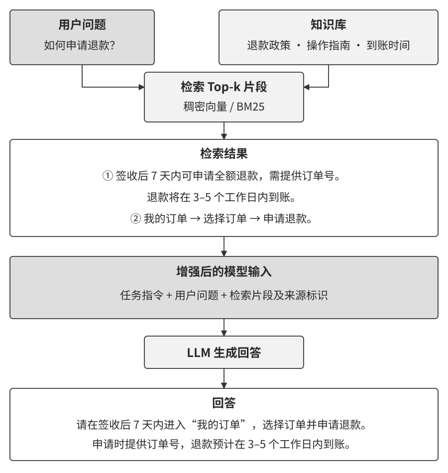

搭建这条链路，需要先决定文档怎样组织，再决定怎样找到相关内容。下面从文档分块开始，依次讨论稠密检索、关键词检索及其组合。

### 文档分块：确定检索的基本单位

一份客服手册可能同时包含支付、配送、退款和售后说明。用户只问退款时，可以将相关章节作为检索单位。**分块**（chunking）把长文档组织成适合检索的片段，同时保留片段与原文的关联。短文档也可以整体建立索引。

分块首先受输入预算约束：片段需要适合嵌入模型的输入范围，也要便于放入生成模型的上下文。其次要考虑信息完整性。退款期限与适用商品写在相邻句中，切分时应让这两个条件一起出现；操作步骤较长时，可以按阶段拆开，再通过章节信息连接。

常用方法可以从三个角度理解。

**固定大小切分**按 token 数控制长度，并让相邻块保留少量重叠。它便于控制输入规模，重叠部分可以帮助保留边界附近的信息。检查时应重点查看句子、表格和步骤是否被切开。

**结构感知切分**利用章节、段落和句子边界。先按章节组织，超过预算时再分成段落或句子。标题、表头和适用条件可以随片段保留，使片段独立出现时仍容易理解。

**语义切分**比较相邻内容的表示，在主题变化处划分边界。它增加了嵌入计算与阈值选择，需要用实际问题检查切分效果，尤其关注跨段条件和连续步骤是否保留。

块大小决定每次检索带回多少背景。块较小时，定位更细，回答可能需要组合多个片段；块较大时，背景更完整，也会带入更多内容。可以选择几组大小与重叠量，比较所需条款是否被找齐、答案是否正确，以及输入开销有多大。

每个片段还应保存文档名称、章节、版本和原文位置。遇到“该公司”“上述条件”等指代，可以补入必要背景，或在命中后读取相邻内容。后面的上下文感知检索会进一步讨论这种处理。

### 稠密嵌入：把文本表示为可比较的向量

用户说“钱怎样退回来”，手册写的是“退款申请流程”。要连接这些用词不同、意图相关的表达，可以使用**嵌入**（embedding）：模型把文本转换为一组数值，再通过向量之间的相似度寻找候选材料。稠密表示通常用固定长度的向量承载特征，多数维度具有非零值。

建立索引时，系统为文档片段计算向量。查询时，用与文档表示配套的模型和编码方式处理问题，再比较查询向量与文档向量。模型的训练目标决定这种相似度能捕捉哪些关系，实际检索质量由任务中的相关材料来检验。

常用的比较方法是**余弦相似度**。它将两个非零向量的点积除以各自长度的乘积，衡量方向的一致程度：

$$
\operatorname{sim}(a,b)=\frac{a\cdot b}{\|a\|\|b\|}.
$$

分子把对应维度相乘后求和，分母消除整体尺度的影响。例如，设两组演示向量为 A＝(1, 0)、B＝(2, 0)，方向相同，余弦相似度为 1；C＝(0, 1) 与 A 垂直，相似度为 0。这组数值用于说明计算。文本经过真实模型编码后，相似度的含义需要结合训练方式与检索任务判断。向量长度也由模型计算产生，文本长度是另一个量。

### 从词向量到检索向量

图3-6 用“苹果”的两种含义说明表示方式的变化。静态词向量为同一个词保存固定表示；上下文表示结合所在句子，使“苹果公司发布产品”与“买了两斤苹果”中的词获得不同表示。检索模型进一步将整段查询或文档编码为用于匹配的表示。

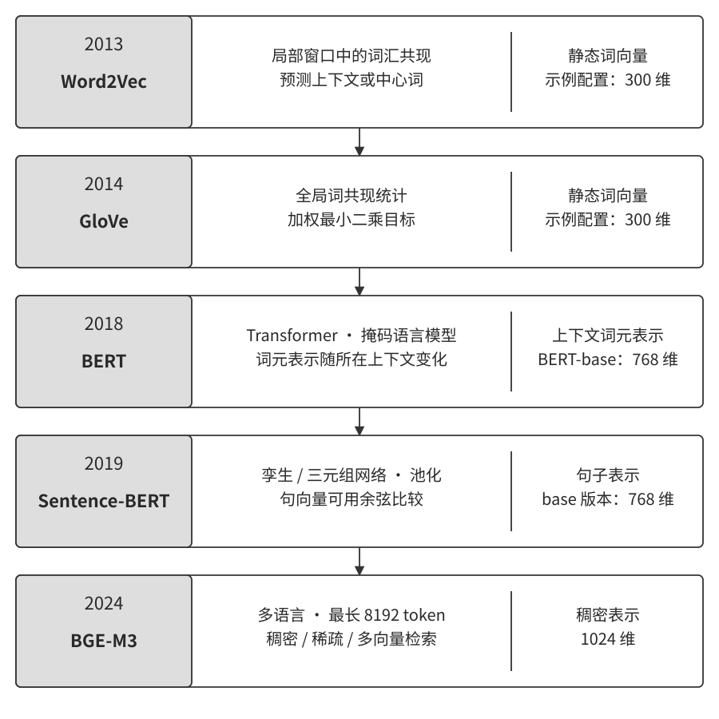

Word2Vec 是静态词向量的代表；BERT 展示了利用上下文计算词表示的方法。[^ch3-embedding-history] 构建文本检索系统时，还需要选择适合查询与文档匹配的训练目标及输出方式。例如，BGE-M3 同时提供稠密、稀疏和多向量表示，其中稠密输出可用于本节的向量检索。[^ch3-bge]

[^ch3-embedding-history]: Mikolov et al., [Efficient Estimation of Word Representations in Vector Space](https://arxiv.org/abs/1301.3781), 2013；Devlin et al., [BERT: Pre-training of Deep Bidirectional Transformers for Language Understanding](https://arxiv.org/abs/1810.04805), 2018。

[^ch3-bge]: BAAI，[BGE-M3 模型说明](https://huggingface.co/BAAI/bge-m3)。

### 用索引缩小向量搜索范围

文档量较小时，可以逐一计算查询与所有文档向量的相似度，得到精确最近邻。数据量增长后，**近似最近邻搜索**（approximate nearest neighbor，ANN）利用索引减少需要比较的候选，在检索质量与查询开销之间取舍。

Annoy 通过多棵随机投影树组织向量，查询时在树中寻找候选。HNSW 使用分层近邻图：高层节点较少，先帮助搜索接近目标区域，再逐层下降，在底层扩大候选搜索。图3-7 展示了后者的层次结构。同一节点可以出现在多层，下降时沿用已经找到的入口。[^ch3-ann]

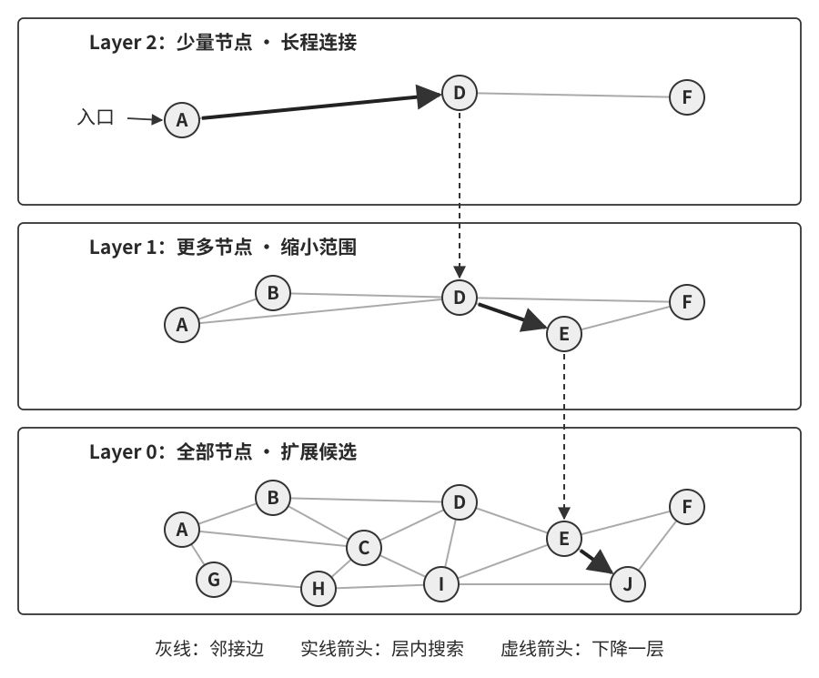

索引参数会改变比较的范围。搜索更多候选通常有助于找齐近邻，也需要更多计算。因此，选择时应同时比较近邻召回、查询耗时、索引空间与更新方式。表3-2 列出两种实现的主要设计选择。

表3-2 Annoy 与 HNSW 的索引设计

| 设计问题 | Annoy | HNSW（以 hnswlib 为例） |
| --- | --- | --- |
| 如何组织向量 | 多棵随机投影树 | 分层近邻图 |
| 如何调整搜索范围 | 调整树数量与查询搜索预算 | 调整图连接及候选搜索预算 |
| 怎样加入新数据 | 构建完成后更新数据需重新建索引 | 可向已建索引插入数据，并管理容量 |
| 怎样评估取舍 | 固定数据与目标召回，比较构建、查询和空间开销 | 使用同一比较方法，同时检查插入后的结果 |

[^ch3-ann]: Spotify，[Annoy 项目说明](https://github.com/spotify/annoy)；nmslib，[hnswlib 项目说明](https://github.com/nmslib/hnswlib)；Malkov and Yashunin，[HNSW 论文](https://arxiv.org/abs/1603.09320)。

> **实验 3-4 ★★：比较两种近似最近邻索引**
>
> 用同一嵌入模型生成文档与查询向量，分别建立 Annoy 和 HNSW 索引。先用全量相似度计算取得精确结果，再检查两种索引找回了多少近邻。
>
> 固定运行使用 Qwen3-Embedding-0.6B，包含 300 篇短文档和 20 个查询，每次取前十项。先用 240 篇建立索引，两种方法都找齐了精确搜索的前十项；再加入剩余 60 篇文档后，Annoy 重新构建索引，HNSW 直接插入，也都找齐了更新后精确搜索的前十项。
>
> 这一步建立了比较索引的起点。接着扩大数据量、改变搜索预算，观察近邻召回与耗时如何变化。这里的近邻召回衡量索引对精确向量搜索的逼近程度；最终问答还需要检查检索到的材料是否支持用户问题，以及模型是否正确使用了材料。

### 稀疏检索：按词项寻找材料

技术手册中的错误码、产品型号和人名，往往需要保留精确的词项。例如，用户查询某个存储控制器的错误码时，包含该编号的说明通常是重要候选。关键词检索可以沿词项快速找到这些材料。

一种基础表示是**词袋模型**（bag of words）：记录哪些词出现过，以及各自的次数。在“猫追狗”和“狗追猫”中，词项及次数相同，词袋表示也相同。它适合统计词项匹配，句子中的角色与关系则需要其他处理。

以词表作为维度，每篇文档只在少数词项上有权重，就形成了稀疏表示。本节从传统词项加权讲起。学习得到的稀疏表示还可以为相关词项赋权，支持更丰富的匹配；本章前面提到的 BGE-M3 也提供这种输出。

#### 从 TF-IDF 到 BM25

**TF-IDF** 将文档内的词频与语料中的稀有程度结合起来。设 100 篇文章中有 60 篇包含“模型”，只有 3 篇包含“蒸馏”，后者能更集中地定位特定主题。一种基础写法是：

$$
\operatorname{TFIDF}(t,d)=\operatorname{TF}(t,d)\ln\frac{N}{\operatorname{DF}(t)}.
$$

其中，TF 是词在当前文档中出现的次数，DF 是包含该词的文档数，N 是文档总数。实际系统可以对词频做变换，并对表示进行归一化。

**BM25** 进一步控制重复出现的贡献，并考虑文档长度。图3-8 将这两个因素与词项稀有程度放在一起。查询含有多个词时，分别计算各词的贡献，再求和得到文档分数。

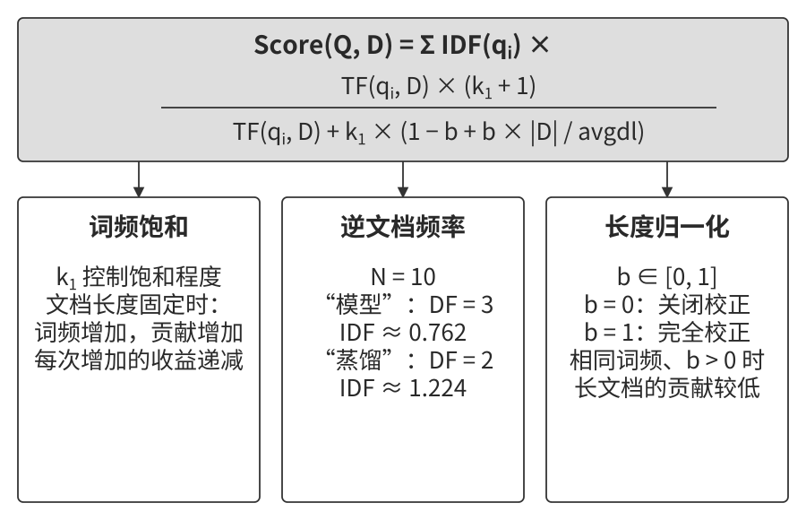

本节使用的形式为：

$$
\operatorname{Score}(Q,D)=\sum_{t\in Q}\operatorname{IDF}(t)
\frac{\operatorname{TF}(t,D)(k_1+1)}{\operatorname{TF}(t,D)+k_1(1-b+b|D|/\operatorname{avgdl})}.
$$

这里将查询词去重，文档长度按分词后的词项数统计。$k_1$ 控制词频饱和：重复次数增加时，贡献继续增长，但增长逐渐放缓。$b$ 控制长度归一化；取 0 时忽略长度，取值增大时，文档长度相对于平均长度的影响增强。保持词频相同、$b>0$ 时，较长文档中该词的贡献较低。

配套手算实验采用下面的 IDF：

$$
\operatorname{IDF}_{\rm raw}(t)=\ln\frac{N-\operatorname{DF}(t)+0.5}{\operatorname{DF}(t)+0.5}.
$$

词越少见，这个值越大。词出现在超过半数文档中时，原始值为负；配套引擎给评分权重设置一个很小的正数下限。其他实现也有不同处理，例如 Lucene 在对数内部给这一比值加 1。[^ch3-bm25] 比较计算结果时，分词、IDF 写法、参数和长度统计都需要保持一致。

[^ch3-bm25]: Apache Lucene，[BM25Similarity：参数与 IDF 定义](https://lucene.apache.org/core/9_12_1/core/org/apache/lucene/search/similarities/BM25Similarity.html)。

检索效率来自**倒排索引**：每个词对应一份包含它的文档列表，同时保存评分所需的词频等信息。查询“模型蒸馏”时，系统读取相关词的列表，合并候选并计算分数。它像书后的术语索引，帮助读者从词找到出现位置。

> **实验 3-5 ★★：逐步计算 BM25 得分**
>
> 先用四篇短文档检查一次评分。固定样例中，目标词只出现在一篇文档里，在该文档中出现两次；文档长度为 3，平均长度为 2.5。取 $k_1=1.5$、$b=0.75$，得到 IDF 约 0.847，词频与长度因子约 1.342，最终贡献约 1.137，与引擎结果一致。
>
> 再在十篇文档上观察查询。四个包含明确主题词或编号的问题都在前五项中找齐了标注材料；查询“cat”时，只使用词项匹配的配置未找到写着“kitten”或“feline”的相关文档。
>
> 可以沿着分词、倒排列表和逐词贡献检查这个差异。词项没有匹配时，先考虑词形归一化、同义词扩展或另一条语义检索路径；词项已经命中时，再检查排序与文档是否包含回答需要的内容。

### 混合检索：合并候选，再判断相关性

同一个知识库可能同时接收产品编号和自然语言问题。编号有助于精确定位，“钱怎样退回来”这类表达则需要与“退款申请流程”建立联系。**混合检索**让稠密与稀疏两路分别寻找候选，再将结果合并。图3-9 展示了检索、融合与重排序的分工。

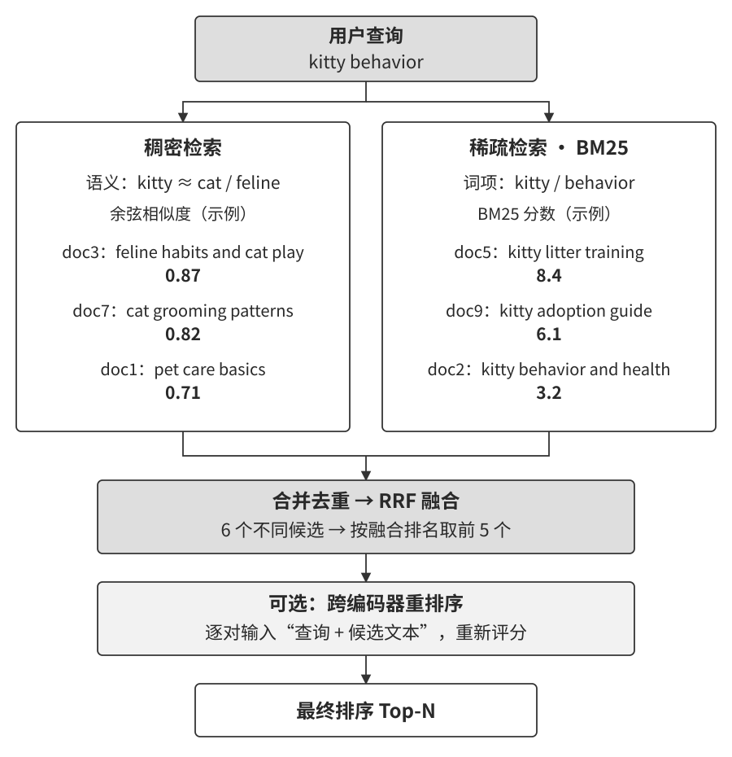

**第一步，两路检索。** 查询分别进入向量索引和倒排索引，各自返回候选。两路使用一致的访问权限与版本过滤，候选通过文档标识关联，重复片段在合并时去重。

**第二步，融合排名。** 余弦相似度与 BM25 分数的尺度不同。可以在校准分数后加权，也可以采用**倒数排名融合**（reciprocal rank fusion，RRF），按文档在各路结果中的名次计分：

$$
\operatorname{RRF}(d)=\sum_{r:d\in r}\frac{1}{c+\operatorname{rank}_r(d)}.
$$

排名从 1 开始，$c$ 是平滑常数，缺席某一路的文档在该路贡献为零。例如，同一文档在两路分别排第 1 和第 3，就累加两项贡献。平滑常数增大，会缩小相邻名次的分差。RRF 用排名组织候选，免去了直接对齐原始分数的步骤。[^ch3-rrf]

[^ch3-rrf]: Cormack, Clarke and Buettcher, [Reciprocal Rank Fusion Outperforms Condorcet and Individual Rank Learning Methods](https://cormack.uwaterloo.ca/cormacksigir09-rrf.pdf), SIGIR, 2009。

**第三步，重排序。** 候选规模缩小后，可以让模型联合读取问题与每个候选片段，再输出相关性分数。常见的**跨编码器**（cross-encoder）采用这种方式。与分别编码查询和文档的**双编码器**（bi-encoder）相比，它能在评分时利用两段文本之间的交互，同时需要为各个候选执行计算。BGE-Reranker-v2-M3 是一个跨编码器实例。[^ch3-reranker]

[^ch3-reranker]: BAAI，[BGE-Reranker-v2-M3 模型说明](https://huggingface.co/BAAI/bge-reranker-v2-m3)。

重排序的输入范围决定了它能调整哪些文档。重要材料尚未进入候选池时，需要改进前面的检索；材料已进入候选池却排得靠后时，可以检查融合与重排序。是否加入重排序，以及给它多少候选，都应结合任务质量与延迟预算选择。

### 怎样度量检索质量

评估前，先为每个查询标注相关文档，再确定查看前多少项。表3-3 给出四个常用指标。

表3-3 检索质量指标

| 指标 | 计算与用途 |
| --- | --- |
| recall@k（召回率） | 前 k 项中相关文档数，除以该查询全部标注相关文档数；检查所需材料找齐了多少 |
| hit rate@k（命中率） | 前 k 项至少出现一篇相关文档的查询比例；检查多少问题找到了相关入口 |
| MRR（平均倒数排名） | 对每个查询取首篇相关文档排名的倒数，再求平均；检查首个相关结果有多靠前 |
| nDCG@k（归一化折损累积增益） | 对前 k 项的相关性按位置折扣求和，再除以理想排序的值；检查整体排序质量 |

设一个问题需要三份材料，前五项只找到其中一份，这个问题的命中值为 1，召回率为三分之一。涉及多个条款或跨文档证据的问题，需要进一步检查材料是否完整。MRR 的计算范围也要注明：在设定范围内没有相关结果时，该查询贡献为零。

有些评估报告使用“检索失败率”，比较时应先确认失败的定义，例如前若干项中没有支持答案的材料。各阶段的指标可以一起记录：候选池的召回、最终排序的位置，以及生成答案的依据是否完整。

> **实验 3-6 ★★：比较稀疏、稠密、融合与重排序**
>
> 配套实验使用相同的文档与十二个查询，覆盖技术编号、精确名称、同义表达和多语言问题。分别记录每种方法的候选与排名，再检查前几项是否包含标注材料。
>
> 在这次固定运行中，稀疏检索有十个查询在前三项中找到相关文档；稠密检索、RRF 融合和重排序都覆盖十二个查询。稠密检索与 RRF 的相关文档全部位于首位，重排序后的平均倒数排名约为 0.90，部分相关文档被移到了后面。
>
> 选择排名变化的查询，将问题、候选正文和各阶段结果并排比较：是哪条路径带来了材料，融合是否保留了它，重排序怎样改变位置？再用更接近业务的问题检验改动。沿着候选的流转定位问题，可以决定应调整检索、融合还是重排序。

## 知识的组织与检索

前面的检索方法从片段中寻找相关材料。接下来考虑另一个问题：当答案涉及整份资料的概览、多个对象的关系或完整集合的统计时，应当怎样组织信息？

先回到第二章的宠物店例子。设一个较大的记录库包含 100 只猫，其中黑猫 90 只、白猫 10 只。用户询问比例时，需要统计整个集合。只取相似度最高的二十条记录，得到的是一个检索子集。系统可以对完整、去重后的记录计算总量，再把统计结果、口径和更新时间写入摘要。后续查询读取这份摘要，详细追问仍能回到原记录。

客服工单则提出了另一类问题。假设归档中记载了几位用户申请优惠的结果：一位退伍军人获批，一位医生获得折扣，一位教师未通过。护士询问自己是否符合条件时，相近职业的工单可以提供查找线索；资格判断还需要正式政策中的对象范围、时间、地区和其他条件。系统据此整理规则卡，并将个案关联到相应版本。工单有助于发现例外与执行差异，政策资料提供资格边界的依据。

这两个例子说明，**知识组织应围绕问题需要的证据展开**。计数需要完整集合与计算，资格判断需要适用规则，跨对象问题需要关系与身份，主题概览需要跨段总结。索引可以提前准备这些入口，查询时再选择合适路径。

下面先介绍层次摘要与实体关系索引，再讨论目录组织、知识更新、Agent 控制检索、上下文感知检索和知识提取。这些方法分别改变信息的组织、维护与使用方式，也可以用于本章开头的用户记忆。

### RAPTOR：建立不同粒度的摘要

**RAPTOR** 将文本片段逐层聚类和总结，形成多层摘要结构。底层保留具体片段，上层概括一组相关内容，再向上汇总更大的主题。图3-10 用技术手册示意这类组织方式。[^ch3-raptor]

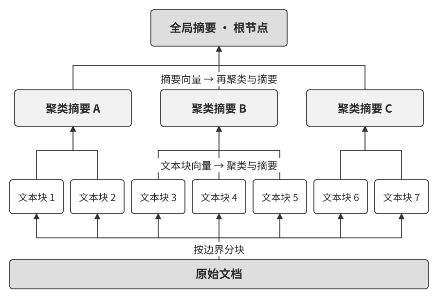

例如，寄存器、数据类型和运算说明分别位于不同片段中。将主题相关的片段归为一组，可以生成“指令编程环境”的摘要。其他分组形成“状态保存”“软件支持”等摘要，再共同组成整体概览。每个摘要保留与来源片段的关联，具体参数和适用条件可以沿关联回查。

查询时，可以在多个层次的节点中检索，也可以按层次展开候选。概览问题更可能需要上层总结，细节问题需要原始片段及局部背景。索引提供不同粒度，检索过程根据问题与预算选择材料。

摘要构建需要检查遗漏与合并错误。两个片段分别描述不同处理器模式时，上层摘要应保留各自条件；内容更新后，依赖它的摘要也要重新核对。来源关联因此同时支持查询和维护。

[^ch3-raptor]: Sarthi et al., [RAPTOR: Recursive Abstractive Processing for Tree-Organized Retrieval](https://arxiv.org/abs/2401.18059), 2024。

### GraphRAG：通过实体与关系组织材料

**GraphRAG** 利用图结构组织实体、关系和原文证据。实体可以是人物、机构、地点或技术概念，关系说明它们怎样连接。例如，“张医生—任职于—甲医院”记录一项联系，再将医院关联到地址，就能为“我的医生所在医院在哪里”提供检索路径。

图3-11 展示了关系索引的一个用途。用户与医生的联系、医生与医院的联系分别来自记录，查询沿这些联系查找相关证据，再交给模型组织回答。每条关系还应携带来源与有效时间，以便检查是否仍适用。

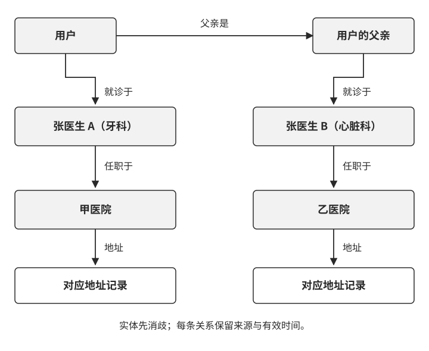

同名实体需要在构建阶段识别。用户的牙医与父亲的心脏科医生都姓张时，可以结合科室、机构和服务对象建立不同实体标识。图中保存这些标识及关系，后续查询才能沿正确路径查找。实体合并是否准确，应回到原始记录核对。

Microsoft GraphRAG 还将关联紧密的实体组织成社区，并生成社区报告。局部查询结合相关实体、关系与原文片段；全局查询利用社区报告汇总跨资料的主题。[^ch3-graphrag] 关系导航与社区概览提供了两种不同粒度的检索入口。

[^ch3-graphrag]: Microsoft，[GraphRAG 查询方式概览](https://microsoft.github.io/graphrag/query/overview/)。

图结构的表达能力取决于建模方式。“如果下周仍然下雨，就取消海边行程，改去博物馆”包含条件、时间和备选方案。可以将它保存为带条件的计划事件，并关联两种行程，同时保留原句。简单地只提取“有海边计划”和“有博物馆计划”，会丢掉决定执行哪一个的条件。

因此，可以让自然语言记录与结构化索引协同工作：原文保存完整表达，实体、时间和关系帮助定位，规则或程序处理明确条件。每次回答都要从已找到的关系回到支持它的证据。

> **实验 3-7 ★★★：比较层次摘要与实体关系索引**
>
> 从英特尔架构手册中选取与 SSE、AVX 和状态管理有关的 14 页，分别建立层次摘要与实体关系索引。用相同的八个问题查询，两类问题各占一半：一类要求解释概念与细节，另一类要求关联多个对象。
>
> 配套实现为页面生成摘要，再形成三个分组摘要和一份总体摘要；另一条路径提取实体、关系与社区摘要。查询时，前者从不同层次选择材料，后者结合实体、关联和社区信息组织上下文。
>
> 阅读“解释 SSE 编程环境”的结果时，可以先看摘要提到了哪些方面，再检查这些说明能否回到原文。阅读关系问题时，则逐条查看关系的方向、含义与来源。图中存在一条连接路径，可以帮助找到材料；路径中每一步如何支持结论，还需要结合原文判断。
>
> 比较两种索引时，记录找到的证据、遗漏的条件、回答质量和构建开销。沿着具体问题观察索引如何提供材料，再决定业务中哪些查询值得增加层次摘要或关系索引。

选择结构化索引，可以从已有系统的失败问题入手。概览中反复遗漏跨章节主题时，尝试增加层次摘要；多对象查询经常混淆主体或断开关系时，尝试建立实体与关系入口。保留片段检索作为对照，用相同问题比较改动前后的证据完整性、答案和成本。查询收益之外，还要考虑资料更新后重新生成摘要、核对实体和维护关系的工作量。

### 文件系统范式：用目录结构组织知识

目录可以为知识提供一个容易浏览的入口。例如，产品知识库按产品、版本和主题分组，用户记忆按用户和事项组织。Agent 先找到相关目录，再读取概要或具体条目。目录体现归属关系，条目之间的链接补充跨主题联系。

火山引擎开源的 **OpenViking** 将资源、记忆和技能组织成虚拟文件系统对象，通过统一地址访问。Agent 可以浏览目录、读取内容，也可以在指定范围内进行语义检索。框架负责将这些操作连接到内容存储与检索索引。[^ch3-openviking]

其中一项设计是 **L0、L1、L2 三层内容按需加载**：L0 是用于快速判断相关性的简短摘要，L1 是帮助理解目录内容和选择阅读入口的概览，L2 是需要时读取的具体内容。经过语义处理的目录可以带有摘要和概览，查询据此决定是否继续深入。[^ch3-openviking-layers]

以产品手册为例，Agent 先从摘要判断某个目录是否涉及账户管理，再从概览找到登录与恢复账户的资料，最后读取与问题有关的步骤和条件。这与第 2 章的 Skills 渐进式披露相通：先提供定位信息，再把当前任务需要的细节放入上下文。

文件式访问便于人和 Agent 查看与修正内容，向量索引则提供语义检索入口。OpenViking 将内容存储与索引存储分开管理，索引保存检索需要的向量、引用、元数据及部分文本。两者共同支持知识访问，更新时也要保持关联。[^ch3-openviking-storage]

[^ch3-openviking]: [OpenViking 项目说明](https://github.com/volcengine/OpenViking)。
[^ch3-openviking-layers]: OpenViking，[上下文分层](https://docs.openviking.ai/en/concepts/03-context-layers)。
[^ch3-openviking-storage]: OpenViking，[存储架构](https://docs.openviking.ai/en/concepts/05-storage)。

在自己的文件式知识库中，还可以借鉴百科全书的组织方式：每个主题有入口页，条目提到其他概念时链接到对应资料，索引页汇集常用入口。例如，“账户恢复”链接到“身份验证”和“联系方式变更”，Agent 读到相关条件后，就能继续查找配套说明。目录支持逐层浏览，链接支持横向导航，语义检索帮助从问题找到起点。

**建立条目时，也要维护它与已有知识的联系。** 可以把写入流程明确为：检索已有条目，判断应补充还是新建，添加相关链接，更新目录概览。提示词说明这些要求，自动检查负责发现失效链接和遗漏的入口。这样，知识增长时，浏览与检索路径也随之更新。

### 知识应该如何更新

知识库上线后会持续收到新信息。用户改了偏好，产品发布了新版，旧规则被替换，都需要及时反映到回答中。长期积累还会带来重复条目、过期摘要和零散的目录。因此，知识维护需要两条相互配合的路径：**增量更新及时处理新证据，全量整理定期检查整体结构与一致性。**

#### 用户记忆和知识库的增量更新

假设用户以前希望在上午安排会议，后来说明“接下来两个月，工作日会议都放在下午”。这次更新涉及偏好、适用日期和工作日条件。系统应找到已有记录，保存新要求及其来源，并让日程相关的摘要同步反映这一变化。两个月后的查询还要重新判断哪条偏好适用。

对于文件式知识库，我主张借鉴代码库的变更管理：**每次知识修改都提交一份可审核的变更。** Markdown 文档、规则和可执行记忆可以通过 Git 保存版本，用合并请求（PR）呈现差异。变更中同时记录新证据、修改理由和受影响条目，便于审核与回滚。

第 1 章的**提议者—审核者**模式可以承担这项工作：

1. **提议者准备变更。** 检索相关知识和原始证据，在工作分支上增删或修改条目，同时维护来源、适用时间、链接和目录入口。
2. **审核者独立核对。** 对照修改前后的内容与原始证据，检查事实、条件、冲突及删除范围。反馈指出需要修改的具体内容和依据。
3. **双方逐轮修订。** 提议者按意见修改，审核者重新检查；达到迭代次数或成本上限时，未解决的问题转交人工处理，变更保持待审核状态。
4. **通过检查后发布。** 审核和自动检查均通过后合入正式版本，再从该版本更新受影响的分块、摘要和检索索引。发布记录关联知识版本与索引版本，以便检查和恢复。

自动检查覆盖格式、链接、必要元数据与权限标签；可执行记忆还要经过类型检查和相应测试。回到会议偏好的例子，可以用工作日、周末和有效期结束后的查询检查修改是否保留了条件。

这套流程中的提议者与审核者都采用能够调用工具的 Agent。提议者需要搜索关联条目，审核者需要追溯证据、比较版本和执行检查；发现新线索后，双方还可以继续查询。工具权限覆盖各自获授权的完整知识范围，使它们能够主动寻找相关材料。运行轨迹、证据引用和审核反馈一并归档。

我倾向于让两个 Agent 使用能力相近、来自不同模型家族的模型，借助不同的处理方式增加审核视角。选择时可以用已知错误的变更集检查漏检与误报，再决定组合。审核者始终围绕原始证据检查变更。权限由 Harness 和存储系统落实：提议者写工作分支，审核者读取证据并提交意见，发布流程更新正式知识和索引。

从数据组织上看，这里包含三层：**证据层**保存对话、运行轨迹和原始文档；**知识层**保存从中整理出的事实、规则和经验候选；**服务层**保存用于检索的分块、摘要和索引。证据按版本留存，知识记录来源，索引关联已发布的知识版本。沿着这些关联，可以从回答追溯到知识变更和原始材料。

#### 用户记忆和知识库的定期整理

多次局部更新之后，同一事实可能散落在几个条目中，入口页也可能逐渐过长。定期整理从整体检查知识，主要完成三件事。

**第一，合并重复内容，调整组织结构。** 将重复条目归并，拆分过长文档，调整目录并维护链接。旧政策退出当前知识的检索范围，历史版本保留可追溯的入口。例如，一项服务的申请条件散落在多次更新记录中时，可以整理成当前规则页，并链接到各次变更依据。

**第二，对照原始材料检查摘要。** 逐项核对关键事实、时间、条件和否定表达，修复长期摘要中积累的遗漏。大型知识库可以按目录、主题或时间分批处理，用覆盖清单记录已检查与待检查的范围。

**第三，为冲突补充适用条件。** 两条记录可能分别适用于不同时间、对象或地区。回查来源后，将这些条件写入知识；仍需补充证据的条目标记为待确认，并记录需要核实的问题。会议偏好的两条记录，就可以通过有效期与工作日条件共同保存。

整理沿用提议、审核、检查和发布流程。较大的重组按主题拆成多份变更，共享整理计划与覆盖清单。发布前回放典型检索和问答，检查常用知识能否找到、条件是否完整；发布时同步更新受影响的派生索引。整理可以按周或月安排，也可以由条目增长、冲突积累或检索质量下降触发。

这种后台整理也为第 9 章的“睡眠学习”提供基础：先把运行记录和知识组织清楚，再评价结果、归纳跨任务经验，并通过后续任务验证。经过这些步骤，操作记录才能逐步形成可复用的方法。

#### 让有效知识进入正确的上下文

维护知识还要处理有效性与访问范围。每个条目及其检索表示都应携带所需的版本、生效时间、失效时间和访问权限。当前业务查询选取仍有效的内容；历史问题则按所询问的时间查找对应版本。摘要合并多个来源时，也要保留影响结论的时间与条件。

共享知识库按照调用者身份确定可检索范围。租户、部门和用户权限应在检索和读取环节执行，并覆盖原文、摘要、索引与缓存。生成上下文时，系统只装入此次调用有权访问的材料。权限变更或内容下线后，相应检索表示和缓存也要同步更新。

### 智能体 RAG：由 Agent 决定检索过程

知识已经进入索引，接下来要决定怎样使用它。对于“某产品的保修期是多少”这类信息需求明确的问题，可以按预定流程检索相关条款，再生成回答。固定流程也可以包含查询改写、多路检索和重排序，各阶段由程序编排。

有些问题需要根据已有结果继续查找。例如，用户询问旧版产品能否升级，第一次检索找到了版本兼容表，却缺少某项功能的数据迁移要求。**智能体 RAG（Agentic RAG）** 将检索作为工具交给 Agent，由模型根据当前证据决定下一步查询、读取哪些材料，以及何时形成回答。图3-12 对比了预定流程与这种动态决策过程。

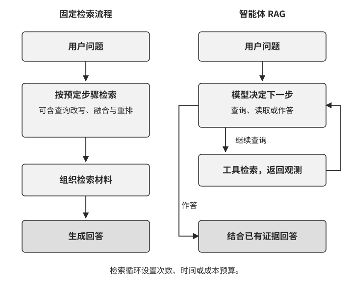

Agent 可以先搜索兼容条件，读到依赖项后补查迁移说明，再核对两份资料是否适用于同一版本。这与第 1 章介绍的行动—观测循环一致，ReAct 是组织这类循环的一种方式。每次工具返回的观测进入上下文，模型据此继续决策。

检索循环需要明确的停止条件。材料已经覆盖问题时，Agent 组织回答并标明来源；检索预算耗尽时，它根据已有证据回答能够确认的部分，并列出仍需补充的信息。评价这套设计时，要同时检查证据完整性、回答质量、调用次数和等待时间。

图3-13 展示了其中的职责分工。模型提出查询或作答，Harness 组织上下文、检查调用并执行预算约束，检索工具在授权范围内访问知识库，将片段与来源作为观测返回。知识库和检索服务位于外部环境中，工具接口将它们连接到 Agent。

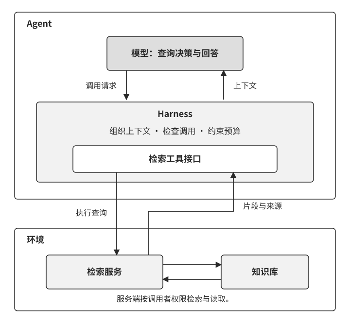

**检索内容按外部资料处理。** 文档可能含有试图改变 Agent 行为的指令，也可能包含错误或被篡改的信息。前一种情况涉及间接提示注入，后一种情况会污染回答依据。上下文应标明来源、资料范围和时间；知识入库与更新经过证据检查，回答中的关键结论能够回查原文。来源标记帮助模型识别材料，工具权限和执行授权由 Harness 与环境强制落实。转账、删除、对外发信等行动还要检查用户授权和业务条件。第 4 章将继续讨论执行环节的设计。

> **实验 3-8 ★★：比较固定检索与智能体检索**
>
> 在同一份中文法条语料上比较两种流程：基线用原问题检索一次，再生成回答；智能体流程由模型提出查询，读取结果后决定是否继续。两者使用相同的检索后端和回答模型，智能体流程最多搜索四次。
>
> 七个问题中，三个问题在两种流程下都找到了预先标注的目标法条。其余四题中，改写查询和继续搜索增加了目标法条的覆盖。例如，一次搜索未找到所需条文后，Agent 将查询收窄到具体罪名和条文，获得了更相关的材料；涉及多个条件的那一题，四次搜索后仍有目标材料遗漏。
>
> 阅读运行轨迹时，先比较每次查询新增了什么证据，再检查回答怎样使用这些证据。目标法条出现在检索结果中，只完成了证据获取这一步；回答还要正确解释条文并保留适用条件。把检索覆盖与回答检查分别记录，才能判断下一步应改查询策略、补充资料，还是改进答案组织。

同样的检索循环也可以用于用户记忆。把获授权保存的历史对话作为资料，Agent 就能按当前问题寻找过去的事实、选择和变更。这里需要同时检查三件事：相关记录是否找到、记录之间的关系是否保留、回答是否正确理解这些关系。

> **实验 3-9 ★★：用智能体检索读取用户记忆**
>
> 将对话历史按固定窗口分块，保留会话标识、时间及来源信息，再提供记忆检索工具。Agent 根据问题发起搜索，读取片段后可以继续查询，最后结合找到的材料回答。实验沿用本章的三层次评估集，每层 20 个案例。
>
> 按既定评分门槛，基础回忆、多会话检索、主动服务三个层次分别通过 19、15、13 个案例。逐例查看回答，可以进一步分辨召回、理解和主动关联中的问题。
>
> 车辆服务案例中，Agent 只搜索了一次，回答了本田车的保养安排，遗漏了用户还拥有另一辆车所带来的指代歧义。这个例子适合检查：什么时候应补查另一辆车的记录，什么时候应向用户确认对象。
>
> 转账变更案例中，Agent 连续搜索三次，找到了最后一次调整，并在回答中说明最终金额、日期和旧记录的替代关系。查看这些片段的时间与会话来源，可以理解系统怎样区分先后变更；再检查回答引用，确认每项结论都有相应记录支持。
>
> 多轮检索为寻找遗漏线索提供了机会。是否继续搜索，取决于模型能否发现当前材料的缺口；能否正确回答，还取决于片段是否保留了足够的背景和关联。实验 3-11 将在同一组问题上继续比较：给片段补充背景，以及同时提供结构化记忆，分别会带来什么变化。

固定窗口中的一句“好的，就按这个安排”，可能依赖前一段对话才能理解。接下来讨论上下文感知检索：在建立索引时，为片段补充定位和理解所需的背景。

### RAG 技巧：上下文感知检索

分块可以控制检索材料的长度，但有些片段需要借助周围文字才能理解。例如，“该公司第二季度收入增长了 3%”省略了公司名称和年份。查询中带有这些信息时，单独索引这句话就缺少相应的匹配线索。

Anthropic 介绍的**上下文感知检索（Contextual Retrieval）**，是在建立索引前，结合完整文档为每个片段生成简短的背景说明，再将说明与原始片段一起用于稠密检索和 BM25。背景应针对当前片段，补充理解它所需的人物、对象、时间或主题。[^ch3-1]

[^ch3-1]: Anthropic，[Contextual Retrieval](https://www.anthropic.com/engineering/contextual-retrieval)，2024 年 9 月。

图3-14 用产品文档说明这个过程。片段写着“升级前需要先备份配置”，标题和前文说明它适用于星河产品的版本升级。背景说明补入产品与版本，原始片段保留具体要求，检索时就多了定位依据。

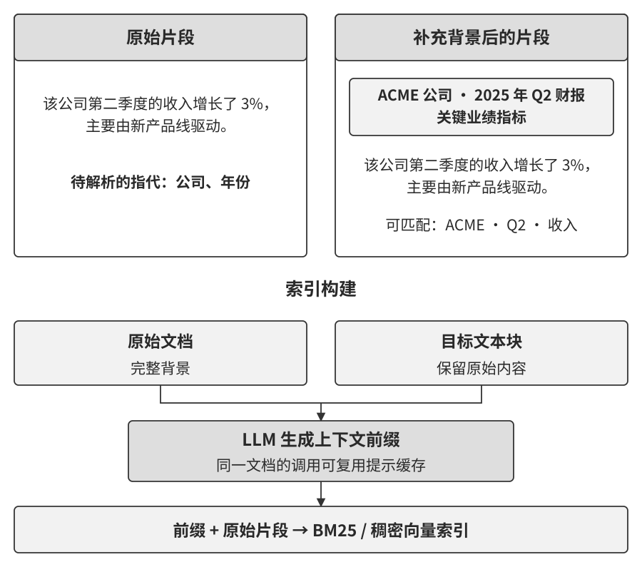

对 BM25，补充背景增加了可以匹配的词项；对稠密检索，背景参与片段的向量表示。两种方式都需要通过查询集检查变化：目标片段是否进入候选，排名是否提高，是否引入了更多无关材料。不同索引中的原始分数受文本长度和表示方式影响，比较时应使用目标片段的排名、召回率等指标。

生成背景时，要检查主体、时间和适用条件是否得到原文支持，并保留原始片段与来源。资料更新后，相应背景和索引也要重新生成或核对。处理同一文档的多个片段时，可以复用文档前缀缓存，减少重复输入的开销；实际成本取决于文档长度、片段数量、模型和缓存使用情况。

这里的背景补充发生在**索引阶段**，目的是让片段更容易找到和理解。第 2 章的上下文感知压缩发生在**运行阶段**，按当前任务整理历史、减少冗余。两者可以配合：先找到带有背景的证据，再按当前任务需要组织上下文。

> **实验 3-10 ★★：比较补充背景前后的检索结果**
>
> 从两份法律文本中选取 22 个片段，设置 15 个查询。每个查询标注一个目标片段，用相同分块分别建立原文索引与补充背景后的索引，再比较稀疏、稠密和混合检索。
>
> 补充背景后，BM25 将目标片段排在首位的查询由 9 个增至 12 个，稠密检索由 13 个增至 14 个，混合检索由 11 个增至 13 个。扩大到前三个候选时，各方法补充前后的命中数相同。这组结果体现了背景对排序的帮助，也说明候选数量会影响读者看到的收益。
>
> 选择一个排名变化的查询，依次查看原始片段、生成的背景和返回结果：背景补入了哪些查询线索？这些信息来自哪里？排在前面的其他片段是否也相关？再检查排名未变或下降的查询，寻找多余背景或表述偏差。这样可以把指标变化对应到具体的索引设计。

对用户记忆也可以采用同样的方法。一段“好的，就按这个安排”，可以结合所在会话补充安排的对象与时间；涉及多次修改时，还可以记录它与先前约定的关系。

> **实验 3-11 ★★★：用背景与结构化事实增强用户记忆**
>
> 沿用实验 3-9 的 60 个案例，比较三种配置：直接检索对话片段；为片段补充背景后检索；在带背景的检索结果之外，再向回答模型提供 Advanced JSON Cards 中的结构化事实。
>
> 实验先让 Agent 在原文索引上生成查询，再把同一组查询用于不同配置，观察索引材料和回答上下文变化后的结果。每个层次各有 20 例，按相同评分门槛统计通过数如下。
>
> | 记忆配置 | 基础回忆 | 多会话检索 | 主动服务 |
> | --- | ---: | ---: | ---: |
> | 原始片段 | 19 | 15 | 13 |
> | 片段补充背景 | 19 | 15 | 18 |
> | 背景片段＋结构化事实 | 19 | 20 | 18 |
>
> 补充背景后，主动服务层次的通过数增加；加入结构化事实后，多会话检索层次进一步改善。逐例比较可以判断，变化来自找到了更多相关片段，还是结构化事实直接补充了回答所需的信息。
>
> 转账变更案例在三种配置下都找到了最终状态。它适合用来检查时间、修改对象和替代关系：原始记录怎样表达先后变化，背景是否准确概括，结构化事实是否与最后一次确认一致。旅行案例同样在三种配置下通过，可用于检查行程与证件信息能否关联，以及回答是否区分已知事实和需要进一步查证的出行条件。

这组对照把本章的两条线索连接起来：**结构化记忆提供概览，检索提供相关细节。** 概览让关键事实进入当前决策视野，细节保留来源与具体条件。实际系统可以按任务选择需要常驻上下文的事实，将其余资料留在外部存储中按需读取，并让两层记录随知识更新保持一致。

### 从案例数据中提取知识

检索帮助 Agent 找到已有材料，数据分析则帮助它比较多份材料、归纳共同特征。例如，一批售后记录既包含故障描述，也包含处理结果。将产品版本、故障现象和维修方式整理成字段，就能进一步分析哪些情况经常一起出现，并为后续排查提供线索。司法案例同样可以按事实、情节和结果组织，再研究样本中的模式。

这类知识提取可以分成两个阶段，如图3-15 所示。

**第一阶段是提取字段，形成结构化记录。** 先阅读一组案例，提出候选字段，再合并同义项，明确每个字段的含义、取值和证据要求。对于内容差异较大的案例，可以同时设置通用字段和类别专属字段。随后让模型逐例抽取，并将结果关联到原文。未提及的信息保留为缺失，明确否定的信息记录为否定，两者分别处理。

**第二阶段是分析样本，提炼可检查的模式。** 对类别字段，可以为每种取值设置独立的指示位；对数值字段，需要处理单位和尺度；对缺失字段，需要选定处理方法并检查它对结果的影响。完成这些准备后，再比较案例之间的相似性、分组及结果分布。

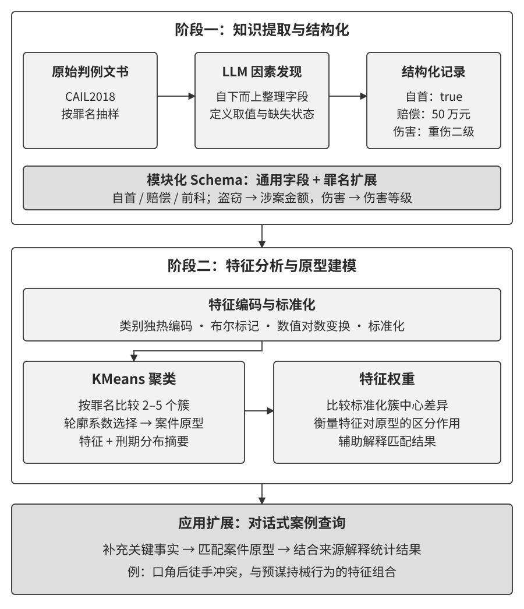

聚类将当前表示下相近的案例归为一组，可以用组内常见特征描述一个“案例原型”。理解这个原型，需要同时查看成员、样本数量和组内差异。**特征区分度描述哪些字段更能区分这些分组。** 要进一步解释某个因素怎样影响结果，还需要明确研究设计、控制其他变量，并检验解释是否成立。

这些产物可以成为 Agent 的新检索入口。它可以先按已知条件找到相关原型，再回查成员案例；也可以根据尚缺的字段组织后续提问。字段定义、样本范围和分析版本应随产物一起保存，使回答能够追溯到具体依据。

> **实验 3-12 ★★★：从司法案例中提取字段与样本模式**
>
> 从 CAIL2018 数据集中选取盗窃、故意伤害、诈骗三类案例，共 420 例。其中 360 例用于发现字段和建立原型，60 例作为留出样本。[^ch3-cail]
>
> 模型先分批阅读建模样本，提出候选因素，再合并为通用字段和各罪名的扩展字段。随后按同一套定义抽取案例信息。例如，自首和赔偿情况可以作为通用候选字段，涉案金额、伤害程度等则按具体类别组织。阅读抽取结果时，先检查字段定义是否清楚，再核对取值是否得到原文支持。
>
> 配套实现把字段编码为数值表示，在各罪名内聚类，并汇总每组案例的特征与刑期分布。运行得到 11 个原型，其中也有仅含一个样本的小组。这样的分组提醒我们检查：它反映了稳定的共同特点，还是被少数稀有取值或缺失信息主导？可以调整字段、缺失值处理和分组参数，再比较成员是否稳定。
>
> 留出样本按相同字段抽取后，匹配已有原型；其中 12 例进一步生成解释并交给独立模型评审。检查重点包括匹配依据、原型中的样本数量、统计值是否准确转述，以及待分析案例与原型有哪些差异。刑期标签用于描述组内样本结果，案例分组由抽取出的特征决定。
>
> 沿这条流程复核，可以依次发现字段遗漏、抽取错误、表示偏差和解释错误。将确认有效的字段与检索入口交给 Agent，才能把数据分析的产物接到后续的信息收集和问答中。

[^ch3-cail]: [CAIL2018 官方项目与数据说明](https://github.com/china-ai-law-challenge/CAIL2018)。

这一方法把知识库扩展为可分析的资料集合：原文提供证据，结构化记录支持比较，样本模式帮助提出问题。投入业务使用前，应围绕具体任务评价抽取准确性、模式稳定性和回答效果，并由领域专家核对字段含义与适用条件。

### 前沿探索：多模态记忆

用户记忆还可能包含图像、声音和视频。文字可以记录“这张照片拍于上次旅行”，原始图片则保留人物外观、空间关系和其他细节。设计多模态记忆时，需要同时考虑保存什么、怎样检索，以及模型怎样读取找到的内容。下面沿原始数据、输入表示和内部存储三个方向展开。

**思路一：保存原始数据及其描述。** 将图片、音频或视频存入外部存储，记录时间、对象、来源和文字描述。查询时先利用描述或多模态向量定位候选，再读取原始内容核对细节。例如，查找某次会议的白板讨论，可以先按会议主题和时间定位图片，再由多模态模型读取图中的连线与文字。经用户授权保存的人像或声音，也可以通过类似流程组织，访问时执行相应权限检查。

**思路二：让模型直接读取多模态表示。** 编码器把图片或声音转换成向量，再通过训练过的连接模块送入模型。研究这条路线时，可以尝试将记忆对象压缩成少量向量，使它们在后续任务中参与注意力计算。需要共同设计编码器、连接方式和读取训练，让模型学会使用这些表示。

这里的容量取决于表示方案：一个对象可以对应一个或多个向量，每个向量仍有维度、精度和存储开销；送入模型后，还会增加计算量。评估时可以逐步增加对象数量，检查相似对象能否区分、细节能否保留，以及查找所需的时间和内存。工程接口也要支持传入这些表示，并在使用时关联用户、来源和版本。

**思路三：为模型提供可寻址的内部记忆。** 进一步的研究方向，是把用户内容写入模型内部的记忆结构，让模型按当前上下文读取。这里需要协同解决寻址、内容写入和读取后的推理。多模态扩展还要建立图像或声音与记忆地址之间的联系，并检查写入、更新和删除是否影响其他对象。

> **延伸阅读：User as Engram 的内容与能力分工**
>
> 我在 User as Engram 中研究了文本用户事实的内部存储。用户事实写入 Engram 模型按哈希寻址的记忆表，共享适配器学习怎样利用事实回答间接问题。用户内容与推理能力分别承载，服务时加载当前用户的记忆记录。[^engram]
>
> 研究比较了直接回忆和间接推理：模型能复述某条事实后，还要检查它能否在新的问题中使用该事实。这个区分也适用于多模态记忆。例如，保存了白板图像之后，仍要评价模型能否结合图中关系解释后续问题。
>
> 将这条路线扩展到多模态对象，需要继续设计跨模态表示与寻址，并评价对象数量、更新频率和跨任务使用效果。文本事实研究为这种内容与能力的分工提供了一个起点。

[^engram]: Li, Bojie，[User as Engram: Internalizing Per-User Memory as Local Parametric Edits](https://arxiv.org/abs/2606.19172)，2026。论文比较了不同的记忆写入与优化方法，并研究共享推理适配器和每用户记忆表的组合。

## 本章小结

本章从跨会话服务出发，讨论用户记忆与知识库怎样保存、组织和使用信息。用户记忆关联特定用户的事实、偏好与交互经验；知识库组织供授权访问的业务资料。持久保存的信息经过检索与选择，进入当前任务的上下文，才参与模型决策。

可靠的记忆需要保留对象、时间、条件和来源。自然语言笔记、结构化卡片与可执行状态各有用途，可以围绕更新、查询和检查需求组合。基础回忆、多会话检索和主动服务三个层次，则帮助我们检查保存的信息是否真正改善后续任务。

知识检索从分块、稀疏与稠密表示开始，可以按需要加入融合与重排序。层次摘要、实体关系和目录提供不同入口；上下文感知检索为片段补充背景；智能体 RAG 根据已有证据决定后续查询。评价这些方法时，既要检查检索排名和证据覆盖，也要检查回答怎样使用材料。

知识维护包含增量更新和定期整理。提议者提出变更，审核者回查证据，通过检查后发布，并同步维护摘要与索引。结构化概览、原始细节和分析产物由来源与版本联系起来，使知识能够持续修订和追溯。

第 2 章关注当前任务中的上下文，本章将信息管理扩展到跨任务存储。第 4 章继续讨论 Agent 如何通过工具获取信息和执行行动；第 9 章则在轨迹、评估与知识维护的基础上，讨论怎样把任务经验转化为经过验证的行为改进。

## 思考题

1. ★★ 同一用户在不同会话中提供了两个家庭住址。记忆系统应怎样判断这是搬家、临时收件地址，还是需要确认的冲突？请说明来源、时间和适用条件的保存方式。
2. ★★ 为片段生成背景时，原文中的矛盾可能进入索引。你会怎样检查背景质量，并在检索和回答阶段使用来源、版本与时效信息？
3. ★★ 将图表转成文字描述可能遗漏空间关系。请举一个例子，设计同时保存描述、结构和原图的方案，并说明检索后如何核对细节。
4. ★★★ 结合 Rich Sutton 的“苦涩的教训”，讨论模型能力和上下文窗口增长后，本章的分块、索引和检索流程会怎样变化。请比较全量输入与按需检索的质量、成本、更新和权限管理，并设计一组用于取舍的评估。
5. ★★★ 更强的基座模型会怎样改变领域知识库的作用？请结合通用知识、最新业务资料和用户私有信息，说明哪些内容适合通过外部存储提供。
6. ★ RAPTOR 的多层摘要与 GraphRAG 的实体关系、社区报告分别提供哪些查询入口？请各举一个问题，并说明如何回到原始材料检查回答依据。
7. ★★ 哪些资料适合用目录、入口页和链接组织？这种组织方式可以怎样与向量检索配合，又需要怎样维护？
8. ★★★ 从案例中发现字段和样本模式后，应怎样评价这些知识的质量？请区分抽取准确性、模式稳定性、任务效果与因素影响，并说明领域专家参与的环节。
9. ★★★ 请为 Markdown 用户记忆库设计增量更新与定期整理流程。若提议者与审核者使用同一模型，审核者又只能看到预选片段，可能遗漏哪些问题？请从模型独立性、证据覆盖和工具权限三方面改进设计。
