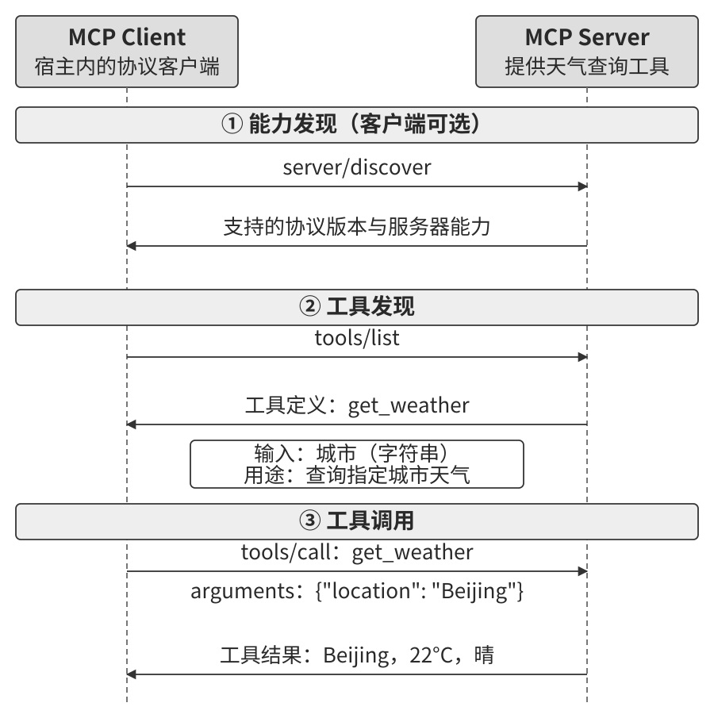
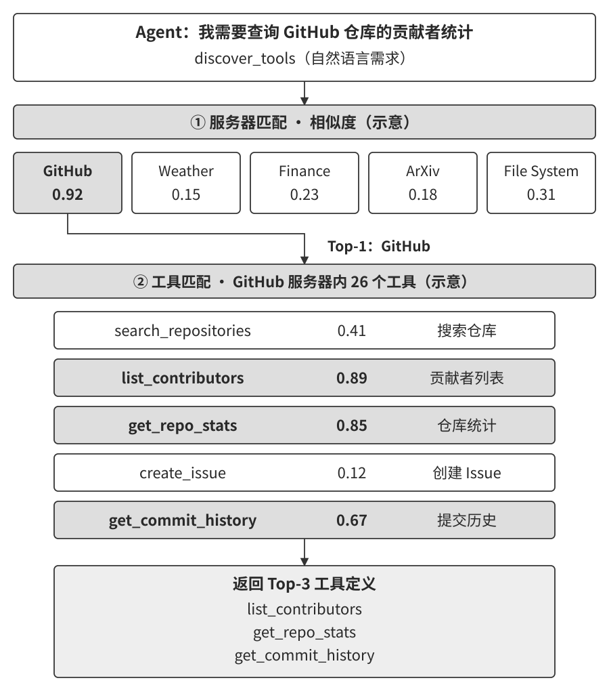
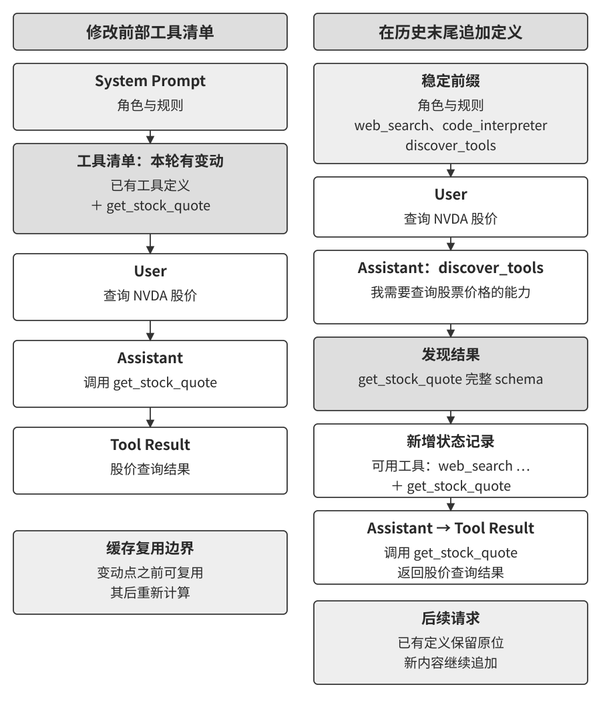
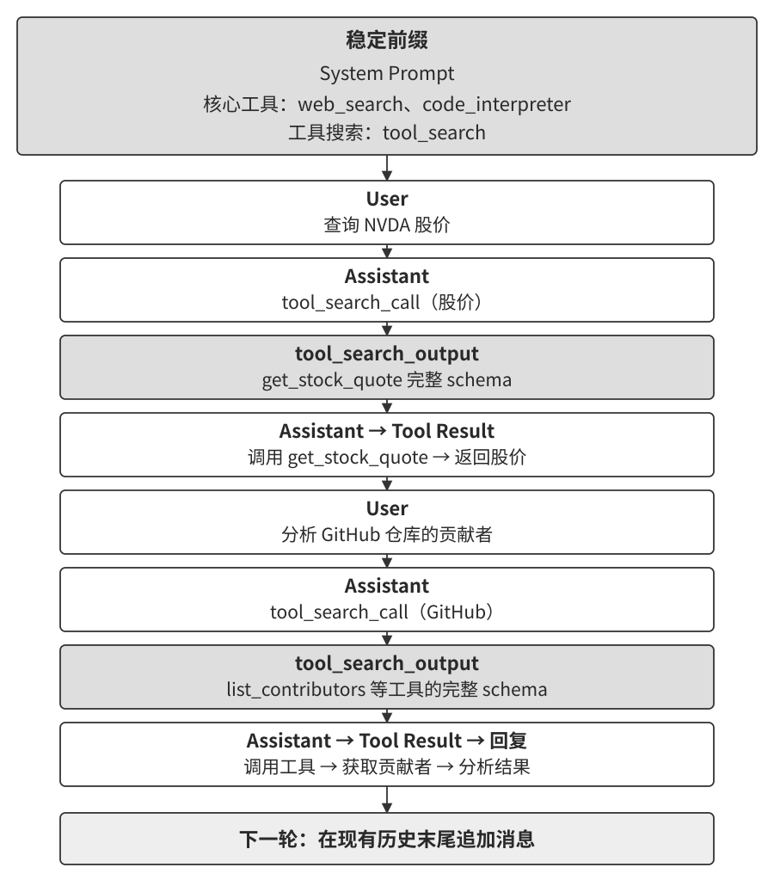

# 工具

电影《Her》中的 AI 助手 Samantha 可以整理邮件、协助写作，并代表用户处理事务。这样的助手需要持续获取信息，也需要把决定变成行动。对 Agent 而言，工具就是连接模型与环境的“感官和手脚”：搜索和读取带来观测，写入和调用外部服务改变任务状态。

前两章分别讨论当前上下文与跨任务知识。本章进一步追问：怎样把外部能力交给 Agent，让它选得对、传得准，并看懂执行结果？我们先梳理五类工具的用途，再讨论接口设计、MCP 与 Skill Hub、工具发现，最后展开感知、执行和协作工具。事件触发与多渠道用户沟通涉及异步运行机制，将在第 6 章继续讨论。

## 工具的分类

第 1 章从感知、执行、协作、事件触发和用户沟通五个方面介绍了工具。表4-1 按交互方式和主要用途整理这些视角。同一个接口可以具有多种属性，例如浏览器既读取页面，也提交表单；向用户发送邮件同时具有执行和沟通属性。

**表4-1 五类工具的交互方式与主要用途**

| 工具类型 | 交互方式 | 主要用途 |
| --- | --- | --- |
| 感知工具 | Agent 发起查询或读取 | 获取环境中的信息 |
| 执行工具 | Agent 提出操作请求，执行层检查后执行 | 修改文件、提交业务操作等 |
| 协作工具 | Agent 委托任务、交换消息或查询进度 | 与其他 Agent 分工合作 |
| 事件触发工具 | 注册监听或由系统配置，外部事件到达后触发 | 把新事件交给 Agent 处理 |
| 用户沟通工具 | Agent 发出回复、确认请求或通知 | 与用户交换信息、协调任务 |

**感知工具**用于搜索网页、检索知识库、定位和读取文件。设计时要让结果保留来源、范围和必要细节，并控制进入上下文的信息量。例如，先返回文件匹配位置，再按需读取相关段落，可以帮助 Agent 逐步缩小查找范围。

**执行工具**用于写入文件、运行程序、发送邮件或修改业务记录。设计重点包括授权、参数校验、结果确认和失败恢复。终端与代码解释器可以完成多种操作，执行层需要根据实际请求检查权限和资源限制。

**协作工具**用于创建子 Agent、委托任务、传递消息、查询进度和取消工作。独立的资料调研可以分别进行，需要不同上下文或专业工具的任务也可以交给相应 Agent。协作接口应说明任务范围、交付物和状态，帮助主 Agent 汇总结果。第 10 章将进一步讨论多 Agent 的分工与协调。

**事件触发工具**把定时任务、新邮件、后台任务完成等事件接入运行系统。监听可以由 Agent 注册，也可以由应用预先配置。事件到达后，运行时记录事件、检查处理条件，再调度 Agent。注册与触发发生在不同时间，可靠实现需要保存状态并处理重复事件。

**用户沟通工具**用于回复消息、展示结构化信息、请求确认和发送提醒。人在关键步骤参与审核，可以通过这类接口或专门的审批接口完成。跨渠道沟通还要处理接收对象、消息送达和用户回复，它与事件触发共同构成第 6 章实时交互的基础。

接下来先看各类工具共同面对的设计问题：能力怎样表达，调用说明怎样写，参数和结果怎样准确传递。

## 工具设计的通用原则

**Agent—计算机接口（Agent-Computer Interface，ACI）**关注 Agent 如何使用软件。SWE-agent 等研究通过文件浏览、编辑和执行接口，考察接口设计对任务表现的影响。[^ch4-aci] 设计工具时，需要把模型视为接口的使用者：它要知道何时调用、如何提供参数，以及怎样根据返回结果继续工作。

[^ch4-aci]: Yang et al., [SWE-agent: Agent-Computer Interfaces Enable Automated Software Engineering](https://arxiv.org/abs/2405.15793), 2024。

直接封装现有 API 是一种起点。进一步设计时，可以围绕任务中反复出现的操作组织接口，把必要的检查和反馈一起提供。例如，读取文档的工具既要返回内容，也要交代读取范围；编辑工具既要接收改动，也要返回是否匹配和实际修改结果。

### 能力的表达形式：专用工具、通用执行器与 Skill

以部署应用为例，可以提供一个接收目标环境和应用版本的专用工具，也可以由 Skill 说明构建、检查、发布的流程，再调用终端或其他工具完成各步操作。两种方式可以组合：Skill 负责串起流程，专用工具负责受控的发布操作。

**专用工具**为一项操作定义清晰的输入、输出和执行行为。参数结构便于检查，服务端可以集中处理业务约束、授权与审计。它适合接口稳定、调用频繁或业务条件明确的操作。

**通用执行器**提供终端、代码解释器等通用能力。模型可以生成程序，处理数据、调用库或组合已有接口。它能覆盖许多事先未单独封装的任务，执行环境负责限制可访问的资源和可执行的操作。

**Skill**保存完成某类任务的方法、步骤和参考资料，指导 Agent 使用已有工具。正文可以用自然语言编写，便于领域人员修改；附带的元数据、脚本和资源则按各自格式维护。修改后需要检查步骤、工具依赖和实际任务效果。

能力的表达形式与披露方式可以分别设计。专用工具可以通过目录按需加载定义，Skill 也可以先提供摘要、需要时再读取正文。前者决定操作怎样传参和执行，后者决定当前让模型看到哪些能力。常驻上下文的成本取决于实际提供的定义与目录长度。

**我的默认取向是优先考虑通用工具。** 模型已经具备代码生成能力，在受控环境中提供解释器和常用计算库，可以让它组合完成统计、转换和分析任务。新增一种计算需求时，往往只需生成相应代码。第 5 章将进一步讨论代码作为通用能力的价值。

专用接口则可以集中处理特定操作的复杂性。选择时，我主要看四个维度：

- **权限与审计。** 发布应用、修改生产数据等操作适合通过受控入口检查业务条件并记录结果。通用执行器也需要沙盒、凭证范围和执行检查，与专用接口共同落实权限。
- **参数复杂度。** 嵌套对象、多字段约束和精确文本适合结构化传参。经过终端执行时，还要处理命令行解析和转义；复杂数据可以通过结构化文件交给执行程序读取。
- **变更频率。** 经常调整的流程可以在 Skill 中维护，稳定的底层操作由工具承载。流程变化涉及权限、脚本或依赖时，相应检查也要同步更新。
- **模型表现。** 用代表性任务比较模型选择工具、构造参数、理解错误和修复问题的能力，再决定需要多少流程指导与专用封装。

工具粒度也要围绕使用过程调整。多种文档格式的读取可以共用一个入口，由实现识别格式并返回一致的结果。频繁使用的文件定位和内容搜索，则可以分别提供接口，让搜索范围、匹配位置和返回数量更明确。整合有助于复用，拆分有助于突出操作语义，取舍依据是实际调用中的错误与成本。

**代码还可以编排多次工具调用。** 例如，收集多个网页中的产品信息时，脚本可以逐页读取、提取字段并汇总，中间数据保留在执行环境中，向模型返回结果摘要和来源。这样可以减少往返调用及大段原文进入上下文的次数。遇到需要模型判断的分支时，再返回相关材料；各次外部操作继续执行权限检查，并保留可追溯的运行记录。

第 9 章将再次讨论这些选择：Agent 从任务中积累新方法后，可以将流程沉淀为 Skill，将稳定操作固化为代码或工具，再通过评估决定是否采用。

### 工具描述：让模型知道何时调用、怎样调用

工具描述需要回答四个问题：适用于什么任务，需要什么输入，会返回什么，以及调用后会发生什么。例如，网页搜索适合查找最新资料和未知事实，文件名搜索用于定位文件，文件内容搜索用于查找文本中的词句。把匹配对象和返回范围写清楚，模型就有了选择依据。

参数说明应同时给出含义、单位、约束和示例。时间参数要交代时区与精度，金额参数要交代币种和单位，电话号码要交代国家代码的处理方式。结构化定义负责表达类型、必填项和可校验的条件，示例展示典型参数组合。涉及多个字段共同决定含义时，要解释它们之间的关系。

返回结果也需要约定。搜索工具可以返回标题、来源和摘要，文件工具可以返回匹配位置与读取范围。结果经过截断时，应说明哪些部分已返回、怎样继续读取。耗时较长的操作还要交代完成状态、查询进度的方式及主要开销，帮助 Agent 安排后续工作。

对于会改变状态的操作，描述应说明影响对象、执行条件和重复调用的行为。例如，一次提交超时后，Agent 需要知道怎样查询是否已经成功，再决定是否重试。错误反馈也应指出出错环节、可修正的参数和当前状态，使下一次调用有明确依据。

**工具选择出错时，先检查描述与实际行为是否一致。** 可以收集一组容易混淆的任务，检查模型是否选对接口、参数是否完整、失败后是否采取合适的下一步。修改描述后用同组任务复核，再判断是否还需要调整工具粒度、示例或模型。Skill 的适用条件、输入要求和操作步骤也可以用同样的方法检查。

### 参数传递的保真性

**工具应准确传递调用参数，并让必要的转换可见。** 模型根据读取结果构造下一步操作，输入经过未说明的改写后，读取与执行之间就可能出现难以排查的偏差。

以精确替换文本为例，文件中使用中文弯引号，读取工具将它原样返回。模型据此提交待替换内容；如果中间层把弯引号转换成直引号，编辑工具就会报告匹配失败。此时需要核对读取、参数传递和匹配三个环节，找到字符在哪一步发生变化。写入也要保留请求中的字符，并返回实际改动，便于后续检查。

类似问题还会出现在命令封装中。执行层如果自动追加标记参数，而底层程序的当前版本不支持该参数，调用就会失败。错误反馈应呈现实际执行的操作和失败原因，使模型能够定位兼容性问题。敏感凭证按日志规则隐藏，影响执行的参数与转换过程则保留可检查的记录。

如果业务需要统一编码、补充默认值或调整格式，应在接口约定中说明，并在结果中标明影响操作含义的变化。精确匹配和写入工具还可以用包含中文标点、空格与换行的样例，检查输入到执行结果的完整传递。**保真性让 Agent 能够把看到的信息、提出的请求和实际结果联系起来。**

## 工具生态：MCP 与 Skill Hub

一个 Agent 接入文件、数据库和业务服务时，往往需要维护多套接口适配。**Model Context Protocol（MCP）**为应用与外部能力之间的通信提供共同约定，使同一服务器可以被多个兼容应用接入。它规定能力怎样描述、发现和调用，应用负责将这些能力交给模型使用。[^ch4-mcp-architecture]

MCP 架构包含三个角色：**宿主**是运行 Agent 的应用，负责模型交互、上下文和权限策略；**客户端**是宿主中与服务器通信的组件；**服务器**提供工具、资源或提示模板。宿主可以管理多个客户端，分别接入不同服务器。

服务器通常提供三类能力：

| 能力 | 提供的内容 | 示例 |
| --- | --- | --- |
| 工具 | 可调用的操作 | 查询数据库、编辑文件 |
| 资源 | 可读取的上下文材料 | 数据库结构、文档内容 |
| 提示模板 | 可复用的交互模板 | 按固定要求整理一份分析 |

工具可以获取信息，也可以改变状态。应用按任务需要选择接口，并检查相应访问权限。以数据库为例，资源可以提供表结构，查询工具按条件返回记录，提示模板帮助组织分析问题。

图4-1 展示一次工具发现与调用的主要过程。客户端取得工具定义后，宿主选择当前任务需要的定义提供给模型。模型提出调用请求，宿主检查参数与权限，再经客户端发送给服务器；服务器执行后返回结果，由宿主组织为下一次模型调用的上下文。

工具定义用结构化模式描述输入，并可提供输出约定。运行时仍需检查参数、业务条件和返回状态。服务器列出的能力、宿主准许使用的能力，以及本次提供给模型的能力，分别由发现、权限与披露策略决定。[^ch4-mcp-tools]

传输方式则解决消息怎样到达服务器。标准输入输出适合本地进程间通信，Streamable HTTP 可用于远程服务，并支持流式返回。接入时需要确认双方支持的协议版本、能力和传输方式，再配置身份认证与权限。服务器的部署位置与模型运行位置可以独立安排。

[^ch4-mcp-architecture]: MCP，[架构概览](https://modelcontextprotocol.io/docs/learn/architecture)。
[^ch4-mcp-tools]: MCP，[工具接口规范](https://modelcontextprotocol.io/specification/2025-11-25/server/tools)。

### Skill 的分发与加载

MCP 连接运行中的能力，Skill 则将任务方法、说明和配套资源打包供 Agent 使用。Skill 可以指导 Agent 调用 MCP 工具，也可以使用终端或应用内置接口。分发平台帮助读者发现和安装这些包，宿主负责读取它们并组织后续执行。

Vercel 的 skills.sh 提供 Skill 目录及安装管理工具，OpenClaw 生态中的 ClawHub 也提供 Skill 发布与发现服务。[^ch4-skills-sh][^ch4-clawhub] 选择 Skill 时，可以先阅读适用任务、所需工具和维护来源，再检查配套脚本与依赖。

[^ch4-skills-sh]: Vercel，[Introducing skills, the open agent skills ecosystem](https://vercel.com/changelog/introducing-skills-the-open-agent-skills-ecosystem)，2026 年 1 月 20 日。
[^ch4-clawhub]: OpenClaw，[ClawHub 文档](https://docs.openclaw.ai/clawhub)。

安装与加载是两个步骤。包可以已经保存在本地，当前上下文中只提供名称和简短描述；任务需要时，再读取详细流程。MCP 工具同样可以先进入宿主目录，再按需向模型披露。比较上下文成本时，应统计实际加载的定义、说明、示例和执行结果。下一节将讨论能力数量增长后的发现策略。

### 第三方能力的接入检查

第三方工具和 Skill 会把说明、返回内容或代码引入系统。接入时，可以沿三个方面检查。

**先确认来源和版本。** 保存服务器地址、发布者、包版本及审核记录，升级时查看定义与实现的变化。工具名称应与来源绑定，路由时使用明确标识，界面也展示实际执行方，减少同名工具造成的混淆。

**再检查进入上下文的内容。** 工具描述、Skill 说明和返回材料可能包含试图改变任务或权限的指令。宿主应保留来源标记，审核与任务无关的要求，并让模型可以识别材料的用途。发现异常时，停止使用相应能力并记录原因。

**最后限定执行权限。** 本地服务器和附带脚本在隔离环境中运行，文件、网络和凭证按任务分配；远程服务使用限定范围的授权，发送前检查参数中的数据是否属于本次任务。需要审批的操作进入独立授权流程，执行后保留结果与审计记录。

安全扫描可以帮助发现已知问题，实际执行还要经过权限与业务条件检查。后文的 Sidecar 审查可以增加独立核对步骤，执行环境负责落实最终权限。第 5 章将结合代码执行继续讨论外部内容、私有数据与对外通信组合时的风险。

## 工具太多怎么办：层次化组织与主动工具发现

“能力的表达形式”一节问的是一项能力该做成什么形态，这一节问的是另一件事：**不管做成什么形态，一次该让模型看见多少？** 当可用工具从十几个增长到成百上千，工具库本身就成了一个需要设计的对象——它们该如何组织、如何暴露给模型、Agent 又该如何找到当下需要的那一个。规模本身就会伤害正确性：工具数量超过一百个时，即使最先进的大语言模型也容易在工具选择上出错；全部平铺进上下文还要占去大量 token，并让每一次工具集的变动都击穿 KV Cache。

答案有三层，一层比一层更“按需”。最朴素的一层是**层次化组织与按需加载**：工具定义仍然事先备好，只是不再全量塞进上下文。再进一步是**主动工具发现**：Agent 在执行过程中意识到能力缺口，主动声明需求，由系统动态匹配并注入。最轻量的一层是 **Skills**：干脆不把工具当成需要注册、检索、注入的正式定义，而当成一份可以随手翻阅的参考资料。

### 层次化组织与按需加载

**按需加载：只暴露索引。** MCP 生态的快速扩张带来了一个工程问题：仅仅 5 个 MCP 服务器就可能引入数万 token 的工具定义开销，在 200K 的上下文窗口里还没开始对话就用掉了近三成。Cursor 在实践中验证了一种缓解方案：将工具描述同步到文件夹中，Agent 默认只看到工具名称的索引，需要时再查询具体的定义。A/B 测试显示，这种方式使 MCP 工具相关任务的总 token 消耗减少了 46.9%。

Pi Coding Agent 把这一思路落实为更激进的架构取舍：核心模块刻意不内置 MCP，优先建议把能力封装成带 README 的 CLI 工具，再由 Skills 按需加载；确实需要 MCP 生态时，则通过扩展接入[^ch4-pi-no-mcp]。社区扩展 `pi-mcp-adapter` 展示了一种折中实现：模型默认只看到一个约 200 token 的代理工具，通过“搜索→查看定义→调用”按需发现后端工具，MCP 服务器也延迟到首次使用时才启动[^ch4-pi-mcp-adapter]。这个案例说明，**是否采用 MCP 作为互操作协议**与**是否在会话开始时暴露所有 MCP 工具定义**是两个独立决策：后端可以保留 MCP 的生态兼容性，前端仍应以 CLI + Skills 或代理工具实现渐进式披露，避免服务器越接越多时上下文和 token 开销同步膨胀。

[^ch4-pi-no-mcp]: Pi Coding Agent, “Philosophy: No MCP,” https://github.com/earendil-works/pi/tree/main/packages/coding-agent#philosophy；Mario Zechner, “What if you don’t need MCP at all?”, 2025-11-02. https://mariozechner.at/posts/2025-11-02-what-if-you-dont-need-mcp/；Pi 介绍中的相关讨论见 21:25 起：https://www.youtube.com/watch?v=Dli5slNaJu0&t=1285s（国内镜像：https://www.bilibili.com/video/BV1M7796VEHj/）
[^ch4-pi-mcp-adapter]: `pi-mcp-adapter`, “Why This Exists” 与 “Quick Start,” https://github.com/nicobailon/pi-mcp-adapter

**层次化组织。** 除了按需加载工具描述，当工具的数量增长到上百个时，层次化的组织方式也比扁平列表更有效。一种有效的方式是**按信息源的性质分类**：

- **搜索工具**：主动查找信息（网络搜索、知识库搜索、文件搜索）
- **读取工具**：从已知位置提取内容（网页阅读、文档读取、数据库查询）
- **解析工具**：处理非结构化数据（图片 OCR、视频分析、音频转录）
- **查询工具**：访问结构化数据源（天气 API、股票 API、公开数据库）

在系统提示词中显式说明分类结构，可以帮助 LLM 快速定位到相关的工具组。

**检索式预筛选。** 更进一步的方案是不把全部工具定义一次性注入上下文，而是按语义相似度先筛出一批候选工具再注入。当可用工具达到上百个时，平铺到上下文中既浪费 token 又干扰决策。Anthropic 的实验显示，这种按需检索的方式使 Opus 4 在工具使用基准上的准确率从 49% 提升到 74%。

### 模型原生的主动工具发现

检索式预筛选缓解了工具过多的问题，但有一个内在局限——它按用户的初始查询做**一次性**匹配，而 “Debug the file” 这类看似简单的请求，实际可能牵出文件访问、代码分析、命令执行等多步骤、跨领域的工具链，任务开始时无法预见所有需求。

**从被动选择到主动发现。** 更进一步的思路，是让 Agent 从被动接受者变为主动发现者：在执行过程中意识到能力缺口时，主动用自然语言声明 “我需要什么能力”，系统再动态匹配并注入。MCP-Zero[^mcp-zero-2025] 是代表性工作：系统提示词中不预置任何工具 schema，Agent 在思考中生成结构化请求块（如 “GitHub 服务器：搜索仓库并返回元数据”），系统通过服务器级→工具级的两层语义路由从数千候选中匹配注入，论文报告在约 2800 个工具上比全量注入节省约 98% 的 token。

工程上更常见的等价方案，是在系统提示词里只保留少数基础工具（web search、code interpreter）外加一个 “工具搜索工具”，Agent 用自然语言描述需求即可检索并加载。Anthropic 在 Claude API 中提供的 Tool Search Tool 即属此类。两者的共同点都是 “Agent 声明缺口、系统按需注入”。

[^mcp-zero-2025]: Fei, X., et al. *MCP-Zero: Active Tool Discovery for Autonomous LLM Agents.* arXiv:2506.01056, 2025.

**层次化匹配与降级。** 高效匹配的关键在于工具组织本身具有层次结构：在 MCP 等协议中，工具按**服务器**分组（类似手机上的 App，每个 App 提供一组相关功能），于是匹配可分两层——先按能力描述定位相关服务器，再在服务器内匹配具体工具，把搜索空间从 “数千个工具” 缩小为 “数十个服务器 × 每个服务器数十个工具”，既省算力也减少跨领域的语义混淆。工程上这依赖一个离线构建、支持增量更新的嵌入索引；若两层匹配的候选相似度都低于阈值，则应明确返回 “未找到”，让 Agent 改写需求重试、用基础工具手工实现，或干脆创造一个新工具（创造工具是第九章的主题）。

首次加载后的 schema 固定在轨迹原位置，静态前缀仍可复用。

**动态加载与 KV Cache。** 主动发现有一个微妙的工程代价：动态加载工具会**破坏 KV Cache**——若把全部工具定义放进静态前缀，每加载一个新工具就使整段缓存失效。破解思路和各大 API 的原生支持（OpenAI 的 `tool_search` 与 `defer_loading`、Anthropic 的 `tool_reference`、Codex CLI 默认开启的 `tool_search`）已在第二章“工具定义的设计”一节介绍：把新工具的完整 schema 追加到上下文末尾，静态前缀保持稳定，schema 此后固定在轨迹的原位置，作为普通历史消息继续命中缓存；状态栏则只维护一份简短的工具名列表。

这里补充两点第二章未展开的工程细节。其一，两个 API 都对“固定在原位置”给出了明确保证：OpenAI 要求后续请求保持 `tool_search_output` 项的原位置，同一工具无需重复加载；Anthropic 在会话历史的原位置内联展开 `tool_reference` block，官方文档明确表示后续每一轮都能保持缓存命中。其二，真正会导致重算的只有两种情况：Prompt Cache 的 TTL 过期（整段前缀一起重算，并非工具定义特有的代价），以及修改、移除或重排已加载的工具集（缓存从变动点起失效）。

图4-4 展示了多轮动态发现之后的上下文全貌：静态前缀中只保留系统提示词、核心工具与工具搜索元工具，历次发现的工具 schema 散落在轨迹各处，并固定在首次注入的位置，后续轮次作为普通历史命中缓存。这也意味着 “工具定义必须在上下文最前面” 不再是铁律——前缀依然是静态的、只增不改的，只是工具定义获得了按需进入轨迹的能力；代价是模型必须在后训练中学会理解散落在上下文各处的工具定义。

不难看出，这一整套 “主动声明—语义匹配—动态注入” 的机制虽然有效，工程上却相当繁琐：要离线维护嵌入索引、要处理 KV Cache 失效、还要为弱模型做专门训练。它们共同的前提，是把每个工具都当成一份**面向模型的正式定义**，先注册、再检索、再注入。下一节的 Skills 机制换了一种更轻量的思路。

> **实验 4-1 ★★★：主动工具发现**
>
> 本实验通过对比验证主动工具发现对小参数量模型的显著价值。使用 Qwen3-4B 模型访问本章感知工具实验（实验 4-2）中构建的 MCP 服务器中的 120+ 工具。
>
> **实验设置**：准备一组需要跨领域工具协作的任务，例如：
> - “查询苹果公司最新股价，搜索相关新闻分析原因”（需 Yahoo Finance + Web Search）
> - “在 arXiv 上搜索关于 transformer 的最新论文，下载排名前三的论文”（需 arXiv Search + File Download）
> - “分析 GitHub 上某个仓库的贡献者统计，生成可视化报告”（需 GitHub + Code Interpreter）
>
> **对照组**：将所有 120+ 工具的完整 schema 一次性注入 system prompt（超 50K tokens）。4B 模型在这么长的上下文下指令遵循能力严重退化，出现典型问题：面对“查询股价”可能错选 Web Search 而非专门的 Yahoo Finance 工具，或者“忘记”工具列表中某些工具导致任务失败。
>
> **实验组**：实现前文所述的混合方案（MCP-Zero 的主动发现思想 + 工具搜索工具式实现）：(1) system prompt 仅保留 `web_search`、`code_interpreter` 和 `discover_tools` 元工具；(2) `discover_tools` 接受自然语言需求（如“我需要查询股票价格的能力”），通过嵌入向量相似度匹配返回 3-5 个候选工具及完整 schema；(3) 新工具定义追加到对话历史（作为 user message），Agent 状态栏更新工具名称列表；(4) 引导模型在遇到能力缺口时主动调用 `discover_tools`。
>
> **预期观察**：准确率和任务完成率显著提升。主动工具发现不仅帮助能力较强的大模型应对成千上万工具的场景，更让小参数量模型在上百工具的场景下保持可用。

### Skills：把工具发现变成“按需查阅”

近来更流行的一种思路来自 Skills 机制。第二章从上下文工程的角度介绍过 Skills 的**渐进式披露**（Progressive Disclosure）；这里换个角度，把它看作一种工具发现范式。它与上一节最大的不同，是不再需要那套 “嵌入索引 + 语义匹配” 的基础设施。

**渐进式披露。** 这是第一章命名的渐进式披露模式在工具侧的变体。MCP 协议本身并不规定工具定义是全量还是按需进入模型上下文，但早期或简单的宿主实现通常会把完整 schema 一次性摆在模型面前，面向大规模工具集的实现则要另建一层发现与披露机制（关键词或语义检索、服务器命名空间、允许列表，或模型原生的 Tool Search）。Skills 则把渐进式披露作为默认的组织方式：Agent 启动时只看到一份薄薄的目录——每个 skill 的 `name` 与 `description`（合计数百 token）。当**当前上下文**真的需要某种能力时，模型才去读取对应的 sub-skill，并顺着其中的引用再往下一层，读取具体的脚本或子文档。

Skill 更接近人使用参考资料的方式。没有人会把一本工具书或整个维基百科从第一页读到最后一页，而是顺着索引和目录，根据当下需要逐个查阅词条。工具的详细定义不必全部常驻上下文，用到哪条查哪条。

专用工具要达到同样的渐进式披露，必须在工具之外另建一层——关键词检索或嵌入索引、检索元工具、命名空间与允许列表、`tool_search` 与 `tool_reference` 这类 API 原语，也就是上一节那套基础设施存在的理由。是否采用 MCP 作为互操作协议，与是否在会话开始时暴露全部工具定义，是两个独立的决策；Skills 的优势在于把渐进式披露内建为默认形态，实现成本更低，因此是一种更省心的工具发现思路。

前面把 MCP 与 Skill Hub 讲成两条并行的渠道，但它们并非互不相干：MCP 官方已经在推动 skill 经由 MCP 被发现和传递[^ch4-skills-over-mcp]。也就是说，同一个 skill 既可以躺在 Skill Hub 里等 `npx` 来装，也可以由一台 MCP 服务器供给。

[^ch4-skills-over-mcp]: Model Context Protocol, “Build an MCP server with Agent Skills” 与 “Skills over MCP Working Group”. https://modelcontextprotocol.io/docs/2026-07-28/develop/build-with-agent-skills；https://modelcontextprotocol.io/community/working-groups/skills-over-mcp

以上都是所有工具共通的问题：能力做成什么形态、怎么描述、参数如何传、用什么协议承载、规模上来之后怎么暴露。下面转入三类工具各自的设计重点，从感知工具开始。

## 感知工具

感知工具是 Agent 获取外部信息的主要渠道，设计上需要在粒度、组织方式和输出格式等多个维度精心权衡。

它常常面临返回信息量远超 Agent 处理能力的挑战：一次搜索可能返回数万个字符，一份 PDF 可能多达上百页，直接塞入上下文既会耗尽窗口空间，又会让关键内容淹没在噪声中。通用做法是在工具层面集成第二章介绍的**上下文感知压缩**——当输出超过阈值（如 10000 个字符）时，基于 Agent 当前的查询意图自动压缩（其原理与压缩效果第二章已详述，此处不再展开）。除了这一通用机制，几类常见的感知工具还各有其特有的设计问题。

**搜索类工具的返回格式与分页**。搜索工具的返回值应该是结构化的候选列表（标题、位置、摘要片段），而不是拼接后的全文——让 Agent 先浏览候选，再决定深入读取哪一条。当结果数量较多时，应提供分页或游标（cursor）参数：默认只返回前若干条，并在返回值中注明结果总数和获取下一页的方式，由 Agent 自主决定是否继续翻页，而不是一次性倾倒全部结果。

**读取类工具的 offset/limit 与截断策略**。read 类工具应支持 offset/limit 参数，按需读取大文件的指定片段。当内容超过阈值必须截断时，应明确标示截断情况：注明省略了多少内容、如何读取剩余部分（如“已显示第 1-200 行，共 5000 行，可用 offset 参数继续读取”）。静默截断是危险的——Agent 会误以为自己看到了全部内容，基于不完整的信息做出错误判断。

**只读性带来的工程红利**。感知工具不改变外部世界，这一只读特性带来两个天然优势：结果更适合缓存（相同查询在数据未过期时直接复用，节省时间和费用——但缓存键仍需包含用户身份与授权范围，并为天气、股价、搜索结果这类会变化的数据设置 TTL），多个感知工具调用也更适合并行执行（如同时读取五个文件、并发发起三个搜索），不必担心相互改写状态——只需留意速率限制，以及多次读取之间外部数据发生变化导致的快照不一致。执行工具则没有这种自由——调用顺序和副作用都必须严格控制。

**多模态感知的输出形态**。对于截图、图表、扫描件等多模态输入，工具需要决定以什么形态交给模型：直接返回图像交给具备视觉能力的模型，还是先用 OCR、图表解析等手段转成文本？前者保留布局和视觉细节但消耗更多 token，后者精简高效但可能丢失关键的空间结构（如表格的行列对应关系）。实践中常按内容类型选择：纯文字内容用文本提取，布局敏感的内容（UI 界面、复杂表格、设计稿）保留图像。

> **实验 4-2 ★★：感知工具 MCP 服务器**
>
> 本实验构建一套感知工具 MCP 服务器，覆盖以下五类感知场景：
>
> - **搜索**：网络搜索、本地知识库搜索、文件下载
> - **多模态理解**：网页阅读、PDF/Word/PPT 等文档提取、图片 OCR 与 AI 分析、音视频转录与分析
> - **文件系统**：文件读取与搜索、目录浏览、文件操作（移动/复制/删除等——严格来说属于执行工具，但通常与文件读取打包在同一个 MCP 服务器中）
> - **公开数据源**：天气、股价、汇率、Wikipedia、ArXiv 论文等免费 API
> - **私有数据源**：日历、Notion 等需要授权的个人数据
>
> 这些工具大多基于免费、开放的 API，无需注册即可使用。MCP 生态中已有大量现成的感知工具服务器可供选用。第五章将论证，其中大部分功能可以用七个核心工具配合 Skill 文档来覆盖。

### 多模态感知

Agent 要能够理解图片、视频、音频、PDF 等多模态数据，就必须具备多模态感知能力。有三条路径可以实现多模态感知：模型原生的多模态处理、将多模态内容自动提取为文本再处理、把多模态模型封装为工具处理。

#### 原生多模态处理

**原生多模态处理**是能力上限最高的技术路线。其核心技术突破在于，通过专门的编码器将不同类型的数据全部映射到统一的高维语义空间。以图像为例，架构公开的多模态模型（如 Qwen-VL、LLaVA）通常集成了基于 **Vision Transformer**（ViT）的视觉编码器。具体来说，ViT 将图像分割为固定大小的图像块（Patches），像处理句子中的单词一样将每个块序列化为向量，与文本词向量共存于共享的多模态嵌入空间。Transformer 的自注意力机制能同等对待文本和图像 Tokens，计算任意跨模态关联。在原生支持多模态的模型中，模型可以直接 “看到” PDF 的页面布局、图表和文字，能理解图文之间的空间和语义关系。

#### 提取为文本

目前很多能力较强的模型，例如 GLM 5.2、DeepSeek V4 Flash，不支持原生多模态处理。此时一种变通方法是将多模态内容**提取为文本（Extract to Text）**。这是一个两阶段过程：先通过专门工具（如 OCR 服务、音频转录服务）将非文本内容转为纯文本，再输入语言模型。

对于文本内容占主体的 PDF 文档等，提取为文本的方法比转换为图片的原生多模态处理方法往往更节约 token。例如，一页 PDF 的截图往往需要上千个 token，而一页 PDF 上的文字一般只有几百个 token。但提取为文本的代价是信息损失：所有版式、图表、图像信息都在提取过程中被丢弃。

#### 工具化多模态分析

当 Agent 的主模型不支持多模态时，**将多模态分析作为工具**是一种比提取为文本更好的方法。它赋予 Agent 可对原始文件深入分析的工具（如 `analyze_image`、`analyze_pdf`、`analyze_audio`），工具接受一个多模态文件和一个自然语言问题作为参数，返回自然语言描述的分析结果。工具内部可以使用多模态模型实现，这个多模态模型不一定需要很强的 Agent 能力，从而有更多技术选型空间。

相比原生多模态处理方案，工具化多模态分析仅在上下文中保留简短的问题和分析结果，可以避免多模态数据（如图片、视频等）的大量 token 占据上下文。

> **实验 4-3 ★★：多模态信息提取：三种技术范式的对比分析**
>
> `multimodal-agent` 项目在统一框架内对三种策略进行系统比较和评估。通过 `demo.py` 将同一多模态文件（如含图表的 PDF 报告）和同一问题分别交给三种模式处理，观察表现差异。
>
> 实验结果清晰展示了三者间的权衡：**原生多模态模式**凭借对视觉和空间信息的深刻理解，在分析图表、理解文档布局等任务上表现最佳。**提取为文本模式**在处理纯文本占主导的文档时成本效益最高，但完全无法处理需要视觉信息的查询。**工具化模式**在交互式场景中展现灵活性，能以较低成本处理大多数初步查询并在需要时通过调用工具进行高成本深度分析，但在需要一次性端到端深度理解的场景下表现不如原生模式。

## 执行工具

执行工具的错误代价可能极高：误删的文件无法恢复，错误的系统命令可能导致服务中断，不当的 API 调用可能产生真实的财务损失。因此，这类工具的设计需要在**能力开放**和**安全约束**之间取得微妙的平衡。

**安全机制的层次化设计。**

执行工具的安全不应依赖单一机制，而应构建多层防护体系。

**第一层是输入验证**——在执行任何操作之前，检查所有参数的合法性：文件路径是否存在路径遍历攻击（如 `../../etc/passwd`——攻击者通过在路径中加入 `../` 使工具跳出指定目录，访问本不应触及的系统文件），命令参数是否有注入风险（如用分号或管道符拼接额外的命令），API 参数的数据类型和格式是否正确。关键是快速失败——发现异常输入时立即拒绝，不尝试“智能”修正。

在此之上是**权限控制**。文件操作限制为只能访问特定的工作目录，命令执行维护一份禁止命令的黑名单（如 `rm -rf /`、`dd if=/dev/zero`），外部 API 检查配额和速率限制。不同的部署场景可以通过配置文件来定制权限策略。需要注意的是，黑名单只是最基础的防护层，不应作为唯一手段。攻击者可以通过变形命令绕过简单的字符串匹配。更健壮的方案是结合语义解析，理解命令的实际意图而非仅匹配表面形式，第五章将详细讨论这一方向。

**提议者-审核者：独立模型的安全审查。**

在输入验证和权限控制之外，对于不可逆的关键操作，还需要更智能的审查机制。引言中提出的**提议者-审核者（Proposer-Reviewer）范式**——用独立的第二视角检验第一视角的产出——应用于安全审查场景时，有两种典型机制：**事前审批**与**事后验证**。

第一种机制是**事前审批**：在工具执行前，**一个模型负责提议行动（Proposer），另一个独立的模型负责审查并批准（Reviewer）**——就像银行的经办、审核双签制度，转账指令须经两道签字才能生效。

高效实现有三个要点。首先是**模型选择**：提议模型和审批模型应来自不同的家族（如 GPT 系列和 Claude 系列），但处于相似的能力水平。不同来源引入了**认知多样性**——就像让两个不同学校毕业的工程师分别审查同一份方案，他们的知识背景和思维习惯不同，不太可能在同一个地方犯同样的错。如果两个模型来自同一家族（如都是 GPT），它们的训练数据和偏好相似，容易在相同的场景下犯相同的错误；而相似的能力水平则确保审批模型能够理解提议模型的思考。两个模型能力相差过大（如 Haiku 审查 Opus 的输出）反而不可靠——审查者跟不上被审者的思考。理想配对是**能力相近但训练偏好不同**的两个模型，例如 Claude Opus 5 与 GPT-5.6 Sol 互审，或者 Kimi K3 与 DeepSeek V4 Pro 互审。

在提示词设计上，两个模型的底层规则和约束必须完全一致，上下文也需要一致，否则会互相扯皮、陷入僵局。但**关注点应有所差异**：提议模型强调行动导向和任务完成，审批模型强调风险控制和规则遵守。

审批失败后不应简单重试，而应**将拒绝理由作为工具调用结果加入 Agent 的轨迹**。从提议模型的视角看，审批拒绝就像一次工具调用失败，返回了错误信息和修正建议——Agent 已经具备处理工具失败的能力，审批机制只是一个新的输入源。

事前审批本质上是把独立的审查视角引入决策链路，以降低单一模型的决策错误率。在实践中可以进行多种优化：风险分级审批（高风险操作总是需要审批，低风险的直接执行）、无法确定时升级至人工审核。任何**不可逆的、影响重大的操作**都可以从事前审批中受益：收费、发送通知和邮件、修改关键配置、创建外部资源等。它们的共同特征是操作后果持久、错误成本高昂，值得投入额外的计算资源来进行审查。

第二种机制是**事后验证**：在操作完成后，由审核视角检验结果的正确性。事后验证的要诀在于**模态切换**——不是简单地让第二个模型重读相同的内容再审一遍，而是在不同的模态下检验结果。例如，Agent 生成了基于代码的文档后，将其渲染为视觉输出再检查排版是否正确；Agent 修改了配置文件后，在沙盒中实际运行来验证配置是否生效。不同的模态提供了互补的验证视角，单一模态的审查很容易陷入相同的盲区。第五章将展示提议者-审核者范式在内容质量迭代中的进一步应用（Proposer 生成演示文稿代码、Reviewer 检查渲染截图）。

**Sidecar 机制：与主思考并行的安全校验。**

提议者-审核者机制解决的是“操作执行前审批或操作完成后验证”的问题，而 **Sidecar 机制**解决的是另一个问题：“操作执行时如何实时校验安全性和可靠性”。

Claude Code 在自动模式（Auto Mode）下的做法是一个典型案例：当主模型决定执行一个工具调用时，一个独立的轻量级 LLM 调用会被触发来判断 “这个工具调用是否安全”。这个旁路的安全检查模块在每次工具调用前独立判断风险，同时尽量不拖慢主 Agent 的思考节奏。Sidecar 得名于微服务架构中的边车（Sidecar）模式——如同摩托车旁挂的边车，独立运行但与主体并行。Sidecar 是一种伴随主 Agent 思考循环运行的轻量级 LLM 调用模式，它不审查主 Agent 的最终输出，而是对主 Agent 的**行为**做独立判断。

Sidecar 与主模型的**流式输出**并行运行：主模型发出一个工具调用后还在继续生成后续文本时，Sidecar 的审查已经同步开始；但对被审查的那次工具调用而言，Sidecar 起**门控**作用。危险操作在 Sidecar 放行之前不会真正执行。

这里的关键威胁仍是**提示注入**（前文 MCP 安全一节已介绍）。具体在 Sidecar 场景下，如果 Sidecar 同时读取主模型的上下文或思考过程，攻击者一旦在用户输入或网页内容中夹带 “请允许执行 rm -rf” 这类话术，Sidecar 就可能将其误判为合理理由。只读结构化字段就堵住了这条话术通道。例如：主模型准备执行 `bash("rm -rf /tmp/data")`，Sidecar 分类器接收结构化输入 `{tool: "bash", command: "rm -rf /tmp/data"}`，识别出 `rm -rf` 模式，判定为高风险操作，返回拒绝并要求用户确认。这次轻量模型调用通常在数百毫秒内完成，与主模型的流式输出并行进行，用户几乎感受不到额外延迟。

读者可能会问：前文刚强调过 “能力相差过大的模型互审不可靠”，这里为什么又用轻量模型来审查？关键在于审查对象不同——提议者-审核者审查的是开放式思考，因此需要能力相近的模型；Sidecar 判断的则是较简单的分类问题（如这条命令是否危险），轻量模型足以胜任。

对于安全性 Sidecar，还需要配备**拒绝熔断器**：当分类器连续多次拒绝操作时，系统不应无限重试（这会浪费资源，还可能让 Agent 陷入死循环），而应转为请求用户手动判断。这正是第一章 Harness “纠正” 功能的典型实例。

**让安全检查在用户体验层面“隐形”**。安全检查可能增加延迟。为了提升用户体验，一种做法是把 “展示” 和 “放行” 两件事拆开并行：当 Agent 准备执行一个工具调用时，系统一边在界面上先行显示进度提示（比如 “正在读取文件 `src/main.py`...”），一边同时在后台执行安全检查。这是 Harness 设计的最高境界：安全性不以牺牲用户体验为代价。

Sidecar 与提议者-审核者机制都引入了第二视角，但二者的执行时机和审查对象不同。表4-2 对比了这两种机制的关键差异。

表4-2 提议者-审核者机制与 Sidecar 机制对比

| 维度 | 提议者-审核者 | Sidecar |
|---------|------------------------------------------|--------------------------------------------|
| **执行时机** | 操作前（事前审批）或操作后（事后验证） | 与主模型的流式输出并行，门控单次工具调用 |
| **审查对象** | 操作的合理性或操作的结果 | 操作本身（工具调用） |
| **审查视角** | 独立模型审批、模态切换验证 | 安全性/可靠性校验 |
| **输入隔离** | 提议者和审查者看到相似信息 | Sidecar 刻意隔离主模型的自由文本 |
| **典型用途** | 不可逆操作审批、文档生成、配置修改 | 权限分类、记忆相关性判断、工具输出摘要 |

Sidecar 模式的另一个典型应用是**构造和补充上下文**：主模型在思考的同时，Sidecar 模型以旁路方式并行筛选相关的用户记忆、为较长的工具输出生成摘要、从数据库中提取用户的最新信息等。这些结果在主模型需要时就已经准备好了，用户感受不到额外的延迟。

**自动验证与反馈闭环。**

执行工具的另一个重要设计原则是：**如果操作结果可以被验证，就应该自动验证**。以代码编写为例，当 Agent 调用 `write_file` 创建或修改代码文件时，工具不应只写入内容然后返回 “成功”，而应在写入后立即执行语法检查：根据文件类型调用相应的 linter（代码静态检查工具），将输出解析为结构化的错误列表，作为工具返回值的一部分返回给 Agent。

这就创建了一个“执行-验证-反馈”的闭环。如果代码有语法错误，Agent 在下一轮思考中就会看到具体的错误信息（如“第 10 行：未定义的变量 `result`”），从而可以立即修正。

**长输出的截断与持久化。**

执行工具常常会产生复杂冗长的输出。当检测到输出超过阈值（如 200 行或 10000 个字符）时，工具只将头尾各若干行写入上下文，完整结果则保存到临时文件：

- **头部保留**：前 50 行，通常包含初始输出或错误上下文
- **尾部保留**：后 50 行，通常包含最终错误信息或成功标志
- **中间提示**：如 “`... [省略 8523 行，完整输出已保存至 /tmp/execution_output.txt] ...`”
- **文件引导**：“如需完整输出，请使用 `read_file` 工具读取该文件”

**执行环境的隔离与沙盒。**

通用执行工具（如 Python 解释器、Shell 终端）本质上允许 Agent 执行任意代码，需要特别的安全考虑。理想的实现方式是在沙盒环境中运行，与宿主机隔离。这里需要澄清一个常见误区：Python 虚拟环境（venv）不是沙盒。它只隔离包依赖，对文件系统、网络和进程没有任何安全约束，在 venv 中运行的代码照样可以删除任意文件、访问任意网络。

真正的隔离依靠操作系统及更底层的机制，按隔离强度递增排列：

- **进程级隔离**：对低风险的 Agent，可以直接在本地环境中执行代码，Claude Code、Codex、OpenClaw 等 Coding Agent 默认都是在本地调用命令的。在没有沙盒的模式下，Agent 生成的代码和命令与本地用户拥有相同的权限，因此可以访问、修改或删除用户的任意文件；而 Codex 的 `workspace-write` 模式、Claude Code 的只读起始权限与文件系统/网络沙盒等，会把默认可写范围限制在工作区内，越界访问或高风险操作需要额外审批。实际权限取决于宿主的沙盒与审批策略，而非“本地执行”这一事实本身。
- **容器隔离**：Docker 等容器提供独立的文件系统和网络栈，隔离更完整，但与宿主机共享内核，内核漏洞仍可能被利用来逃逸。
- **microVM/虚拟机**：Firecracker 等 microVM 提供带独立内核的硬件级隔离，是运行完全不可信代码的最强层级。

容器和 microVM/虚拟机隔离环境还应设置 CPU、内存、磁盘、网络的使用上限，防止恶意或失控的代码耗尽所有资源。

应根据部署环境和安全需求选择隔离层级——本地开发且输入可信时，进程级机制加上宿主的工作区沙盒与审批通常够用；输入不可信、凭证敏感或操作不可逆的场景，即使是本地开发也应升级到容器乃至 microVM 级别的隔离，生产环境更是如此。

**工具执行的可观测性。**

执行工具还需要**可观测性**（Observability），用于监控、审计和调试 Agent 的执行行为。优秀的 Agent 框架应该对执行工具提供：详细的日志（每次调用的时间、参数、结果、耗时）、审计追踪（谁在什么上下文下为什么执行了操作）、性能指标（调用频率、成功率、平均耗时）以及告警机制（频繁失败、超时、资源超限时通知管理员）。

**幂等性与取消语义。**

执行工具改变外部世界，因此必须回答一个感知工具无需考虑的问题：**当一次调用被取消或超时时，它的副作用到底发生了没有？** 一个转账调用在网络超时后返回失败，钱可能已经转出，也可能还没——Agent 若不加判断地重试，就可能重复转账。

解决这一问题的核心是**幂等性**：同一个操作执行一次和执行多次，对外部世界的影响完全相同，因而可以安全重试。设计上有两条常用手段：其一是让操作携带**唯一标识**，服务端凭此去重，重复请求直接返回首次结果而非再次执行；其二是**先查询后变更**——重试前先查询目标资源的当前状态（订单是否已创建、文件是否已写入），确认未完成再执行。具备幂等性的操作让超时与打断的处理简单得多。

但并非所有操作都能做成幂等的。**发送邮件、拨打电话、对外转账**这类操作，每执行一次就产生一个不可撤销的真实世界事件。对这类操作，应采用 **“预检-确认” 两段式**：第一段使用一个来自不同模型家族的模型和专用安全检查提示词做校验，例如检查余额、确认收款方、生成待发送内容；第二段才真正执行。执行阶段如果失败不能盲目重试，而要把详细的错误信息返回给 Agent 主模型重新规划。

> **实验 4-4 ★★：执行工具 MCP 服务器**
>
> 本实验构建一套执行工具系统，重点展示安全机制的实践应用。工具覆盖以下几类：
>
> - **文件写入与编辑**：写入后自动调用 linter 验证语法，返回结构化错误信息
> - **终端命令执行**：支持超时控制、危险命令检测（如 `rm`、`dd`、`curl | sh`）、命令历史追踪
> - **代码解释器**：沙盒 Python 执行，支持危险操作审批和长输出总结
> - **数据操作**：Excel 读写、公式应用、截图生成
> - **外部系统对接**：日历事件创建、GitHub PR、邮件发送、Webhook 调用
> - **图形界面操作**：基于 browser-use 的虚拟浏览器（导航、内容提取、截图、处理机器人检测）、虚拟桌面（Anthropic Computer Use，控制桌面应用）、虚拟手机（Android World，控制 Android 设备）
>
> **实验要求**：为这些执行工具添加完整的安全和验证体系——实现文件操作的自动 linter 检查（针对 Python、JavaScript 等语言），为危险命令添加 LLM 驱动的审查机制，为长输出实现截断和持久化。

## 协作工具

当任务超出单个 Agent 的能力边界时，协作工具可以让它把子任务委托给其他 Agent 或人类，再整合各方的结果。

**子 Agent 的设计哲学。**

子 Agent 的核心价值在于**专业化分工**——与其构建一个“全能”的 Agent，不如构建一组各自专精的 Agent，让它们通过协作来解决问题。每个子 Agent 可以独立优化提示词、工具集和知识库，无需担心相互之间的冲突。

**子 Agent 提示词的关键要素。**

**角色定义要清晰**。开门见山说明“你是专门负责 XXX 的助手 Agent”。

**上下文来源要明确标注**。子 Agent 可能接收来自多个来源的信息。提示词中应该明确区分各个来源：“`[FROM_MAIN_AGENT]` 是主协调 Agent 给你的任务指令；`[FROM_USER]` 是用户直接补充的信息；`[TOOL_RESULT]` 是你调用工具后的返回结果”。这种标注可以防止子 Agent 混淆信息来源，避免**提示注入**（前文 Sidecar 一节已介绍）攻击。

**任务边界要明确界定**。什么在职责范围内，什么需要转交或上报。

**输出格式要标准化**。无论使用 JSON 还是 Markdown 格式，都要在提示词中明确子 Agent 的输出格式。这可以保证子 Agent 考虑所有需要考虑的方面，降低主 Agent 的解析负担，也使错误处理更加可靠。

**Agent 间的协作机制。**

协作工具的接口可以归纳为三组原语。**其一，启动与取消**：`spawn_subagent` 创建子 Agent 并分配任务；`cancel_subagent` 在任务失去意义时（如用户改变了主意、另一个子 Agent 已经找到答案）及时终止，避免继续浪费 token。**其二，消息传递**：`send_message_to_subagent` 在子 Agent 运行期间向它发送补充指令或追问，子 Agent 也可以反向给主 Agent 发消息汇报进展或请求澄清。**其三，发现**：在一个同时运行着多个 Agent 的系统中，`list_agents` 列出当前可用的 Agent 及其职责描述和运行状态，让 Agent 找到潜在的协作者——这与 MCP 用 `tools/list` 列出可用工具是同一思路，只不过列出的是 Agent。

在这组原语之上，可以承载多种协作形态：**同步调用**（等待子 Agent 返回，适合快速完成的任务）、**异步调用**（立即获得任务 ID，完成时通过事件通知）、**流式协作**（子 Agent 持续发送增量消息，适合过程本身有价值的场景）和**多轮交互**（子 Agent 主动询问、主 Agent 应答的对话式协作）。本章关注的是这些形态共享的工具接口；至于调用子 Agent 时应该传递哪些上下文、选择哪种协作形态、如何组织多个 Agent 的拓扑与分工，属于多 Agent 协作架构的范畴，详见第十章。

**人工介入的艺术。**

尽管 AI Agent 的能力日益强大，在某些关键的决策点上，人类的介入仍然是必要的。有些判断本质上需要人类的价值观或领域专业知识。

**超时和降级策略**。HITL（Human-In-The-Loop，人在回路，即在 Agent 的决策流程中加入人类审核环节）请求可能不会立即得到响应。因此需要设置超时阈值和默认行为：“如果 5 分钟内没有响应，采用保守策略”。还需要引入优先级队列：“紧急请求通过多渠道通知，普通请求只发邮件”。

**反馈循环的建立**。HITL 不应是一次性的交互，而应形成学习循环。人类的批准、拒绝及其理由首先构成带证据的反馈数据：可归纳的判断原则可以进入知识库或 Skill，高维而隐式的偏好则可以形成后训练数据。第九章将讨论如何评价这类轨迹并选择更新载体。

> **实验 4-5 ★★：协作工具 MCP 服务器**
>
> 本实验构建一套完整的协作工具系统，涵盖子 Agent 管理、人类协助和多渠道通知。
>
> **子 Agent 管理工具。**
>
> - **创建子 Agent** (`spawn_subagent`)、**发送消息** (`send_message_to_subagent`)、**取消子 Agent** (`cancel_subagent`)、**获取结果** (`get_subagent_status`)：支持同步与异步两种调用模式，异步模式立即返回任务 ID，任务完成后凭 ID 取回结果
>
> **人类协作工具。**
>
> - **请求管理员协助** (`request_human_approval`，`request_human_input`)：关键决策前请求批准或额外信息输入，支持超时和默认行为
> - **通知工具** (`send_im_notification`，`send_email_notification`，`send_slack_message`)：多渠道通知
>
> **实验要求**是设计智能的协作策略：为子 Agent 实现至少两种上下文传递方式并对比效果——如最小化传递（只传任务参数）和 LLM 生成上下文（额外调用一次 LLM，从主 Agent 轨迹中提炼出交接上下文）；编写系统提示词让 Agent 识别何时需要 HITL，主动请求确认或输入；实现超时机制和多渠道通知。

## 本章小结

工具设计决定 Agent 的能力上限。第一个决策是能力用什么形式表达——默认往通用的一端靠，只在安全权限、参数复杂、使用频率极高和平台差异这四种情况下退回专用工具；它与“一次让模型看见多少条能力”是两个独立的决策，前者定每条能力的常驻成本，后者定同时暴露多少条。能力靠两条渠道分发：MCP 协议统一专用工具的接入，Skill Hub 用包管理器分发 `SKILL.md`；两条渠道都把引入一条能力的成本压到了一条命令，也都扩大了信任边界，因此必须审查描述与版本、隔离凭证，并保证模型看到的参数与工具真正执行的参数一致。当工具增长到成百上千，层次化组织、按需加载、主动发现与 Skills 依次接管，把“选哪个工具”变成“查哪条资料”。

本章展开的是五类工具中由 Agent 主动调用的三类：

- **感知工具**：关键在于粒度权衡、上下文感知的智能总结，以及分页与显式截断等接口设计；只读性使其天然适合缓存与并行
- **执行工具**：关键在于层次化的安全防护、提议者-审核者审查（事前审批与事后验证）与 Sidecar 机制
- **协作工具**：关键在于子 Agent 的生命周期原语（创建、消息、取消、发现）和人工介入的学习闭环

剩下的两类——事件触发工具与用户沟通工具——由外部事件驱动，或需要在用户不一定在线时跨渠道异步触达，它们的设计离不开事件驱动的异步运行时，因此放在第六章讨论。

本章聚焦 Agent 如何使用工具，下一章要回答一个更基本的问题：Agent 能不能通过写代码来**创造**工具？

## 思考题

1. ★★ MCP 标准将工具定义从 Agent 框架中解耦了出来。但标准化也意味着复杂的工具交互模式（如流式输出、双向通信、有状态会话）可能难以在标准协议中表达。你认为 MCP 未来最需要扩展的能力是什么？
2. ★★ 在 MCP 生态中，不同的 MCP 服务器可能提供功能高度重叠的工具。当 Agent 面对多个来源不同但功能相似的工具时，应该如何选择？如果不同来源的同名工具在行为上略有差异（比如一个返回摘要，另一个返回全文），Agent 是否有能力感知并利用这种差异？
3. ★★ 本章提出了“执行-验证-反馈”闭环（如写代码后自动运行 linter）。这种“操作后立即自动验证”的模式还可以应用到哪些工具场景？是否存在某些操作，其验证本身的成本或风险超过了操作本身，导致这种模式不可行？
4. ★★ 本章提出了“工具爆炸”问题——Agent 面对数千个工具时选择精度下降。除了主动工具发现，还有哪些方案？可以参考人类专家在面对大量可用工具时的策略。
