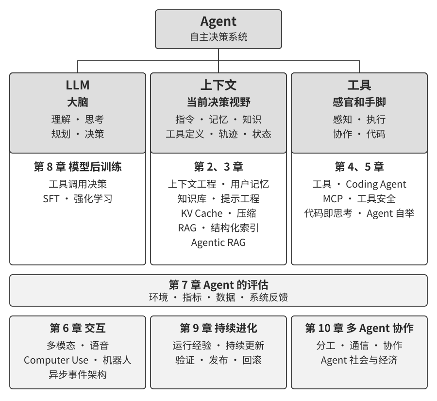
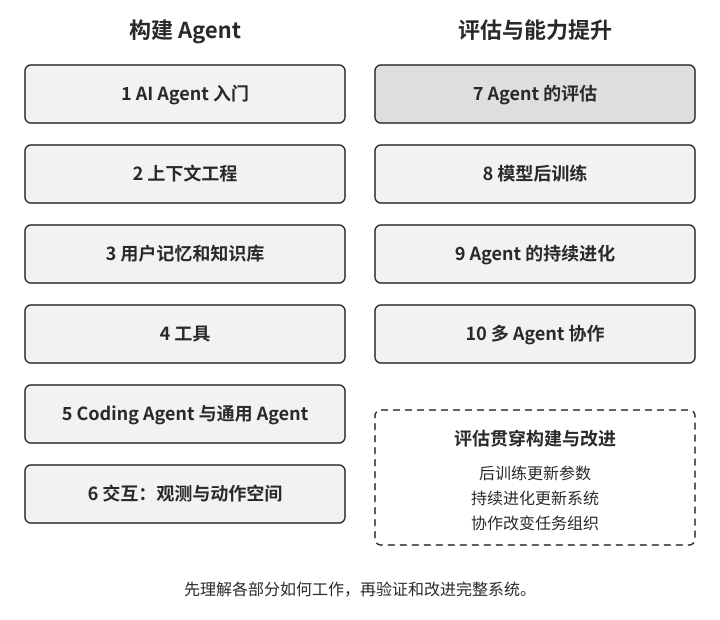

# 前言 {.unnumbered}

2025 年 8 月至 2026 年年初，我在图灵《Agent 实战营》中讲授了一系列课程。课程围绕一个核心问题展开：如何以可解释、可验证、可复用的工程方法构建 AI Agent？在跑通演示系统的基础上，课程进一步分析 Agent 为何采用特定架构，以及每项设计决策对应的能力边界与工程取舍。本书以课程讲义和配套实验为基础，经过系统整理、补充与重构而成。

> **本书的形成：一次人机协作实践**
>
> 本书的形成过程本身也是一次人机协作实践。从最初构思到书稿定型，我主要采用 **whisper coding**（口述式协作）的方式，与 Pine 的语音 Agent 共同完成资料整理和文本迭代。准备课程时，我先口述章节提纲，由 Agent 调研相关工作并形成材料草稿；课程结束后，再结合学员反馈，对论证、案例和实验反复核查与修订。语音降低了将想法外化为文本的成本，也缩短了“提出问题—检索资料—形成草稿—复核修改”的迭代周期。因而，这本书不仅讨论 Agent，也记录了一种由 Agent 深度参与的知识生产方式。

2025 年以来，AI 研究与产业实践在继续提升基座模型能力的同时，也更加重视 Agent 的系统化落地。在模型侧，DeepSeek-R1 等推理模型展示了强化学习对数学、编程和推理能力的提升。[^preface-r1] 智能体强化学习（Agentic Reinforcement Learning）进一步将工具调用与环境交互纳入训练，让模型在编程和图形界面操作（Computer Use）等任务中学习如何行动。 在产品侧，Manus、Claude Code、OpenClaw 等 Agent 推动了人机交互方式的变化，并使“代码生成 + 文件系统”成为重要的系统架构范式。

重新审视课程中总结的 Agent 工程方法，可以发现：尽管模型和产品快速迭代，这些方法仍然具有稳定的解释力。业界后来广泛使用 Skill、Harness、loop engineering 等术语，相应的工程实践往往更早出现；概念的形成，是对大量实践经验的归纳。换言之，实践在前，命名在后。

这些方法主要来自长流程、高风险场景中的工程实践。作为 Pine AI 的首席科学家，我与团队共同研发了 Pine，使 Agent 能够代表用户与真人沟通，并处理账单协商、退款投诉和订阅取消等涉及真实经济利益的复杂任务。这类任务通常跨越较长时间、包含多轮交涉，且单个步骤的错误就可能造成实际损失。对可靠性、安全性和可审计性的严格要求，促使我们逐步形成了本书所讨论的工程方法。下面几个例子均来自这段实践。

- 早在 Skill 概念流行之前，我们就已经采用动态加载提示词的方法解决提示词无限膨胀的问题，采用命令行执行工具的方式解决工具列表无限膨胀的问题，采用系统状态栏技术解决 Agent 不感知执行环境和用户时间、工作状态等问题。
- 早在 Harness 概念流行之前，我们就已经采用类似 Claude Code 的方法，解决模型工具调用不稳定、产生幻觉、执行危险或越权操作、不遵循指令等问题。
- 早在 loop engineering 概念流行之前，我们就在使用本书称为提议者-审核者（proposer-reviewer）的方法解决模型过早认为任务完成的问题。

许多模型与 Agent 团队在解决相似问题时，也独立形成了与 Pine 相近的工程方法；这种趋同说明，它们反映的是 Agent 系统的共性约束。基于这些认识，我于 2025 年在图灵开设《Agent 实战营》，并于 2024—2026 年持续在中国科学院大学讲授 Agent 实践课程。本书选择开源发布，也希望让这些可复用的知识和经验服务于更多研究者与工程实践者。

**实践在前，命名在后**。对企业级 Agent 开发而言，这意味着团队需要主动识别实践中的问题：当一个术语成为行业共识时，其对应的问题往往已经在领先系统中经过了长期探索。要更早识别并解决这些问题，我认为有两个关键条件。

**第一，选择对 Agent 能力上限提出足够高要求的真实业务，并持续获取真实反馈。** 以 Pine 为例，一项任务可能持续数小时乃至数周，期间需要与多个利益相关方反复沟通，完成长时间通话、复杂表单操作和多轮邮件往来；同时还必须保证关键数字准确、操作可控，并始终维护用户利益。足够复杂的场景会持续暴露模型能力与业务要求之间的差距，从而促使团队构建 Harness，系统解决模型暂时无法独立处理、业务却必须完成的问题。如果业务需求很容易被下一次模型升级覆盖，团队也较难积累稳定的系统设计原则。

**第二，建立系统的评估（Evaluation）机制。** 评估帮助我们区分设计改进带来的提升与随机波动。评估把 Agent 的迭代从经验判断转化为可比较、可复现的工程过程，是以科学方法开展系统开发的基础。第七章将专门讨论这套方法。

真实业务暴露问题，工程实践形成方法，评估检验方法。经过反复验证和抽象，这些方法才能逐步沉淀为可复用的系统设计原则。

底层模型和产品形态持续变化，成熟的 Agent 系统仍会形成相近的架构模式，因为它们面对着相似的系统约束。**好的设计原则本就应该穿越模型的迭代周期**，因为它们描述了智能系统与世界交互时需要处理的基本问题。

## 本书的使命 {.unnumbered}

本书希望帮助你理解 Agent 的基本结构、构建方法与能力边界。全书的核心公式是：**Agent = LLM + 上下文 + 工具**。它概括了三类功能要素：LLM 负责理解、规划与决策，上下文承载当前决策所需的信息，工具连接 Agent 与外部环境，用于获取观测或执行行动。

借助一个直观的比喻，LLM 是“大脑”，上下文是“当前决策视野”，工具是“感官和手脚”。这个视野中既有环境信息、对话历史、记忆和知识，也有系统指令、工具定义与任务状态。工具则兼具感知和执行作用：搜索、读取和截图带回信息，点击、写入和调用业务接口改变外部状态。图0-1 展示了三类功能及其在后续章节中的展开。

对熟悉强化学习（Reinforcement Learning，RL）的读者，可以从策略、观测和动作理解这些功能。LLM 的决策功能近似于策略（Policy），它根据上下文选择下一步；上下文承载本次决策用到的具体观测与历史；工具提供获取观测和执行动作的接口。观测空间（Observation Space）描述可能获得哪些观测，动作空间（Action Space）描述允许采取哪些动作，两者共同刻画 Agent 与环境交互的范围。[^preface-spaces] 第 1 章将结合工具调用例子，进一步说明这些概念的关系。

> **延伸思考：从生命到设计实体**
>
> 除了工程上的现实价值，Agent 还引出了关于智能系统演化的思考。图灵奖得主、强化学习先驱 Richard Sutton 曾将宇宙演化概括为尘埃、恒星、生命和“设计实体”（designed entities）四个阶段。[^preface-sutton] 生物进化依靠随机变异和自然选择；设计实体则可以由已有的智能系统有目的地构建和改进。
>
> Agent 可以参与这一过程：通过生成代码构建新的 Agent，分析系统行为，提出并验证修改，从而实现自举（bootstrap）和持续进化。这就像一个程序员编写了另一个程序员，新的程序员又能继续参与构建下一个系统。如何理解自身的运行机制、根据目标改进系统，是这一方向的重要问题，也是本书讨论代码生成和持续进化的动力。

## 全书结构 {.unnumbered}

本书共十章，围绕两个相互衔接的问题组织（图0-2）。**第一部分“如何构建 Agent”**包括第一至六章：从基本概念出发，依次讨论上下文、记忆与知识、工具、Coding Agent，以及观测与动作空间的扩展。**第二部分“如何提升 Agent 能力”**包括第七至十章：先用评估建立可度量的反馈，再通过模型后训练、基于运行经验的持续进化和多 Agent 协作，分别从模型参数、单体系统和群体系统三个层面扩展能力。

- **第一章（AI Agent 入门）**从真实产品与工具调用实例出发，讲解核心组成、ReAct 循环、Harness 和编排模式，建立全书的概念框架。通过实验理解上下文的作用，并区分任务内的上下文适应、跨任务的外部产物更新与训练中的参数更新。
- **第二章（上下文工程）**是全书最关键的一章，讨论怎样组织 Agent 的“当前决策视野”。从 API 消息、工具定义与调用循环出发，讲解 KV Cache 的原理，再展开流程化提示设计、工具描述、业务规则细化、提示注入防护、Skills 按需加载、状态栏与上下文压缩，说明怎样让模型持续获得决策所需的信息。
- **第三章（用户记忆和知识库）**将信息管理延伸到跨会话的保存和使用。从四种用户记忆存储格式出发，讲解 RAG 的分块、稠密与稀疏检索、融合和重排序，再讨论结构化索引、知识更新、智能体化 RAG、上下文感知检索及多模态记忆，建立持久化知识的管理方法。
- **第四章（工具）**讨论 Agent 如何通过“感官和手脚”连接外部世界。从感知、执行、协作、事件触发和用户沟通五类工具的用途与接口设计出发，讲解专用工具、通用执行器与 Skill 的选择，以及 MCP、工具发现与执行安全。感知部分比较原生多模态处理、提取为文本和工具化分析三条路线；事件触发与用户沟通的运行机制在第六章展开。
- **第五章（Coding Agent 与通用 Agent）**以 Manus、OpenClaw 等系统为例，讨论 Coding Agent 与文件系统怎样支撑通用能力。从工作流程、Harness、搜索、编辑及故障恢复进入具体实现，再展示代码作为思考工具、业务约束、多媒体生成手段、系统适配器和生成式 UI 的价值，最后讨论代码如何创造工具并实现 Agent 自举。
- **第六章（交互）**从模态与时序两个维度扩展交互。异步事件让 Agent 持续接收外部变化，语音将交互推进到实时尺度，Computer Use 连接图形界面，机器人将动作延伸到物理环境。通过这些场景理解唤醒、安全点、取消、抢占与快慢路径分离等共同机制。
- **第七章（Agent 的评估）**回答怎样判断一次改动是否有效。沿着成功标准、评估环境、数据集、验证器与 LLM-as-a-Judge，建立可度量的反馈；进一步通过统计分析、失败归因、模型选型和生产回归推动系统改进，并以仿真环境衔接后训练。
- **第八章（模型后训练）**讨论怎样通过数据与环境更新模型能力。先梳理预训练、中期训练、监督微调（SFT）与强化学习（RL）的作用，再讲解经典 RL、单轮与多轮训练、奖励设计、验证路径惩罚和样本效率。结合“SFT 记忆、RL 泛化”的实验，理解不同更新方法的效果，以及“数据与环境比算法更重要”的工程判断。
- **第九章（Agent 的持续进化）**研究怎样把运行经验转化为下一版本的能力。先从环境结果、过程规则和 LLM Rubric 获得学习信号，再比较知识、Prompt 与 Skills、程序与 Harness、模型参数四种更新载体，最后讨论验证、灰度发布、回滚和长期整理。
- **第十章（多 Agent 协作）**讨论多个 Agent 何时带来额外价值，以及怎样分工与通信。从上下文共享或独立、对等协作、管理者和去中心化结构展开，结合翻译、电话与电脑协同等案例，分析信息收益、协调成本和失败模式，并讨论 Agent 社会与经济。

## 如何阅读本书 {.unnumbered}

本书的各章节相对独立，你可以根据自己的需求选择不同的阅读路径：

- **如果你是 Agent 开发者**，建议按顺序阅读全书：第一至六章建立完整的 Agent 构建方法，第七至十章则从评估、模型后训练、持续进化和多 Agent 协作四个方向讨论能力提升。
- **如果你时间有限**，优先阅读第一章（建立全局认知）和第二章（掌握最关键的上下文工程）。第二章中 KV Cache 的底层原理较为技术化，初次阅读可先跳过原理部分、只记住开头给出的三条核心结论，不影响后续理解。
- **如果你关注模型训练**，可以直接阅读第八章（模型后训练）；其中评估方法（第七章）是训练的前提，建议一并阅读，并先读第一至二章以建立整体认知。

每章都包含大量的**实验**和**思考题**，编号格式为“实验 X-Y”（X 为章节号，Y 为章节内序号）。实验和思考题的标题中用星级标注难度：★ 表示入门级，适合所有读者；★★ 表示中等难度，需要一定的工程实践基础；★★★ 表示进阶挑战，通常涉及开放性问题或复杂的系统设计。大部分实验配有完整的可运行代码，组织在配套的开源仓库中：

> **配套代码仓库**：[https://github.com/bojieli/ai-agent-book](https://github.com/bojieli/ai-agent-book)

配套代码可以通过 Git 或仓库页面的 **Code → Download ZIP** 获取。下载后，按“实验 X-Y”的编号在各章实验索引中找到对应项目，再按项目说明安装依赖并运行。标为“复现指南”的实验会提供外部仓库及获取方法。完整命令与目录说明见配套仓库的 README。

我强烈建议你动手跑一遍这些实验。AI Agent 是一个实践性极强的领域，很多设计上的直觉需要在动手调试的过程中才能真正建立起来。

## 前置知识 {.unnumbered}

本书面向具备基本编程能力、希望理解和构建 Agent 的读者。以下按“必需”和“推荐”两个层次列出前置知识，帮助你评估自己的准备程度。

**必需：阅读全书的基础**

- **Python 编程**：书中几乎所有实验都基于 Python。你需要熟悉 Python 的基本语法、常用的数据结构、包管理（pip）等基本概念。应能读懂和修改中等复杂度的 Python 代码。
- **LLM 的基本使用经验**：你应该用过 ChatGPT、Claude 或类似的产品，理解“提示词（Prompt）→ 模型回复”的基本交互模式。
- **一款 AI 辅助编程工具**：强烈建议安装并熟悉至少一款 AI 辅助编程工具，如 Claude Code、Codex、Cursor、TRAE 等。一方面，这些工具能显著提高书中实验的开发效率，因为实验涉及大量代码编写和调试。另一方面，这些编程工具本身就是成熟的 Coding Agent，你在使用它们的过程中会直观地体验到 ReAct 循环、工具调用、上下文管理等书中反复讨论的核心机制。这种第一手体验对理解 Agent 的设计原则极有价值。
- **软件工程常识**：熟悉命令行操作、Git 版本控制、JSON 数据格式、REST API 等基本概念。这些是运行实验和理解 Agent 工具调用机制的基础。

**推荐：提升特定章节的阅读体验**

- **机器学习基础**（第八章）：了解训练与推理、损失函数、梯度下降、过拟合等基本概念，有助于理解模型后训练。
- **基础数学**（第 2-3、8 章）：对线性代数有直观的理解（比如知道向量可以表示方向和大小、矩阵可以做批量运算）有助于理解嵌入和注意力机制；基本的概率统计知识有助于理解评估指标和强化学习中的期望奖励。书中的数学不涉及复杂的推导，侧重直观解释。
- **Web 开发基础**（第 6 章）：了解 HTTP、WebSocket、前后端分离架构等概念，有助于理解事件驱动的异步 Agent 架构和语音 Agent 的实时通信实验。
- **对 Transformer 架构的基本了解**（第 2、8 章）：Transformer 是当前几乎所有大语言模型的底层架构。对于希望系统地补充大模型基础知识的读者，推荐阅读《图解大模型：生成式 AI 原理与实战》（Jay Alammar、Maarten Grootendorst 著，李博杰译，图灵教育出品）。[^preface-llm-book]该书以直观的图解方式讲解了 Transformer 架构、预训练与微调等核心概念，与本书的 Agent 工程视角形成良好的互补。

本书侧重 **Agent 工程方法及其背后的系统设计原则**。具备基本编程能力后，可以先通过实验建立直觉，再按各章需要补充相关知识；第八章的后训练内容需要更多机器学习与数学基础。

Agent 技术仍在快速演进，但**好的系统设计原则具有穿越时间的力量**。掌握了“为什么要这样设计”，你就能在技术浪潮的变化中保持清醒的判断力。希望这本书能成为你构建 AI Agent 的可靠指南。

## 致谢 {.unnumbered}

感谢图灵的梦鸽老师和刘美英老师的辛勤编辑，以及为组织图灵《Agent 实战营》课程付出的努力；感谢刘俊明老师在国科大开设 Agent 实践课程。也要特别感谢图灵《Agent 实战营》的所有学员，以及国科大 Agent 实践课程的所有同学——在我讲授这些课程的过程中，大家给了我许多有价值的反馈与建议，也让我对这些概念本身有了更清晰的理解。

感谢 Pine AI 的所有同事。Pine AI 的真实业务挑战让我积累了对 Agent 的深入理解与实践经验；在一次次思想碰撞中，同事们也提出了许多宝贵的见解。

也要感谢 AI 业界的许多朋友（在此不一一具名）。在各种行业讨论中，大家对我的观点给予了坦诚的反馈，纠正了我不少错误的判断，提升了我对模型与 Agent 的认知。

最要感谢的，是我的家人，特别是我的太太孟佳颖。她始终支持我完成本书的写作，还为本书提出了许多宝贵的意见。

[^preface-r1]: DeepSeek-AI, *DeepSeek-R1: Incentivizing Reasoning Capability in LLMs via Reinforcement Learning*, 2025. https://arxiv.org/abs/2501.12948。
[^preface-spaces]: Gymnasium, “Spaces.” https://gymnasium.farama.org/api/spaces/。
[^preface-sutton]: Richard Sutton 与 Dwarkesh Patel 的访谈，2025-09-26，“Succession to AI”部分。https://www.dwarkesh.com/p/richard-sutton。
[^preface-llm-book]: 《图解大模型：生成式 AI 原理与实战》，O’Reilly 北京图书介绍。https://velocity.oreilly.com.cn/index.php?func=book&isbn=978-7-115-67083-0。
